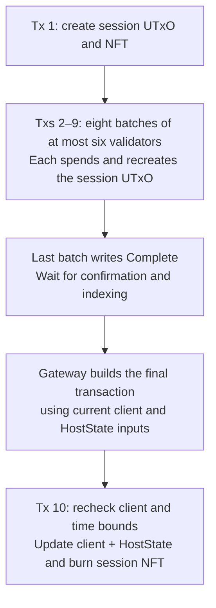

# Architectural Challenges

Author: Julius Tranquilli, https://github.com/jtranq

This document tracks engineering challenges caused by asymmetries between Cardano and Cosmos, including differences in transaction semantics and consensus algorithms. **Reviewed against [`main` at `107866a9`](https://github.com/cardano-foundation/cardano-ibc-incubator/commit/107866a998fb8a469c5b11379ee32f692815009b) on September 10, 2026.** The maintained Cardano light client is `08-cardano-probabilistic`. The older Mithril client is deprecated, disabled, and retained only as historical design reference and for type compatibility.

## Introduction

Ouroboros and Tendermint differ in how blocks are produced and in the evidence a light client can verify. When bridging Cardano and Cosmos, we need to understand both who produced a block and what evidence makes its state acceptable to the other chain.

Tendermint produces a header at each height and a commit containing signatures from more than two-thirds of the validator voting power. Validators exchange prevotes and precommits for a block ID before committing that block. The header includes an `app_hash` supplied by the application. In a conventional Cosmos SDK chain this commits to the application stores and supports ICS-23 membership and non-membership proofs. It reflects the state after executing the **previous** block. A packet commitment created in block `100` is therefore reflected in header `101`. The initial header uses the state returned at chain initialization. See the [CometBFT header specification](https://github.com/cometbft/cometbft/blob/main/spec/core/data_structures.md#header).

Under Ouroboros Praos, each slot is an opportunity to produce a block. Each stake pool privately checks a verifiable random function (VRF) against a threshold determined by its relative delegated stake in the epoch-frozen Praos snapshot. A slot can have no eligible pool, one eligible pool, or several. The VRF proof allows other nodes to check eligibility for that slot. See the [Praos glossary](https://ouroboros-consensus.cardano.intersectmbo.org/docs/references/glossary/).

The pool signs its block header with a key-evolving signature (KES) key. After the key evolves and the old signing material is erased, compromising the current key does not allow an attacker to forge signatures for earlier KES periods. For example, a key compromised in period `10` cannot be used to sign a block from period `9`. See the [Cardano key documentation](https://docs.cardano.org/about-cardano/learn/cardano-keys).

These checks authenticate the producer and its slot eligibility under the supplied epoch context. They do not establish that all transactions in the block satisfy the ledger rules. A full node also validates the block body and applies those rules. Neither check supplies a per-height quorum commit from SPOs.

To be clear about why that's such a big deal, the crux is that "verifiable" and "trustworthy as an IBC root" are totally different things. When we talk about a Tendermint header being trustworthy we're bundling three different concepts together:

**#1. Authenticity: who produced it / did the network agree ?**

**#2. Finality / Canonicity: is this THE header for height H ?**

**#3. State commitment: does it contain an authenticated root I can verify proofs against ?**

For **#1** and **#2**, a Tendermint commit proves that more than two-thirds of the voting power in a validator set signed the block. A light client must first establish that this is the chain's validator set. It starts from a trusted checkpoint and verifies validator-set changes while the trusted state remains within its trusting period. Tendermint's safety guarantee assumes less than one-third Byzantine voting power. A header and a list of signing keys supplied by an unknown party cannot establish that trust on their own. See the [CometBFT light-client verification specification](https://github.com/cometbft/cometbft/blob/v0.38.x/spec/light-client/verification/README.md).

For **#3**, the conventional Cosmos SDK `app_hash` commits to a multistore that combines the module store roots. Individual module stores use IAVL trees, so `app_hash` is not simply one module's IAVL root. This commitment appears in the next block's header. Tendermint itself does not require a particular application storage format. See the [Cosmos SDK storage model](https://docs.cosmos.network/sdk/latest/learn/concepts/store).

On the Cardano side we'll start with **#1** which is the authenticity problem. Cardano does not produce a per-height quorum certificate, so a Cardano IBC client needs additional assumptions or machinery to approximate the guarantees that IBC normally gets from Tendermint consensus.

An authenticated Cardano header gives evidence about its producer. It does not show that a supermajority of SPOs has voted to finalize that block. Praos instead provides probabilistic settlement under its stake and network assumptions, so the bridge needs evidence beyond a single leader's header.

The maintained probabilistic client does not derive a Tendermint-equivalent quorum condition. Its [compiled policy](cosmos/cardano-probabilistic-light-client-v10/heuristic_policy.go) requires at least `24` descendant blocks, `5` distinct qualifying pools, and `511` basis points (`5.11%`) of qualified unique stake. The [qualification check](cosmos/cardano-probabilistic-light-client-v10/update.go) counts only pools first registered before `2026-01-01T00:00:00Z`. Each qualifying pool's stake is counted once.

These thresholds are constants in the light-client code. Operators cannot change them through Gateway or relayer configuration. The verifier applies them to a contiguous Cardano block-history witness. Its decision is deterministic but does not provide a portable finality certificate. Canonical history and epoch context come from configured observers, so the model has explicit assumptions about those data sources.

The deprecated Mithril client explored a different tradeoff: it used stake-based certificates and transaction-snapshot proofs as a portable trust anchor, but checkpoint cadence and tip lag made it unsuitable for the latency expected from the maintained bridge path. Historical Mithril design and operating assumptions are documented in `docs/mithril-light-client.md`.

Next **#2**, also significant problems arise here because even the **notion** of canonicity doesn't exist on the same paradigm. On Cardano canonicity is basically a **chain-level** property as opposed to a block/header-level property. In Ouroboros you can see multiple short-lived forks where multiple competing blocks are valid. That's why in the Cardano developer community you'll often hear this "k-deep/k-blocks" logic, as in "if you wait k blocks, you can consider the block to be **reasonably** final" (In fairness this is true, and a fine paradigm for dApp development). But that means that a header that you fetch "right now" is not inherently a final checkpoint the way that a Tendermint header+commit is.

Finally **#3** (state commitment), current Cardano headers do not contain a ledger-state root that an ICS-23 verifier can use directly. They do [commit to the block body](https://ouroboros-consensus.cardano.intersectmbo.org/docs/references/block_diagrams_of_data/), so a verifier can authenticate transaction data and extract an application commitment such as our HostState root.

Cardano applications can keep state in UTxO datums. A validator checks a transaction's proposed transition. For example, the [HostState validator](cardano/onchain/validators/host_state_stt.ak) requires the spent HostState output to be recreated with the correct `ibc_state_root` during a root update. The validator does not keep mutable storage between invocations. Nodes maintain the wider ledger state by applying ledger rules. That state includes staking and governance information as well as the UTxO set.

State commitments and settlement are separate properties. Two competing forks can each contain a correct root for their own state. A root lets us check what state a block commits to, but does not by itself tell us which block will remain on the canonical chain. Probabilistic settlement does not make a state commitment impossible. For example, [Ethereum block headers](https://ethereum.org/developers/docs/blocks/) contain state roots before those blocks are finalized.

The STT architecture addresses the application-state commitment problem, but it does not remove the consensus asymmetry. It makes `ibc_state_root` a script-enforced commitment to Cardano IBC state. A counterparty still needs a defensible way to decide which Cardano transaction and HostState output are canonical. The current probabilistic client makes that decision using its compiled settlement policy. This does not provide parity with Tendermint finality.

[IOG's October 14, 2024 explanation of Ouroboros Peras](https://www.iog.io/blog/posts/2024/10/14/ouroboros-peras-the-next-step-in-the-journey-of-cardano-s-protocol-1/) describes a voting layer that can accelerate settlement. It also describes a cooldown after a voting round fails to reach quorum. During that period the chain relies on Praos, with the cooldown length chosen to limit the advantage an attacker could have gained from the failed round.

This describes the protocol design at that date. It does not establish a latency improvement for this bridge. Lowering the client's acceptance thresholds would require a separate analysis of the deployed protocol and the evidence this client verifies.

# Asymmetries and Architectural Considerations

## Unimplemented / Not Supported

The following IBC features are not currently supported by the Cardano bridge path.

### Channel Upgrades

Existing channels should be treated as fixed once established. If channel parameters need to change, the practical path is to open a new channel and migrate application routing to that new channel rather than attempting an in-place channel upgrade handshake. Note that this affects token redemption and lifecycle. This is something that is planned to be addressed prior to main net launch.

`ibc-go` v8.1.0 introduced channel upgradability. Compatible applications could change the channel version, ordering, or connection without replacing the channel. Upstream v10 later removed channel upgradability and ICS-29 fee middleware. Support on a Cosmos counterparty therefore depends on its version and application stack. See the [v8.1 migration guide](https://github.com/cosmos/ibc-go/blob/main/docs/docs/05-migrations/12-v8-to-v8_1.md) and [v10 changelog](https://github.com/cosmos/ibc-go/blob/v10.2.0/CHANGELOG.md).

Cardano IBC now provides a narrower, Cardano-local cleanup operation for packet
history without implementing the channel-upgrade handshake. After the source
packet commitment has been removed by acknowledgement or timeout, anyone may
submit its authenticated non-membership proof. The operation deletes the
matching Cardano receipt and acknowledgement on an unordered channel, or only
the acknowledgement on an ordered channel, whose monotonic receive sequence
remains the replay guard. The channel also records a monotonic proof-height
floor and receive high-water mark on-chain, so deleting those entries does not
make an older packet-membership proof replayable; unresolved packets remain
deliberately unprunable.

Ordered-history pruning changes the Channel and HostState validator hashes and
therefore requires a fresh bridge deployment and new channels. Existing
Channel and HostState UTxOs cannot be migrated to the new validator addresses
in place.

Adding channel upgrades here would require a compatible counterparty implementation. A newer `ibc-go` version does not by itself imply support for that handshake.

### ICS-29 Fee Middleware

The Cardano relayer endpoint cannot query incentivized packets and its counterparty payee registration method does not register a payee. It therefore does not provide a Cardano-side ICS-29 fee interface.

ICS-29 is also [deprecated in the IBC standards index](https://github.com/cosmos/ibc/blob/main/README.md#app-1), and `ibc-go` v10 removed its fee middleware. For routes to older Cosmos counterparties, relayer compensation must be assessed against that chain's fee configuration and the channel's negotiated capabilities.

### Host Consensus State Query

Cardano host consensus state queries are not implemented. The relayer endpoint cannot currently answer the standard host consensus state query for Cardano in the way it can for a conventional Cosmos SDK chain. This is a consequence of the same underlying asymmetry discussed elsewhere. Cardano does not expose Tendermint-style per-height consensus states with an `app_hash`. The bridge instead authenticates Cardano IBC state through the Cardano HostState commitment and the relevant Cardano light-client evidence. Any workflow requiring a generic host consensus state query should be treated as unsupported for Cardano today.

This is not currently a target for further development.

### Balance Query

Balance queries through the Hermes Cardano chain endpoint are not implemented. This does not mean Cardano balances are unknowable, since balances can still be inspected through Cardano-specific tooling, Gateway functionality, or local test tooling where available. The unsupported part is the generic relayer balance query interface for Cardano.

As a practical example, commands such as relayer wallet balance checks should not be expected to work uniformly for Cardano the way they do for Cosmos SDK chains. Operational scripts should use Cardano-specific balance inspection paths instead.

### ICS-31 and Asynchronous Cross-Chain Queries

[ICS-31](https://github.com/cosmos/ibc/blob/main/spec/app/ics-031-crosschain-queries/README.md) describes queries where a relayer reads the remote chain through RPC and submits the result with a proof to the querying chain. It does not require an IBC packet round trip or a transaction on the queried chain. The [Hermes Cardano endpoint](https://github.com/cardano-foundation/hermes-relayer/blob/e20533b9bebb209d0f8485e7bd2ba7f1b2d805c7/crates/relayer/src/chain/cardano/endpoint.rs#L2937) returns an unsupported error for this query interface.

The Cheqd integration uses a separate asynchronous query design. It sends query requests in IBC packets on `icq-1` channels and returns results in acknowledgements. The repository includes a reusable [Cosmos query host](cosmos/async-icq-v10/README.md) on `icqhost` and a [Cardano host service](cardano/gateway/src/tx/async-icq-host.service.ts) for an allowlist of IBC queries. The [Cheqd adapter](cardano/gateway/src/api/cheqd-icq.service.ts) supplies query paths and request and response handling for Cheqd's modules.

Adding another counterparty requires compatible host wiring, allowed query paths, and application-specific data handling. The packet transport can be reused. Each integration still needs testing on the intended route, and the asynchronous query support does not implement the Hermes ICS-31 interface.

### Client Upgrade

Standard IBC client-state upgrades through `MsgUpgradeClient` are not currently supported for the Cardano light client: both the [v8](cosmos/cardano-probabilistic-light-client-v8/upgrade.go) and [v10](cosmos/cardano-probabilistic-light-client-v10/upgrade.go) adapters reject `VerifyUpgradeAndUpdateState`.

[`MsgUpgradeClient`](https://docs.cosmos.network/ibc/v8.5.x/light-clients/developer-guide/upgrades) lets a relayer submit replacement client and consensus states, with proofs that the tracked chain committed to the transition; the installed verifier must validate those proofs before updating the existing client ID. It does not install new verifier code or give the relayer authority to choose arbitrary trusted state. The Cardano client has no implemented proof-verification path for authorizing such a transition; adding one would require defining the Cardano-side commitment, permitted state changes, and activation rules. A Cosmos-style chain revision change is a common use case, but the absence of that convention on Cardano does not itself rule out future client-state upgrades. Separately, Cosmos validators/operators can coordinate a node binary upgrade containing new light-client Go code. That code then handles existing client IDs against their retained database state, provided it can safely interpret that state or the host applies an explicit migration. Normal `MsgUpdateClient` messages resume afterward; no `MsgUpgradeClient` is required to activate the new code. Compatibility of each old-to-new implementation must still be tested, as tracked in [#629](https://github.com/cardano-foundation/cardano-ibc-incubator/issues/629).

#### When to send `MsgUpgradeClient`

Send it to the chain **hosting the client** when a supported, proof-authorized upgrade of the **tracked chain** requires a client-state transition that ordinary `MsgUpdateClient` cannot perform. This preserves the existing client ID and its connections and channels. There is no universal exhaustive list across all light-client types: each implementation defines its allowed transitions. The table below covers every chain-controlled client-state field adopted by the [ibc-go v8.7.0 Tendermint upgrade implementation](https://github.com/cosmos/ibc-go/blob/v8.7.0/modules/light-clients/07-tendermint/upgrade.go), plus its accompanying consensus-state transition. These are supported categories, not separate messages to send for each field; one authorized upgrade can change several together. **None is currently implemented by our Cardano probabilistic client.**

| Reason for an upgrade transition | State affected | When `MsgUpgradeClient` applies |
| --- | --- | --- |
| Follow the tracked chain under its upgraded chain identity, such as `chain-b-1` becoming `chain-b-2`. | `ChainId` | The old chain commits to the new identity; a relayer cannot simply rename the chain through an ordinary header update. |
| Cross an upgrade's revision/height boundary, including a height-counter restart under a higher revision. | `LatestHeight` | The authorized upgraded IBC height must be greater than the current one when comparing revision and height. Advancing to another block within the normal update rules uses `MsgUpdateClient` instead. |
| Adopt a changed unbonding period on the tracked chain. | `UnbondingPeriod` | The committed replacement must remain compatible with the client's retained trusting period; the upgrade is rejected if the resulting client parameters are invalid. |
| Adopt changed specifications for verifying the tracked chain's state-commitment proofs. | `ProofSpecs` | The new specifications must be supported by the installed verifier. The upgrade proofs themselves are checked using the old specifications, so this message cannot install a new proof algorithm. |
| Change where subsequent upgrades will be committed in the tracked chain's state. | `UpgradePath` | The current upgrade must be proved at the existing configured path; the accepted new path governs future upgrades. An empty existing path disables this upgrade mechanism. |
| Establish the trusted consensus checkpoint from which verification continues after the upgrade. | Consensus-state timestamp and next-validator-set hash | This accompanies the authorized client-state upgrade, rather than providing a way to choose an arbitrary checkpoint or replace validators. In v8 Tendermint, the initial upgraded consensus state has a sentinel root; a subsequent normal header update is needed before it can verify packets. |

These cases require an existing **active** client, authenticated upgrade commitments, and successful verification under the installed implementation's rules. The [v8 client keeper](https://github.com/cosmos/ibc-go/blob/v8.7.0/modules/core/02-client/keeper/client.go) rejects upgrades of inactive clients. The Tendermint implementation preserves the existing `TrustLevel`, `TrustingPeriod`, and `MaxClockDrift`; a relayer cannot use this message to retune them. A future client type could define additional upgrade transitions, but those need their own verification rules and cannot be inferred from this table.

| Situation that does not call for `MsgUpgradeClient` by itself | Applicable mechanism |
| --- | --- |
| New blocks, normal validator-set evolution, or a tracked-chain software upgrade that remains compatible with ordinary client updates. | Continue using `MsgUpdateClient`. |
| Install a new version of our Go verifier on the Cosmos host, or convert its persisted data to a new schema. | Coordinate the host binary upgrade and any required host state migration; test compatibility. |
| Recover an expired or frozen client. | Use the separately authorized recovery path where supported; this is not an upgrade-proof shortcut. |
| Switch to an unrelated chain, a different client implementation/type, or an incompatible consensus algorithm. | Design an explicit supported transition or create new clients and routes. The v8 Tendermint upgrade handler requires Tendermint client and consensus state types; the message does not supply replacement code. |
| Change channel/application parameters or migrate the Cardano IBC script deployment. | Use the relevant channel, application, or deployment migration procedure; this message does not perform those migrations. |

Operational-certificate validation adds information that must be present when a client is created: the certificate number currently in use by each Cardano stake pool and the network limit on a block-signing key's lifetime. Cardano IBC is not live today, so there are no deployed clients or routes to migrate for this change. The first deployment must create every client with this information from its initial Cardano checkpoint. Before allowing the Gateway to create those clients, deploy the upgraded Cosmos light-client code and use Ogmios v6.12.0 or newer.

Proof-based client-state upgrades may be a target for further development.

## IBC Revision Number & Chain Upgrades

An **IBC revision number** is the first component of an IBC height, `Height(revision_number, revision_height)`, and exists so that a chain can reset its native block height without making heights ambiguous.

For example, a chain may move from `foo-3` at block 12,000,000 to `foo-4` at block 1, and IBC can determine that `foo-4` is "later" than `foo-3`; IBC treats these as `(3, 12,000,000)` and `(4, 1)`. Note that it's just an option, bumping the revision number does not inherently require resetting the block height, so a chain could go from:

foo-3 @ (3, 12,000,000)

to:

foo-4 @ (4, 12,000,001)

with no height reset. That is still a new revision/chain ID, so it is a client-breaking change and existing IBC Tendermint clients need the authenticated upgrade procedure to cross into the new revision. The IBC-Go docs separately list **changing the chain ID** as a supported upgrade and **resetting height to 0** as another supported upgrade, with the latter requiring the revision number to be incremented.

This is a pretty special and obviously security-critical process, getting it wrong could easily lead to devastating vulnerabilities for assets on both sides of the bridge. The counterparty light client can not accept this as an ordinary header update, changing the revision, normally together with the chain ID, is a discontinuity in the identity/height namespace of the chain. The standard ICS-07 upgrade mechanism preserves continuity by having the **old chain, while it is still trusted, commit an `UpgradedClientState` and `UpgradedConsensusState` describing its successor** chain. This is analogous to how in most Cosmos blocks, the validator set for that block are committing to the validator set for the next block.

A relayer updates the counterparty light client to the last block of the old revision, proves those upgrade commitments against that trusted state, and submits `UpgradeClient`; only after that authenticated transition should the light client accept headers from the new revision. In other words, trust in `foo-4` comes from a cryptographic statement made by the already-trusted `foo-3`, rather than merely from observing that a chain calling itself `foo-4` exists. Ordinary ICS-07 updates are explicitly required to remain within one revision.

A **software upgrade does not inherently require a revision-number change**. A Cosmos chain can replace its node binary + run state migrations, or otherwise upgrade its application while keeping the same chain ID and continuing monotonically from block `N` to block `N+1`. In that case the IBC revision remains unchanged and existing light clients can continue normally. The chain can also choose to change its chain ID/revision as part of an upgrade, but doing so makes it an IBC-client-breaking upgrade and requires the authenticated client-upgrade procedure described above. A revision bump is therefore not equivalent to a software-version bump. It identifies a new revision of the consensus height namespace. A height reset specifically requires the revision number encoded in the Cosmos chain ID to increase, whereas an ordinary binary upgrade generally does not.

**IBC Eureka appears to have changed how it handles this!**

Earlier versions of the Solidity Eureka contracts exposed an `upgradeClient` mechanism corresponding to the normal IBC idea of upgrading an existing light client, but the current v3 release explicitly removed `upgradeClient` in PR #776. Current Eureka instead exposes a privileged **client migration** mechanism: a new `SP1ICS07Tendermint` contract is deployed with the desired client/consensus state, and `ICS26Router.migrateClient(...)` repoints the existing IBC client ID to that new implementation. Their current operations documentation uses this mechanism both for light-client recovery and for the v2→v3 SP1 migration, with `migrateClient` controlled by the deployment's timelocked administration/governance. Consequently, current Eureka does **not appear to expose the classic ICS-07 trustless `UpgradeClient` path in which the old Cosmos revision cryptographically commits to and authorizes the new revision**. Normal SP1 light-client updates remain constrained to the chain being tracked; if a revision/chain-ID discontinuity must be crossed, the current operational mechanism is instead replacement/migration of the light client under privileged governance. That is an important security-model distinction: standard ICS-07 derives continuity from the old chain's authenticated state, whereas Eureka's current migration mechanism derives authorization for the replacement client from the Ethereum-side migration authority.

## Denom Display in Wallets

A Cardano `assetName` can contain at most 32 bytes. The bridge's voucher token name uses a four-byte CIP-67 label for fungible tokens (`333`) followed by a 28-byte Blake2b hash of the full denom trace. The [packet decoder](cardano/onchain/lib/ibc/apps/transfer/types/fungible_token_packet_data.ak) and [trace registry](cardano/onchain/lib/ibc/apps/transfer/trace_registry.ak) each limit denomination strings to 256 bytes. A supported trace can therefore still be too long to use directly as an asset name. See the [voucher naming implementation](packages/cardano-ibc-trace-registry/src/voucher.ts).

The first mint of a voucher also creates a [CIP-68](https://cips.cardano.org/cip/cip-68) reference NFT with label `100` under the same policy. Its immutable datum records the full denom trace and the voucher identity. The on-chain policy requires this metadata to match the voucher being minted. Later mints reference the existing metadata rather than creating it again. See the [minting policy](cardano/onchain/validators/minting_voucher.ak).

For `transfer/channel-7/uosmo`, the generated `name` and `ticker` are `uosmo`. These labels come from the last segment of the base denom. They do not establish an official token brand or display precision. The [metadata builder](cardano/onchain/lib/ibc/apps/transfer/voucher_metadata.ak) does not currently supply a `decimals` value.

This removes the need to submit CIP-26 registry entries for every voucher or to pre-register possible routes. Wallets that resolve the CIP-68 metadata can use it for presentation. Other wallets may still show raw asset identifiers or require a registry entry or another metadata integration. Creating metadata on-chain does not guarantee that every wallet will display it.

The full trace remains part of the asset's identity. For example, `transfer/channel-7/uosmo` and `transfer/channel-8/uosmo` produce different voucher token names even though both display labels are `uosmo`. If a redeployment changes the voucher `policyId`, its vouchers are also different Cardano assets. Wallet integrations must resolve the new asset identities rather than assume that matching labels make them interchangeable.

## Underlying Cryptography

There are two different membership and non-membership problems in IBC, and the asymmetry between Tendermint and Cardano matters in different ways depending on which direction verification is happening.

When Cardano verifies Cosmos state, it follows the standard ICS-07 flow: Cardano stores a trusted consensus root for the Cosmos chain from signed Tendermint headers and verifies ICS-23 membership and non-membership proofs against that root.

When a Cosmos chain verifies Cardano state there is a fundamental asymmetry. In the Cosmos SDK model, an authenticated header at height `H` contains the application commitment after block `H-1`. ICS-23 proofs link the relevant module store to `app_hash`. Nodes and indexers supply proof material, which the verifier checks against that authenticated root.

Cardano does not expose anything analogous to a Tendermint per-height quorum commit that both identifies the canonical chain and attests to an application state root. Cardano block producers sign blocks, but Ouroboros does not provide the same per-height quorum commit that a Tendermint light client checks against an authenticated validator set. Chain selection and settlement depend on the ledger rules and consensus protocol. An external verifier needs additional evidence or trust assumptions to decide which Cardano history to accept.

This is why just querying a node is not a trustless replacement for a light client. If the Cosmos chain (or its relayer) simply asks a node, an indexer, or the Gateway “what is the current HostState UTxO and datum?” then the security model reduces to trusting that external party’s view of the chain. Even if the data is accurate most of the time, the verifier has no cryptographic basis to reject stale data, fork data, or fabricated data. In the Tendermint client model, the counterparty authenticates the header from its trusted checkpoint and checks the commit under the validator-set and trusting-period assumptions above. It can then check ICS-23 proofs against the authenticated `app_hash`.

In the Cardano IBC architecture in this repository, the on-chain datum on the HostState UTxO contains `ibc_state_root`, which is an application-level commitment to Cardano’s IBC key/value state. That commitment is made meaningful by script-level enforcement: every state transition that changes committed IBC state must co-spend the HostState UTxO (identified by the HostState NFT) and must update `ibc_state_root` consistently with the witness data present in the transaction, so the commitment root and the underlying state cannot diverge. This closes an “internal correctness” gap on Cardano (the operator cannot arbitrarily write a new root), but it still does not solve the “external attestation” problem. Effectively what we've done is skirted the fact that Cardano has no such analogous `app_hash` by inventing a local one that only covers the on-chain state of the IBC host infrastructure. Cosmos then uses the transaction output selected by the active Cardano client as the source of truth for Cardano-side IBC host state changes.

Separately, a counterparty must decide that a specific HostState update transaction, including the exact output datum bytes containing `ibc_state_root`, is included in an accepted view of the Cardano ledger. The maintained probabilistic client verifies a contiguous block witness from a previously trusted height, binds the HostState transaction/output to the accepted anchor block, and applies its compiled depth, pool-diversity, and stake-weight thresholds to descendant blocks. After accepting that anchor, the verifier extracts `ibc_state_root` and uses standard ICS-23 membership and non-membership proofs against it. This is a settlement heuristic over observer-supplied history, not a quorum-attested finality proof.

Height semantics must therefore be explicit. The proof height is the accepted Cardano anchor block number for the HostState root, not a Cardano slot number or necessarily the live chain tip. This asymmetry affects query semantics, proof heights, timeouts, and relayer waiting behaviour.

## Tendermint Updates Across Transactions

A 45-validator Tendermint update already exceeds Cardano's transaction size and execution limits in our [Injective benchmark](docs/tendermint-update-capacity.md#results). We explored SP1 to replace the validator evidence with a compact proof. Our [SP1 benchmark](https://github.com/cardano-foundation/cardano-ibc-incubator/pull/663#issuecomment-5530901453) reached about two minutes per proof on infrastructure estimated at $1,000–$2,000 per month. We set that approach aside because of the operating cost.

[PR #710](https://github.com/cardano-foundation/cardano-ibc-incubator/pull/710) implements staged verification and is awaiting merge. It follows the same broad idea as [IBC Eureka's Solana client](https://github.com/cosmos/ibc-contracts/blob/2f11033999d57993f68d901e40a1e50fd350a1a2/ibc-solana/programs/ics07-tendermint/README.md#chunked-upload-instructions): verify signatures across transactions and retain authenticated results for the final update. The Gateway builds the transactions and Hermes signs and submits them. Each batch checks at most six validators and their commit signatures on-chain. It spends a temporary session UTxO and recreates it with the same NFT and updated verification progress and voting-power totals. The scripts keep every batch bound to the same header and require the validator-set hashes and voting-power thresholds to match before the session becomes `Complete`. The client changes only in the final transaction, which checks the session against the current client and time bounds then updates the client and HostState atomically and burns the session NFT.

For a 45-validator update to the next height, this takes ten transactions. Multiple session transactions can land in the same block.

Skipping heights adds a pass over the trusted validator set and checks that enough of its voting power also signed the target header. Our batches depend on one another through the session UTxO, while Solana can preverify signatures in parallel. The [staged protocol](https://github.com/cardano-foundation/cardano-ibc-incubator/blob/c5f72b66dbc42149b6db9fa8f109e7d66f4b3282/docs/tendermint-update-capacity.md) caps each validator set at `256`. A live 200- or 256-validator update has not yet been completed. Staged client freezing and recovery are not implemented yet.

## UTXO Contention

TLDR: Root-changing IBC transactions are serialized through the canonical HostState UTxO. This is a throughput and liveness constraint independent of the selected Cardano light-client mode. Sharding or carefully constrained batching remains future work.

Every IBC transaction that changes committed state must spend the current HostState UTxO to update `ibc_state_root`. If two transactions are built against the same HostState output, only one can spend it. The other must be rebuilt against its successor. This serializes client, connection, channel, and packet updates even when they touch different keys. Cosmos SDK chains also execute an ordered sequence of state updates, but their transactions normally do not name a particular previous state output that they must consume. The additional constraint here is the shared UTxO input.

We haven't settled on a production strategy to mitigate this. Options include batching multiple IBC updates into a single HostState-spending transaction, which I think is an uglier solution,  or alternatively sharding committed IBC state into multiple independently-spendable state UTxOs (and adjusting the commitment model and light client verification accordingly) so unrelated flows do not contend on a single global input. This will likely be a complex and challenging solution but I believe is the more "correct" path forward.

## Constrained by Probabilistic Settlement

On Cosmos SDK chains, state changes from block `H-1` can be proved against the `app_hash` in authenticated header `H` when the required historical state is available. In the maintained Cardano-to-Cosmos direction, a HostState update can be observed immediately but cannot be used until its anchor block satisfies the probabilistic client's compiled acceptance thresholds and the required history and epoch context are available.

Cross-chain latency is therefore driven by block depth, distinct-pool and stake-weight thresholds, history availability, and relayer progress. The Gateway and relayer must consistently treat the accepted anchor block number as the proof height and wait for accepted-height progression rather than assuming the live tip is immediately usable.

## Stability Client Epoch Context Trust

The stake-weighted stability client relies on an epoch context containing stake weights, VRF key hashes, nonce, KES settings, and epoch slot bounds. It does not independently authenticate that context as the canonical Cardano epoch context. A first context that passes the consistency and header checks can still contain incorrect information.

A later header that passes verification but carries a different context for the same stored epoch is [treated as misbehaviour](cosmos/cardano-probabilistic-light-client-v10/misbehaviour_handle.go) and freezes the client. Detecting a bad first context therefore depends on an honest relayer or observer obtaining the real data and getting verifiable conflicting evidence included on the counterparty chain.

Freezing prevents further use of the client. It does not reverse operations already processed using an accepted root. For example, if a transfer was processed using a root accepted with an incorrect epoch context, a later freeze cannot undo that transfer. Detecting a contradiction does not make the first accepted context trustworthy.
