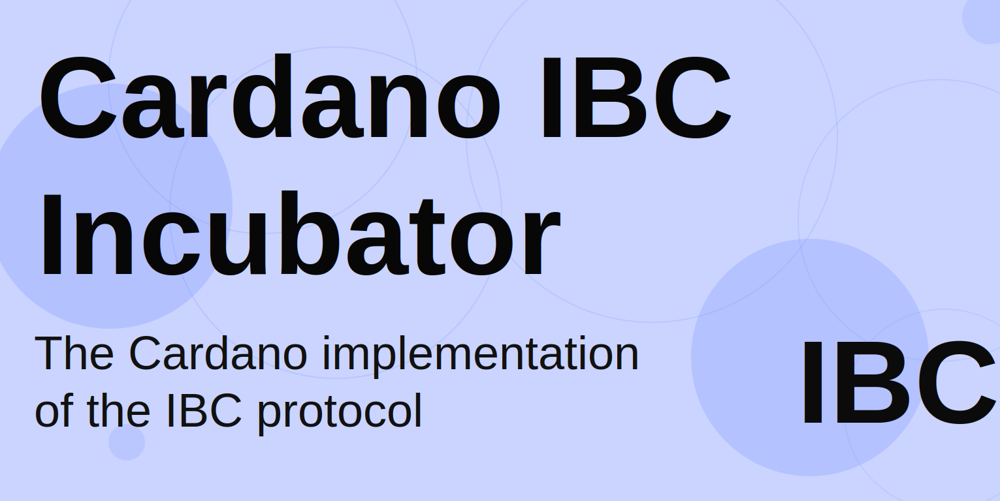
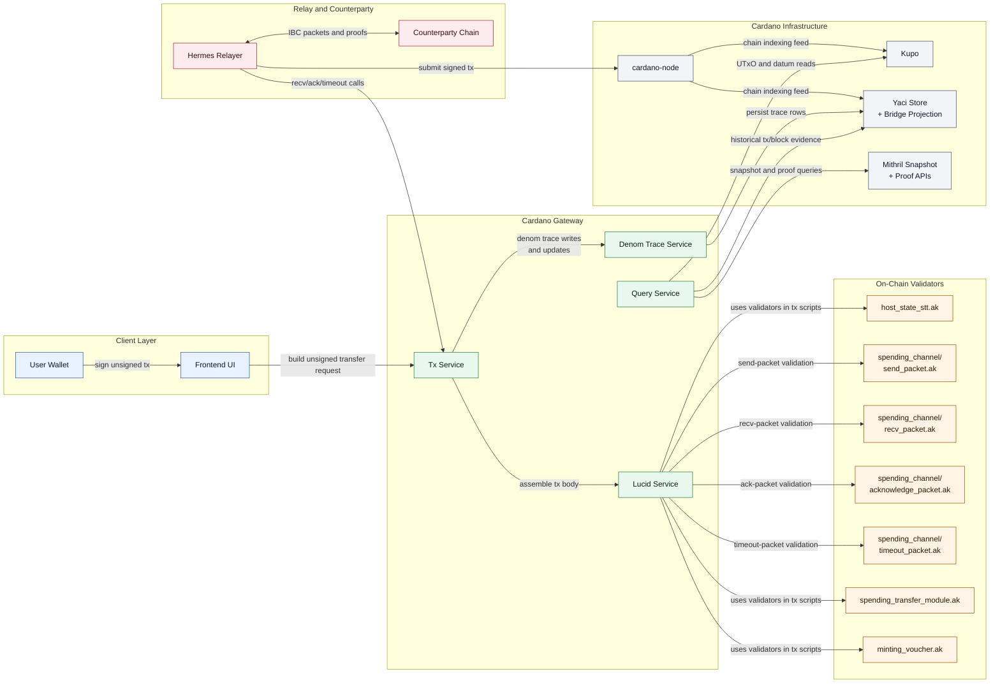

<p align="center">
  
</p>

[](LICENSE)
[](#status)
[](#architecture)

This is a work-in-progress implementation of IBC v1 for Cardano. It implements a Cardano-native realization of the IBC protocol semantics which allow trustless interop between Cardano and the Cosmos ecosystem. The bridge implements ICS-02 (clients), ICS-03 (connections), ICS-04 (channels and packets), ICS-20 (fungible token transfer), and the proof/path model of ICS-23 and ICS-24, while adapting Cardano to the IBC client model through a custom Mithril light client.

The implementation adheres to the [inter-blockchain communication protocol](https://github.com/cosmos/ibc) standards.

> [!CAUTION]
> *Disclaimer*
>
> Please be aware that this is an incubator project, and it is neither complete nor sufficiently tested at this time. The source code and software artifacts in this repository are subject to your own discretion and risk, and are not suggested as adequate for a production bridge deployment.
>
> While we strive for high functionality and user satisfaction, unforeseen issues may arise due to the experimental nature of this project.

## Index

- [Status](#status)
- [Trust Model & Security Considerations](#trust-model--security-considerations)
- [Overview](#overview)
- [Architecture](#architecture)
- [Getting Started](#getting-started)
- [Testing Against Cosmos Chains](#testing-against-cosmos-chains)
- [Demo: Sending a Demo Message from Cosmos to Cardano](#demo-sending-a-demo-message-from-cosmos-to-cardano)
- [Demo: Cross-chain Token Swap](#demo-cross-chain-token-swap)
- [Additional Resources](#additional-resources)
- [Contributing](#contributing)

## Status

| Area | Status | Notes |
| --- | --- | --- |
| Local devnet stack | Active | Managed through `caribic` with Cardano, Entrypoint, Hermes, Kupo, Ogmios, Mithril, and Yaci-backed history services |
| Core IBC semantics | Active | Implements clients, connections, channels, packets, acknowledgements, and timeouts |
| ICS-20 transfer path | Active in maintained demo and test flows | Exercised through `caribic demo` and `caribic test` |
| Historical query backend | Active | Uses `Yaci Store + Bridge Projection` rather than a generic `db-sync` query surface |
| Public network integrations | Pre-production | Select paths exist for public testnets and external Cardano services, but the operating model is still evolving |
| Production deployment | Not recommended | This repository should be treated as pre-production software |

## Trust Model & Security Considerations


There are currently protocol-level constraints that prevent IBC-style state proofs of Cardano, for example UTxO inclusion proofs. A valuable conversation on that topic can be found here: [CIP-0165 (Canonical Ledger State)](https://github.com/cardano-foundation/CIPs/pull/1083).

The Cardano-native approach is to use Mithril in conjunction with a proprietary STT architecture to attain an analogous IBC state machine in Cardano semantics. The strategy for IBC proofs under this architecture is that we use our STT architecture over the IBC host state keyspace to function as an authenticated mutex for IBC host state mutation, and rather than trying to directly prove this on-chain state, we instead use Mithril certificates to prove transaction inclusion, and deduce IBC-state mutation from the transaction outputs of certified transactions.

## Overview
This repository is divided into five main directories:
- `cardano`: Contains all Cardano related source code that are part of the bridge as well as some facilities for bringing up a local Cardano blockchain for test and development purposes. It also contains the Aiken based Tendermint Light Client and IBC primitives implementation.
- `cosmos`: Contains all Cosmos SDK related source code including the Cardano light client (or thin client) implementation running on the Cosmos chain. The folder was scaffolded via [Ignite CLI](https://docs.ignite.com/) with [Cosmos SDK 0.50](https://github.com/cosmos/cosmos-sdk).
- `relayer`: A fork of [Hermes](https://hermes.informal.systems/) (Rust IBC relayer) with Cardano integration. This replaces the deprecated Go relayer and provides native `ChainEndpoint` implementation for Cardano chains.
- `caribic`: A command-line tool responsible for starting and stopping all services, as well as providing a simple interface for users to interact with and configure the bridge services.

## Architecture



Additional architecture diagrams:

- Gateway escrow flow: `cardano/gateway/README.md#sendpacket-escrow-flow`
- Denom trace lifecycle: `docs/denom-trace-mapping.md`
- Mithril proof flow: `docs/mithril-light-client.md#mithril-proof-flow-for-relaying`
- Diagram index: `docs/architecture-overview.md`

### Relayer Implementation (Hermes)

This project uses a fork of the [Hermes IBC relayer](https://github.com/informalsystems/hermes) with native Cardano support. The relayer is integrated as a **git submodule** pointing to:

**Fork Repository:** https://github.com/webisoftSoftware/hermes  
**Branch:** `feat/cardano-integration`

The Cardano implementation resides in `relayer/crates/relayer/src/chain/cardano/` and includes:

- `ChainEndpoint` trait implementation for Cardano
- CIP-1852 hierarchical deterministic key derivation
- Ed25519 transaction signing using Pallas primitives
- Gateway gRPC client for blockchain interaction
- Cardano-specific IBC types (Header, ClientState, ConsensusState)
- Full async runtime integration with Hermes's message-passing architecture
- Complete protobuf generation for Gateway Query and Msg services

#### Hermes Configuration

> [!CAUTION]
> When configuring Hermes, ensure your `~/.hermes/config.toml` has the correct `key_store_folder` path. **Use absolute paths, not tilde (`~`) notation**, as tilde expansion may not work correctly:
>
> ```toml
> [[chains]]
> type = 'Cardano'
> id = 'cardano-devnet'
> key_store_folder = '/Users/yourusername/.hermes/keys'  # Absolute path required
> ```

## Architecture & Design Decisions

### Transaction Signing Architecture

The Hermes relayer implements Cardano transaction signing using [Pallas](https://github.com/txpipe/pallas), a pure Rust library for Cardano primitives. The architecture separates concerns between transaction building and signing:

- **Gateway (NestJS/TypeScript)** builds unsigned transactions using [Lucid Evolution](https://github.com/Anastasia-Labs/lucid-evolution) and handles all Cardano-specific domain logic (UTxO querying, fee calculation, Mithril proof generation)
- **Hermes Relayer (Rust)** signs pre-built transactions using CIP-1852 key derivation and Ed25519 signatures via the native `CardanoSigningKeyPair` implementation

This separation provides:
- Clean boundaries between chain-specific logic (Gateway) and generic IBC relaying (Hermes)
- Native integration with Hermes's keyring system following the same pattern as Cosmos SDK chains
- Easier testing and maintenance of cryptographic signing separate from transaction construction

The Cardano chain implementation in Hermes (`relayer/crates/relayer/src/chain/cardano/`) follows the same architectural patterns as other supported chains, ensuring consistent behavior across the IBC ecosystem.

## Getting Started

### Prerequisites

The following components are required to run the project:

- [Docker](https://docs.docker.com/get-docker/)
- [Aiken](https://aiken-lang.org/installation-instructions)
- [Node.js](https://nodejs.org/en/download/) `>= v20.0.0`
- [deno](https://docs.deno.com/runtime/manual/getting_started/installation)
- [golang](https://golang.org/doc/install)
- [Rust & Cargo](https://www.rust-lang.org/tools/install)

#### Verify Prerequisites

To check if you have all the necessary prerequisites installed:

```sh
cd caribic
cargo run check
```

#### OS and Architecture Considerations

This project uses Docker containers that require platform-specific images depending on your operating system and CPU architecture. Some Docker images (such as Kupo) support multiple architectures (AMD64/x86_64 and ARM64), but Docker may not automatically select the correct one.

**If you encounter issues with containers crashing immediately or OOM (Out-Of-Memory) errors**, you may need to explicitly specify the platform in the Docker Compose configuration:

- **ARM64 (Apple Silicon, M1/M2/M3 Macs)**: Ensure images specify `platform: linux/arm64`
- **AMD64/x86_64 (Intel/AMD processors)**: Use `platform: linux/amd64` or omit the platform (defaults to AMD64)

The `chains/cardano/docker-compose.yaml` file includes platform specifications where needed. If you're running on a different architecture or encounter compatibility issues, you may need to adjust these platform settings accordingly.

### Running a local Cardano network

To start the Cardano node, Mithril, Ogmios, Kupo, and the Yaci-backed history services locally run:

**Mithril note:**
In local devnet, Caribic starts a local Mithril aggregator and signers so that certificates, transaction snapshots, and inclusion proofs correspond to the local Cardano chain. This is necessary for testing because public Mithril endpoints only certify their own networks and cannot attest to transactions produced by a local devnet.
When running a local devnet, start Caribic with `caribic start --with-mithril` so the local Mithril aggregator and signers attest to state on your local network.

Mithril transaction snapshots are periodic checkpoints, not one certificate per Cardano block/slot. In this repository, the Mithril "height" used for IBC verification refers to the snapshot `block_number` (Cardano block height), not Cardano slot. The latest certified snapshot height can lag behind the Cardano node tip. The Gateway currently treats the Mithril transaction proof API as "latest snapshot only", so after submitting a HostState update transaction the relayer may need to wait until a newer snapshot includes that transaction before Cosmos-side verification can succeed. The snapshot cadence and stability tradeoffs are controlled by the Mithril config in `chains/mithrils/scripts/docker-compose.yaml`. As a frame of reference, as of March 2026 there is generally a hard Mithril-level constraint on a minimum certificate cadence of 15 blocks, irrespective of configurable values and tip lag. 

**Mithril Configuration Parameters:**

The key Mithril aggregator configs that affect snapshot frequency and IBC latency:

| Config | Description |
|--------|-------------|
| `RUN_INTERVAL` | Polling interval (ms) - how often the aggregator checks for new blocks to process. This is NOT the snapshot frequency. |
| `CARDANO_TRANSACTIONS_SIGNING_CONFIG__STEP` | Snapshot frequency - a new `CardanoTransactions` snapshot is created every N blocks. |
| `CARDANO_TRANSACTIONS_SIGNING_CONFIG__SECURITY_PARAMETER` | How many blocks behind the chain tip snapshots are created. Provides finality buffer. |
| `PROTOCOL_PARAMETERS__K` | Mithril protocol security parameter (lottery). |
| `PROTOCOL_PARAMETERS__M` | Mithril protocol quorum parameter. |
| `PROTOCOL_PARAMETERS__PHI_F` | Mithril protocol stake threshold parameter. |

**Devnet vs Mainnet Values:**

| Config | Devnet | Mainnet (Jan 2026, per @jpraynaud) |
|--------|--------|-------------------------------------|
| `RUN_INTERVAL` | 1000 (1s) | 60000 (60s) |
| `CARDANO_TRANSACTIONS_SIGNING_CONFIG__STEP` | 5 | 30 |
| `CARDANO_TRANSACTIONS_SIGNING_CONFIG__SECURITY_PARAMETER` | 15 | 100 |
| `PROTOCOL_PARAMETERS__K` | 3 | 2422 |
| `PROTOCOL_PARAMETERS__M` | 50 | 20973 |
| `PROTOCOL_PARAMETERS__PHI_F` | 0.67 | 0.2 |

Devnet values are configured in `chains/mithrils/scripts/docker-compose.yaml` for fast local iteration.

This means on mainnet you can expect a new `CardanoTransactions` certification approximately every ~10 minutes (~30 blocks), at 100 blocks behin* the chain tip. At this point in time, with the current architecture for IBC relaying, this translates to a minimum ~10 minute latency between a Cardano transaction being included and being provable to the counterparty chain via Mithril.

In production deployments on public Cardano networks, the IBC stack is not intended to run its own Mithril aggregator or signers. Instead, the Gateway and relayer are configured to consume an existing Mithril aggregator endpoint for the target Cardano network; the counterparty chain verifies Mithril certificates and proofs and does not need to trust the aggregator as an authority (it is a data source and availability dependency).

Before using the CLI, build and install `caribic` locally:

```sh
cd caribic
cargo install --path . --force
cd ..
```

To start the managed local Cardano devnet together with the bridge components and local Mithril services, run:

```sh
caribic start --clean --with-mithril
```

If you need to start components separately, use:

```sh
caribic start network
caribic start bridge
```

### Testing against Cosmos chains

> [!IMPORTANT]
> Chains like Cheqd and Osmosis must explicitly support the Cardano light client and allow it via `ibc.core.client.v1.Params.allowed_clients` (e.g., `08-cardano`). If the client type is not registered/allowed on the Cosmos chain, creating the counterparty client will fail and IBC connection/channel handshakes cannot proceed. Also ensure the relayer key on those chains is funded; Cosmos SDK accounts can return `NotFound` until they receive tokens.

### Stopping the services

To stop the services:

```sh
caribic stop
```

### Demo: Sending a demo message from Cosmos to Cardano

The maintained message-exchange flow runs against the native `cosmos/entrypoint` chain and its built-in datasource in `cosmos/entrypoint/datasource`.

Start the local bridge stack first:

```sh
caribic start --clean --with-mithril
```

Then run the demo:

```sh
caribic --verbose 5 demo message-exchange
```

To demonstrate message exchange, a vessel-oracle module is integrated into the local `entrypoint` chain. It simulates vessels sending their positions and requesting a harbor in a trustless and decentralized way. The data is consolidated and cleaned on the Cosmos side and sent out as an IBC packet. This packet is picked up by Hermes and written to the Cardano blockchain, acting as an oracle.

The demo command prepares Hermes, waits for Mithril artifacts, creates the message-exchange channel if needed, and runs the datasource flow automatically (`report`, `consolidate`, `transmit`).

## Demo: Cross-chain token swap

The maintained token-swap entrypoint is `caribic demo token-swap`. It prepares Hermes, creates transfer paths if needed, runs the Osmosis/Injective-side setup scripts, and executes the swap flow end to end. The internal scripts such as `setup_crosschain_swaps.sh` and `swap.sh` are invoked by the demo and are not the recommended operator entrypoint.

For local Osmosis:

```sh
caribic start --clean --with-mithril
caribic start --chain osmosis --network local
caribic demo token-swap --chain osmosis --network local
```

For Injective:

```sh
caribic start --clean --with-mithril
caribic start --chain injective --network local
caribic demo token-swap --chain injective --network local
```

See `caribic/README.md` for the maintained token-swap prerequisites and supported target networks.

## Useful commands for local networks

#### Local account configuration

`caribic` generates the local Cardano account material in `config.json` the first time it runs. By default, it can be found at `<USER_HOME>/.caribic/config.json`.


#### Register a new stake pool on the local Cardano blockchain
```sh
cd cardano/chains && ./regis-spo.sh <name>
```

Example:

```sh
cd cardano/chains && ./regis-spo.sh alice
```

#### Retire a stake pool on the local Cardano blockchain
This will sent a tx to retire your pool in the next epoch:

```sh
cd cardano/chains && ./deregis-spo.sh <name>
```

Example:

```sh
cd cardano/chains && ./deregis-spo.sh alice
```

#### Register a validator on Cosmos
This script will connect to your current docker and regis a new validator

```sh
Run this to check we only have 1 validator: curl -X GET "http://localhost:1317/cosmos/base/tendermint/v1beta1/validatorsets/latest" -H  "accept: application/json"

Run this to regis new validator: cd cosmos/scripts/ && ./regis-spo.sh

Run this to check we now have 2 validators: curl -X GET "http://localhost:1317/cosmos/base/tendermint/v1beta1/validatorsets/latest" -H  "accept: application/json"

```

#### Unregister a validator on Cosmos
Stop the running script above, then wait for about 100 blocks (~2 mins), then check we only have 1 validator:

```sh
curl -X GET "http://localhost:1317/cosmos/base/tendermint/v1beta1/validatorsets/latest" -H  "accept: application/json"
```

#### Test IBC primitives and lifecycles

For current end-to-end timeout and packet lifecycle validation, use the maintained integration suite:

```sh
caribic start --clean --with-mithril
caribic --verbose 5 test
```

## Additional Resources

- [ELI5: What is IBC?](https://medium.com/the-interchain-foundation/eli5-what-is-ibc-def44d7b5b4c)
- [IBC-Go Documentation](https://ibc.cosmos.network/v8/)
- [ICS 20: The Transfer Module](https://ibc.cosmos.network/v8/apps/transfer/overview/)

## Troubleshooting

### Cardano Node DiffusionError: Network.Socket.bind permission denied

If you encounter an error like `DiffusionError Network.Socket.bind: permission denied (Operation not permitted)` when starting the Cardano node, see the [Cardano Forum thread on this issue](https://forum.cardano.org/t/first-time-starting-a-node-diffusionerrored/63585).

If this doesn't resolve the issue, this is typically related to Docker runtime configuration. If using Colima on macOS, ensure you're using VirtioFS mount type by recreating Colima with `colima delete` followed by `colima start --vm-type=vz --mount-type=virtiofs --network-address`, and verify the cardano-node is configured to bind to `0.0.0.0` rather than a specific IP address.

## Kudos to the Developers in the Cardano Ecosystem

This project stands on the shoulders of some incredible frameworks and tools developed by the Cardano community. Huge thanks to the developers behind these services—projects like this wouldn’t be possible without their hard work and innovation:

- [Lucid Evolution](https://github.com/Anastasia-Labs/lucid-evolution)
- [Ogmios](https://github.com/cardanosolutions/ogmios)
- [Kupo](https://github.com/cardanosolutions/kupo)
- [Apollo](https://github.com/Salvionied/apollo)
- [gOuroboros](https://github.com/blinklabs-io/gouroboros)
- [Mithril](https://github.com/input-output-hk/mithril)

## Contributing
All contributions are welcome! Please feel free to open a new thread on the issue tracker or submit a new pull request.

Please read [Contributing](CONTRIBUTING.md) in advance. Thank you for contributing!

## License

This project is licensed under [Apache 2.0](LICENSE).

## Additional Documents
- [Code of Conduct](CODE_OF_CONDUCT.md)
- [Security](SECURITY.md)
