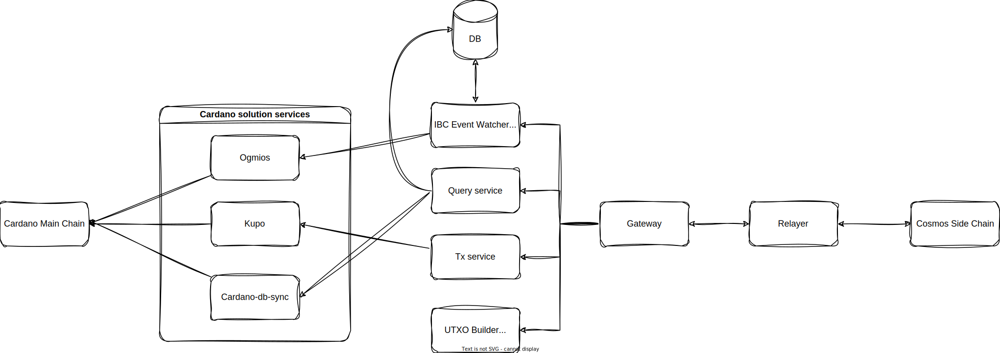

# High-Level Architecture Documentation

## Overview

This document outlines the high-level architecture of a blockchain solution integrating the Cardano main chain with various services and a Cosmos side chain. The architecture aims to provide a comprehensive environment for testing and implementing Inter-Blockchain Communication (IBC) transactions.

## Components

### Cardano Main Chain

- **Environment**: Testing environment using a development network.
- **Execution**: Runs using Docker Compose within the `/chains` directory.
- **Functionality**: Houses Aiken contracts that store IBC transactions.

### Cardano Solution Services

These services form the Dmeter service suite, essential for account registration and transaction management.

#### Ogmios

- **Role**: Responsible for submitting signed transactions.

#### Kupo

- **Role**: Manages queries for UTXO by address and slot.

#### Cardano-db-sync

- **Role**: Retrieves a list of SPOs and query epoch nonce (to verify spo)
- **Alternative**: May be replaced with Yaci-store (under evaluation).

### IBC Event Watcher Service

- **Purpose**: Indexes only IBC transactions from the chain and saves them to a Postgres database.
- **Necessity**: Acts as an intermediary to transform UTXO information into events for the Relayer due to the absence of native events in Cardano.

### Query Service

- **Function**: Supports query endpoints for the status of IBC modules for the Relayer.

### Tx Service

- **Function**: Provides endpoints to submit UTXO for the Relayer.

### UTxO Builder Service

- **Nature**: Off-chain code.
- **Function**: Builds outputs based on the inputs provided by the Relayer.

### Gateway

- **Description**: An intermediary endpoint that facilitates communication between the Relayer and the above services using the GRPC protocol.

### Relayer

- **Source**: Forked from [cosmos/relayer](https://github.com/cosmos/relayer).
- **Function**: A Relayer in the IBC, essential for transaction communication between different chains.

### Cosmos Side Chain

Using Cosmos SDK v0.50.2 and ibc-go v8.0.0, the default modules of Cosmos SDK.

