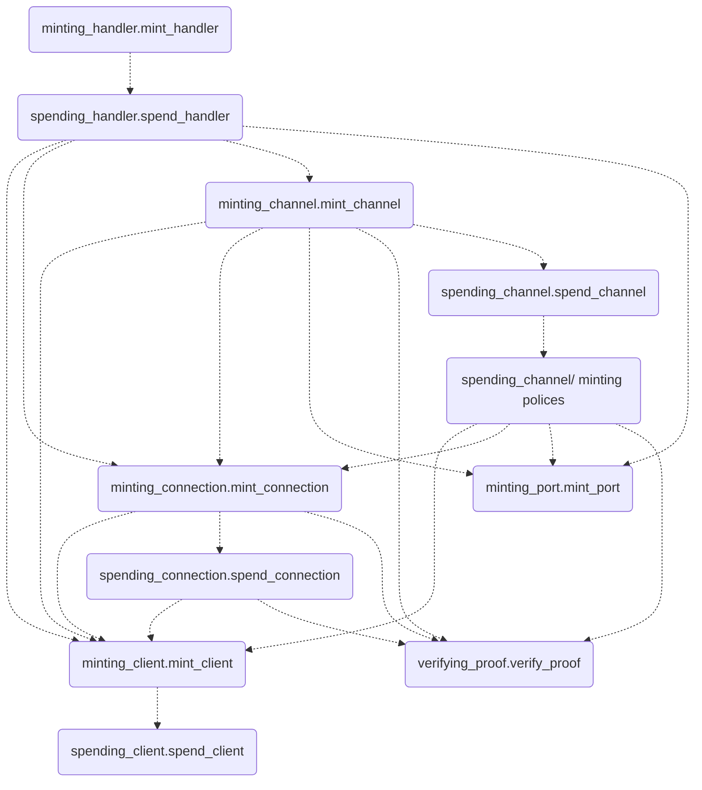

# Cardano Validator Script

## Overview

This document contains information about validator scripts that power IBC on Cardano blockchain.

Validator scripts is written in Aiken - a modern programming language and toolchain for developing smart contracts on the Cardano. Aiken is easier than Plutus to get started with for those who are less familiar with functional languages like Haskell. For more information visit [Aiken docs](https://aiken-lang.org/).

## Components

Validators scripts are located in `validators/` directory and implement the following specifications of IBC:
- [ICS-25 Handler Interface](https://github.com/cosmos/ibc/tree/main/spec/core/ics-025-handler-interface): `minting_handler.mint_handler`, `spending_handler.spend_handler`.
- [ICS-02 Client Semantics](https://github.com/cosmos/ibc/tree/main/spec/core/ics-002-client-semantics): `minting_client.mint_client`, `spending_client.spend_client`.
- [ICS-03 Connection Semantics](https://github.com/cosmos/ibc/tree/main/spec/core/ics-003-connection-semantics): `minting_connection.mint_connection`, `spending_connection.spend_connection`.
- [ICS-04 Channel & Packet Semantics](https://github.com/cosmos/ibc/tree/main/spec/core/ics-004-channel-and-packet-semantics): `minting_channel.mint_channel`, `spending_channel.spend_channel`, all validators in `spending_channel/` directory.
- [ICS-05 Port Allocation](https://github.com/cosmos/ibc/tree/main/spec/core/ics-005-port-allocation): `minting_port.mint_port`.
- [ICS-23 Vector Commitments](https://github.com/cosmos/ibc/blob/main/spec/core/ics-023-vector-commitments): `verifying_proof.verify_proof`.
- [ICS-20 Fungible Token Transfer](https://github.com/cosmos/ibc/tree/main/spec/app/ics-020-fungible-token-transfer): `spending_transfer_module.spend_transfer_module`, `minting_voucher.mint_voucher`.

There are also some validator scripts used as utilities and will be explained later.

## Storing IBC states

Cardano uses the eUTXO model, where the states of the blockchain are stored in UTXOs and updated by spending these UTXOs. Unlike other blockchains, where an address can hold almost unlimited data (as long as you can pay the fee for it), transactions in Cardano have a size limit, and the UTXO size, which is also included in the transaction, must be lower than that limit. Therefore, if a DApp has too much data, we must distribute it into multiple UTXOs. In IBC which has a bunch of states, we choose to store states of each client, connection and channel in a sole UTXO and have different validator scripts to manage their spending conditions.

However, distributed states also bring some challenges, one of which is identifying which UTXOs belong to our system. Since anyone can create UTXOs that contain any data and attach them to any address, we need a way to distinguish the ones with the same address. To achieve this goal, we used another type of validator scripts called minting policy which help us manage minting and burning native token on Cardano. With this, beside creating new UTXO for each object of IBC, we also mint a new authentication token and attach it to newly created UTXO. Then the spending validator script of the UTXO will ensure that the spent one must contain the authentication token, and this token will be retained in the updated output UTXO.

By leveraging both the spending validator and minting policy, we can effectively create, update and query states of IBC on Cardano. You can refer to the previous section and notice that all semantic of IBC specs are also implemented with both these types of mentioned validator script.

## Reference scripts

Every time a script is used, the transaction which caused the usage must supply the whole script as part of the transaction. This not only increases the transaction fee but also makes the transaction reach its size limit more frequently. That is why Cardano introduced CIP-33 Reference scripts. This CIP allows scripts to be attached to UTXOs and used to satisfy the requirement of providing the scripts during validation.

In Cardano IBC, which has a large Aiken validator scripts codebase, using reference scripts is a must because transaction size limit is never satisfied with a large amount of IBC states plus a very long Aiken scripts (sometimes it can be 2 to 3 times larger the transaction size limit). While effectively helping reduce the transaction size and cost, using reference scripts also requires some extra steps for setup and use.We will discuss this further in section [Deploying](#deploying)

## Transaction Level Validator Minting Policy

Sometimes the size of a single validator script can be larger than the transaction size limit, so we can't even execute a transaction to attach it to a reference script. This can happen if the validator script handles a lot of operations, as many of our IBC scripts do. To deal with this, instead of implementing all logic for a semantic in a single script, we can use minting policies to extend transaction-level validation. With this solution, the role of the original validator script is simply to check that other minting policies are included in the transaction, while the minting scripts will be responsible for validating the main logic. Despite bringing some downside regarding the cost of cross-validation between scripts and minting unused tokens, this method is very effective in reducing the size of validator scripts. Combined with reference scripts, it allows us to have very complicated logic in our validator scripts.

## Dependencies between validator scripts

Since we have separated validator scripts into multiple smaller ones, they often need to refer and cross-validate each other. This leads to some scripts needing to know about others, making dependencies between them somewhat complex. You can see the graph of script dependencies below (scripts depend on the ones they point to):

## Deploying

Cardano does not have the concept of deploying validator scripts, so what we actually mean by deploying here is the creation of essential UTXOs to operate our system. More specifically, we will create UTXOs for the IBC Handler, modules and reference scripts. The Handler is needed to manage metadata of IBC like object IDs and ports. Module UTXOs contain IBC applications states. Other UTXOs have the role of holding validators in reference scripts fields, which helps us reduce transaction size and cost as mentioned [before](#reference-scripts).

In the section about [dependencies between scripts](#dependencies-between-validator-scripts), we saw that some scripts need to know about others. The technique we use here is passing the script hashes of dependent scripts to the validator parameters of the needed ones. These parameters are only set off-chain and will become a part of the bytecode of the scripts instead of being stored as states on-chain. This leads to another requirement that validator scripts need to be initialized in a specific order, particularly in a bottom-up order from our dependencies graph, starting with scripts that do not have any dependencies to the handler that needs to know all about other scripts.

As you can see, the deploying process is quite complex and hard to do manually. To make the deploying experience better, we wrote a script to automate this process. This [script](https://github.com/cardano-foundation/cardano-ibc-incubator/blob/draft/aiken-contract-docs/cardano/src/deploy.ts) will read the `plutus.json` file generated by Aiken, initialize validator scripts, create required UTXOs for the system, and store all the needed information in a file called `handler.json`.