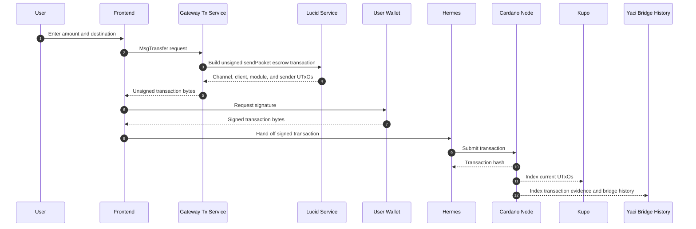

# Cardano Gateway

The Gateway is the Cardano-facing service for the bridge. It exposes IBC query
and transaction-building APIs, builds unsigned Cardano transactions for wallet
signing, and supplies the relayer with Cardano state and proof data.

By default, the service listens on:

- HTTP/REST: `http://localhost:8000`
- gRPC: `0.0.0.0:5001`

See [`.env.example`](.env.example) for the complete configuration surface.

## Data Sources

The Gateway separates current-chain access from historical bridge evidence:

- **Ogmios** follows live chain progression and submits transactions.
- **Kupo** indexes current UTxOs needed to build and validate transactions.
- **Yaci Store plus the bridge projection** provides historical transactions,
  UTxOs, and stake-pool evidence.

The active Cardano light-client mode is `stake-weighted-stability`. Mithril
integration remains only for compatibility with historical deployments and is
deprecated for new deployments.

IBC denomination traces are kept in the on-chain trace registry. The Gateway
reads the registry directory and shards rather than treating a local database
as the source of truth.

## Bridge Discovery Manifest

The Gateway exposes the public bridge manifest through
`GET /api/bridge-manifest` and the Cardano gRPC `Query/BridgeManifest` method.
The manifest records the script hashes, reference UTxOs, modules, auth tokens,
and deployment metadata needed to reconnect a Gateway and relayer to an
existing bridge deployment.

At startup, either `HANDLER_JSON_PATH` or `BRIDGE_MANIFEST_PATH` can provide the
deployment configuration. To convert an existing `handler.json` into the public
format, run:

```bash
npm run export:bridge-manifest -- <handler-json-path> <output-path>
```

Tracked manifests are included in published container images under
`/usr/src/app/manifests`.

## SendPacket Escrow Flow



Related documentation:

- [System architecture](../../README.md#architecture)
- [Denom trace lifecycle](../../docs/denom-trace-mapping.md)
- [Probabilistic light client](../../docs/probabilistic-light-client.md)

## Development

```bash
npm install
npm run start:dev
```

Build and test commands:

```bash
npm run build
npm test
npm run test:e2e
npm run test:cov
```

## Published Container Image

Gateway images are published to GitHub Container Registry after relevant
changes reach `main`:

```bash
docker pull ghcr.io/cardano-foundation/cardano-ibc-incubator/cardano-gateway:main
```

Tags include `main`, immutable `sha-<commit>` tags, and `v*` release tags.

## License

This project is licensed under the [Apache License 2.0](../../LICENSE).
