# Cardano IBC On-chain Protocol

This package contains the Aiken validators that make Cardano act as an IBC host
chain. It maps the account-based IBC model onto Cardano's eUTXO model by using
state-thread tokens, validator-checked datum transitions, and a single HostState
commitment root that counterparties can verify.

The goal of this document is to give contributors a visual map of how the
on-chain protocol works. For exhaustive security claims and test labels, read
[`../../INVARIANTS.md`](../../INVARIANTS.md). For voucher reverse lookup details,
read [`../../docs/cardano-trace-registry.md`](../../docs/cardano-trace-registry.md).

For a formal validator-level model, read
[`docs/protocol-state-machine`](docs/protocol-state-machine). It represents
every on-chain validator as a state-machine participant and maps protocol
mechanisms to transitions, guards, effects, and durable writes.

## Mental Model

IBC expects a host chain to maintain clients, connections, channels, packet
commitments, receipts, acknowledgements, ports, and application callbacks. On
Cardano, those are distributed across UTxOs. Each canonical UTxO is authenticated
by a non-fungible token minted by protocol-controlled policies.

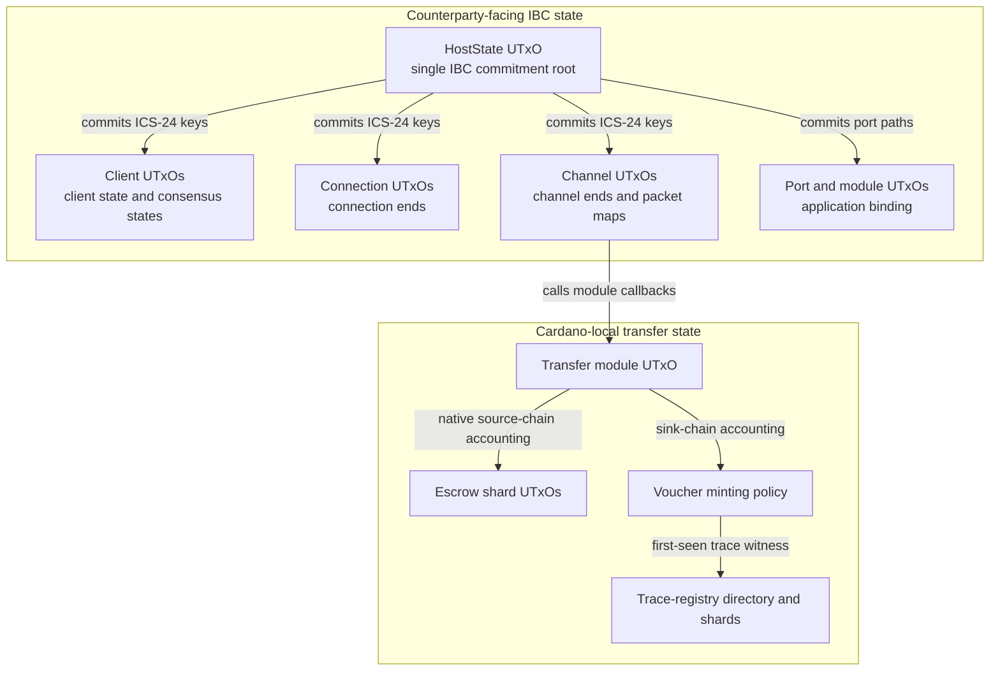

The protocol has three recurring patterns:

- **Thread tokens identify canonical state.** A script address alone is not
  enough because anyone can send arbitrary UTxOs to a script address.
- **HostState commits cross-chain state.** Client, connection, channel, packet,
  and port changes must update the HostState commitment root in the same
  transaction.
- **Marker mints bind multi-validator transactions.** Operation-specific minting
  policies make sure the channel spend, HostState spend, proof check, and module
  accounting all refer to the same operation.

## Directory Map

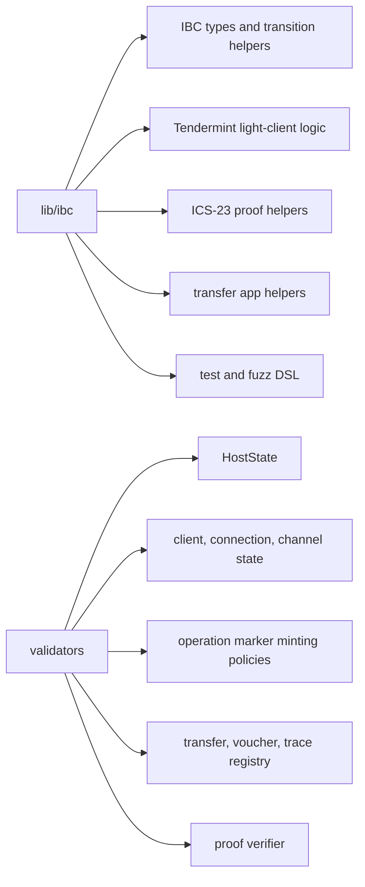

Key entry points:

| Area | Files |
| --- | --- |
| Host coordinator | [`validators/host_state_stt.ak`](validators/host_state_stt.ak), `lib/ibc/core/ics-025-handler-interface/host_state.ak` |
| Auth tokens | [`lib/ibc/auth.ak`](lib/ibc/auth.ak) |
| Client updates | [`validators/spending_client.ak`](validators/spending_client.ak), `lib/ibc/client/ics-007-tendermint-client/*` |
| Connection state | [`validators/spending_connection.ak`](validators/spending_connection.ak), `lib/ibc/core/ics-003-connection-semantics/*` |
| Channel and packets | [`validators/spending_channel.ak`](validators/spending_channel.ak), [`validators/spending_channel/`](validators/spending_channel/) |
| Transfer app | [`validators/spending_transfer_module.ak`](validators/spending_transfer_module.ak), `lib/ibc/apps/transfer/*` |
| Voucher assets | [`validators/minting_voucher.ak`](validators/minting_voucher.ak), [`validators/voucher_metadata.ak`](validators/voucher_metadata.ak) |
| Trace registry | [`validators/trace_registry.ak`](validators/trace_registry.ak) |
| Proof verification | [`validators/verifying_proof.ak`](validators/verifying_proof.ak) |

## State UTxO Anatomy

Most canonical state UTxOs look like this:

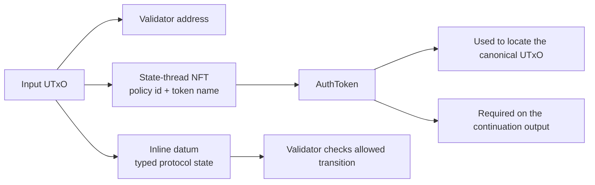

The state-thread NFT is the identity. The datum is the mutable state. A valid
transition spends exactly the old state UTxO and creates the matching
continuation output with the same auth token and the updated datum.

## Auth Token Derivation

The HostState NFT is the root identity. Other state tokens are derived from that
root token, a domain prefix, and a sequence number.

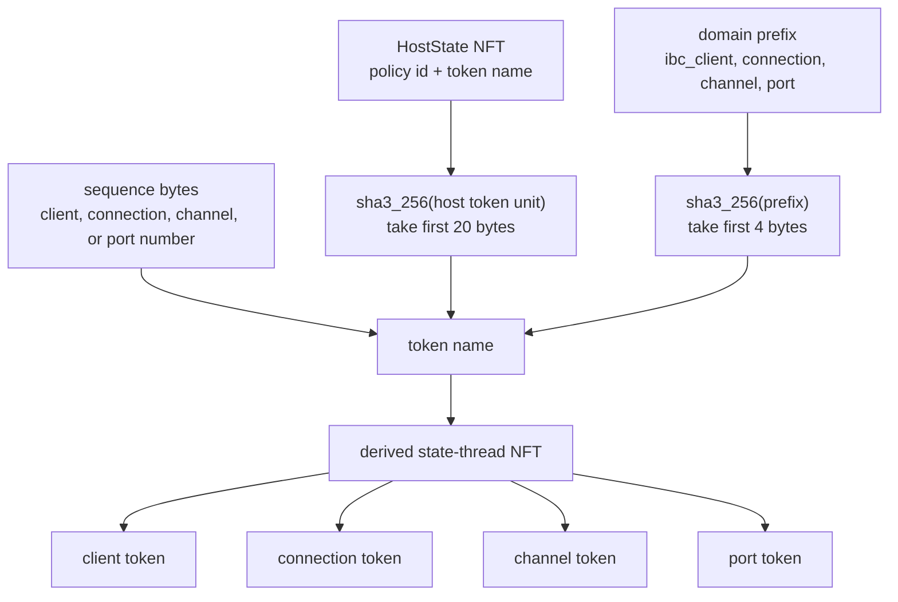

This lets validators prove that a client, connection, channel, or port belongs
to the same HostState instance without trusting script addresses alone.

## HostState Commitment Root

HostState is the only state thread that counterparties conceptually care about.
It contains the IBC commitment root and sequence counters. Transactions that
change IBC state must also prove the corresponding root update.

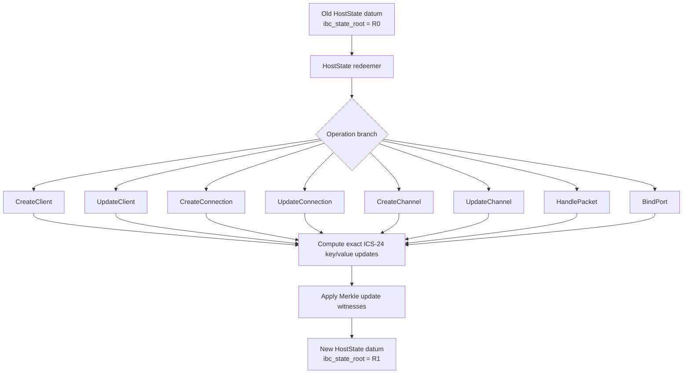

The HostState validator does not just check that the root changed. It derives
the exact keys and values from the state UTxOs in the transaction, applies the
provided sibling witnesses, and requires the output root to match.

## Validator Coupling Pattern

Most protocol operations are not single-validator events. They are composed
transactions where multiple scripts must agree on the same logical operation.

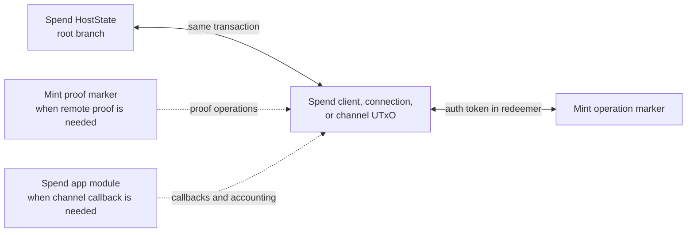

Examples:

- `spend_client` requires a matching HostState `UpdateClient` redeemer.
- `spend_connection` requires HostState `UpdateConnection` and proof-marker
  validation for proof-bearing handshake steps.
- `spend_channel` requires HostState `UpdateChannel` or `HandlePacket` plus the
  exact operation marker mint.
- `spend_transfer_module` requires the HostState thread and validates transfer
  module accounting against the channel packet callback.

## Client Updates

Client state tracks the counterparty chain. Updates verify a Tendermint header
or detect misbehaviour, update the client datum, and commit the result into the
HostState root.

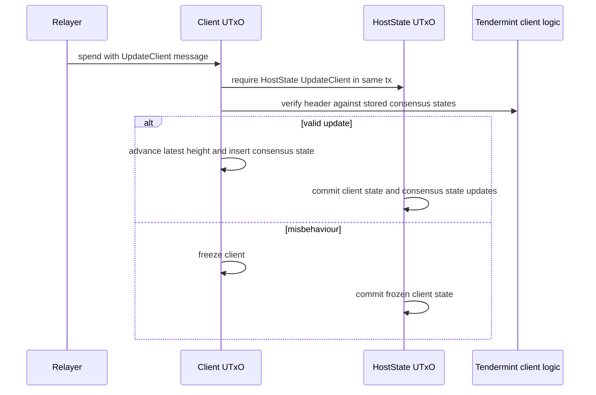

Important checks:

- The input carries the client auth token.
- The continuation output keeps only the same client auth token.
- The client is active before normal updates.
- The transaction validity interval is converted to nanoseconds for client-time
  checks.
- Added and removed consensus states are mirrored in the HostState root.

## Connection Handshake

Connections follow the IBC state machine while adapting proof verification to
Cardano minting policies and reference inputs.

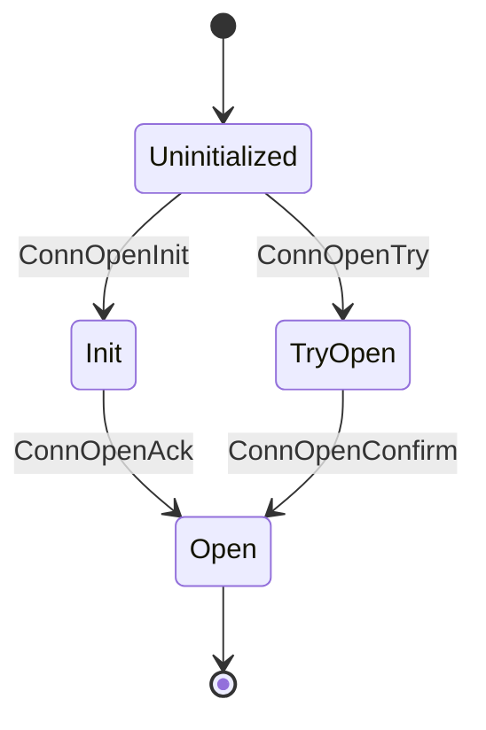

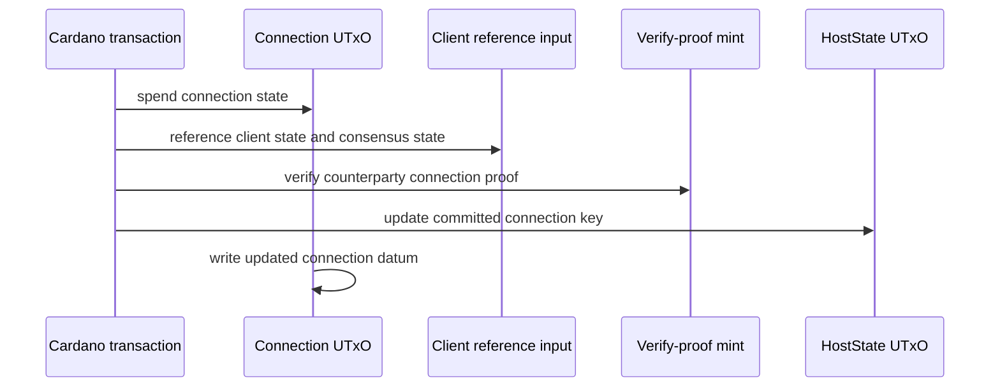

The connection validator verifies that:

- the connection UTxO carries its auth token;
- the client referenced by the connection is active;
- proof-bearing steps include the expected verify-proof redeemer;
- the datum transition matches the IBC handshake rules;
- HostState commits the connection state update.

## Channel Handshake And Close

Channel state is stored in a channel UTxO and committed through HostState. The
channel validator also enforces operation marker mints so the spend cannot be
reused as an unrelated channel transition.

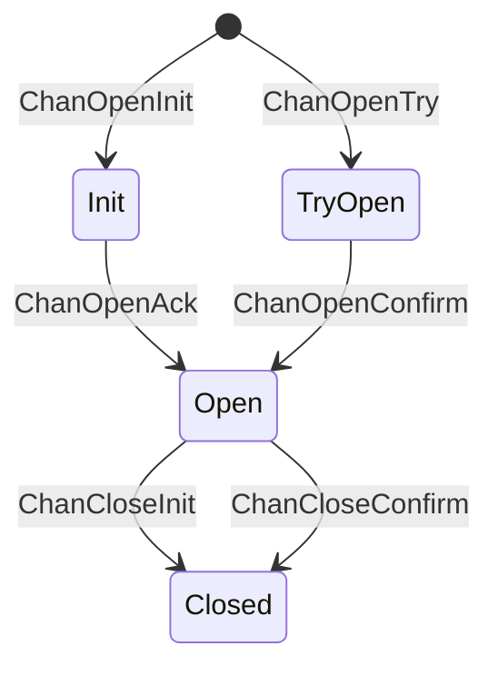

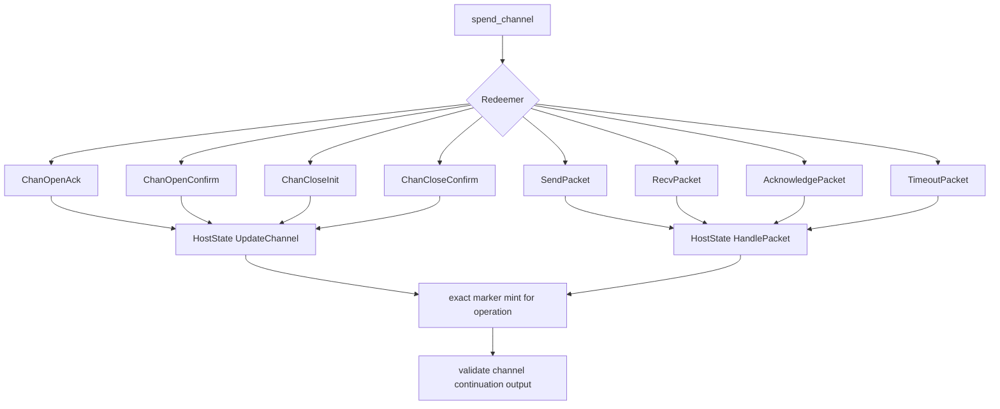

## Packet Lifecycle

Packet state lives inside the channel datum and in the HostState commitment
root. Packet operations are coupled to transfer module callbacks when the
channel belongs to the transfer application.

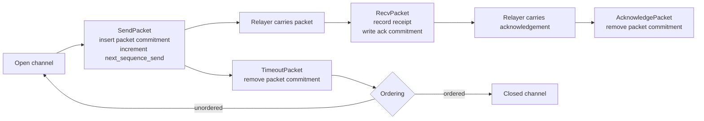

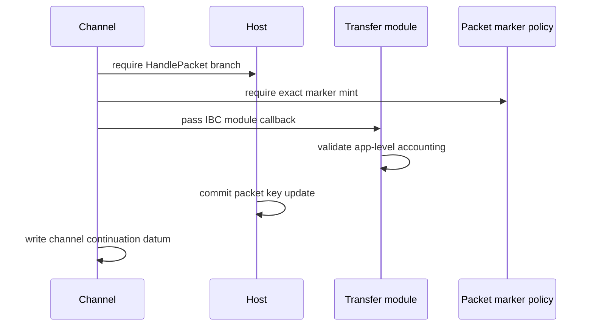

The packet validators enforce:

- send sequence matches `next_sequence_send`;
- packet commitments, receipts, and acknowledgements are updated consistently;
- timeout cannot execute before the timeout timestamp;
- ordered timeout closes the channel;
- application callbacks refer to the same packet bytes as the channel redeemer.

## Transfer Accounting

ICS-20 transfer accounting depends on whether Cardano is the source chain for
the packet denom.

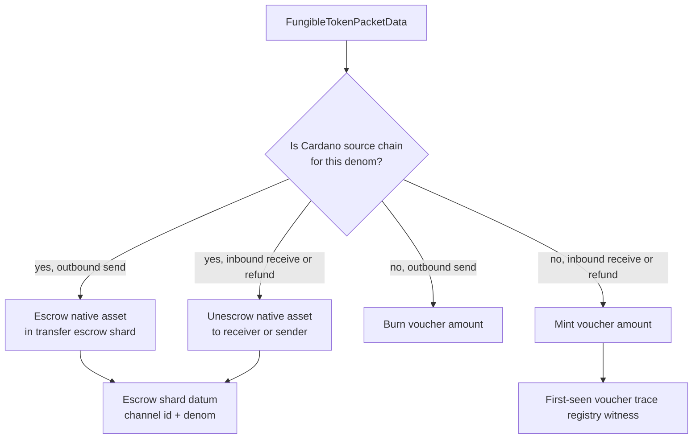

The transfer module validator is the bridge between channel callbacks and asset
accounting. It validates callback shape, channel identity, and exact value
deltas on module state or escrow shard UTxOs.

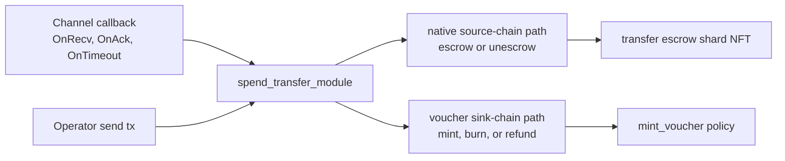

## Voucher Minting And Metadata

Cardano voucher token names are compact hashes of full ICS-20 denom traces. The
minting policy ties each mint or burn to a channel packet operation.

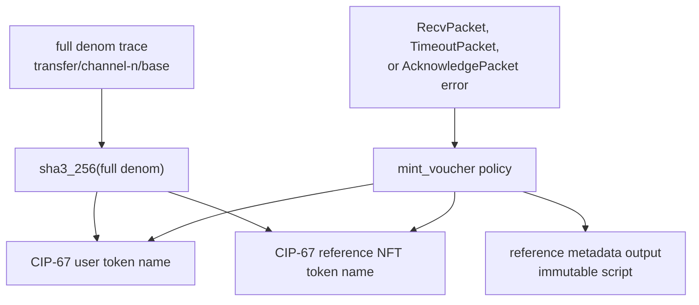

Voucher mint paths:

| Redeemer | When used | Asset effect |
| --- | --- | --- |
| `MintVoucher` | Cardano receives a sink-chain packet | Mint voucher tokens to receiver |
| `BurnVoucher` | Cardano sends an existing voucher away | Burn voucher tokens from sender |
| `RefundVoucher` | Timeout or acknowledgement error returns a voucher send | Re-mint voucher tokens to sender |

## Trace Registry

The trace registry is Cardano-local metadata that makes hashed voucher names
reversible. It is intentionally outside HostState because counterparties do not
need it for IBC proof verification.

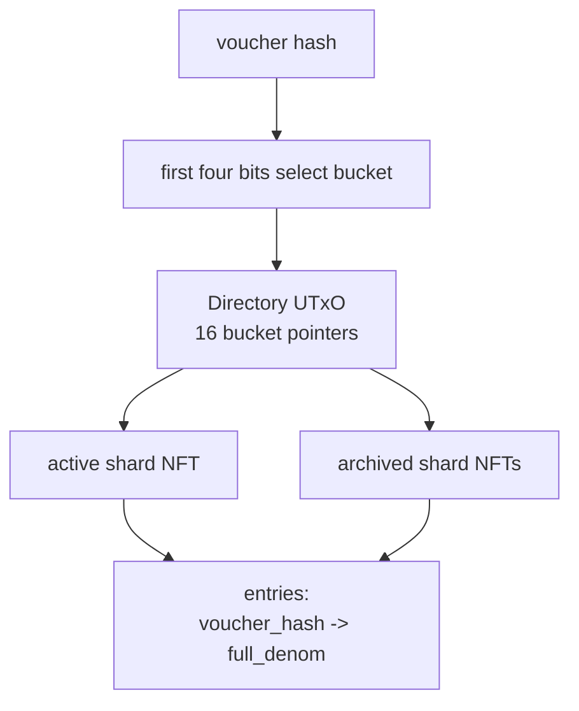

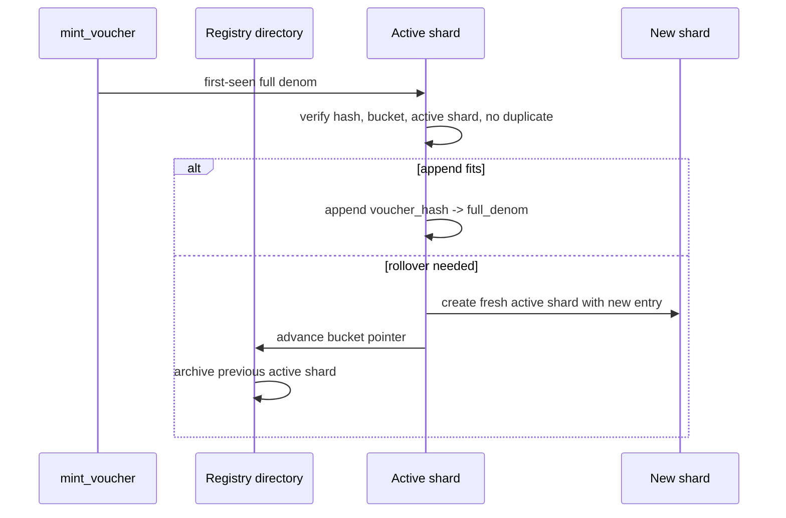

Registry invariants:

- inserted `full_denom` must hash to the inserted voucher hash;
- the hash must belong to the selected bucket;
- active shard writes must be authorized by the directory;
- archived shards are immutable history;
- first-seen writes require a matching voucher mint in the same transaction.

## Proof Verification

Proof-bearing operations mint through `verifying_proof.ak`. That minting policy
does not create a lasting asset for users. It is an operation marker proving the
transaction supplied a valid ICS-23 membership or non-membership proof against a
client consensus state root.

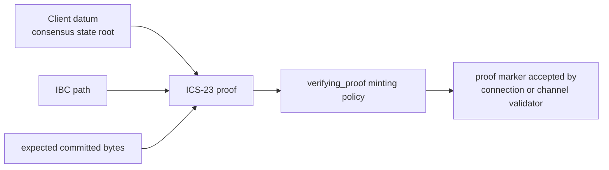

The consuming validator checks that the proof marker redeemer is exactly the
proof it expects for the operation.

## Creation Flow

Creation flows mint a new state-thread token and create a new state UTxO, while
HostState increments the appropriate sequence and commits the new key.

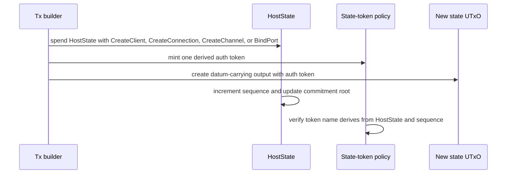

## Operation Marker Policies

Marker policies are small minting scripts used to prevent a transaction from
claiming one IBC operation while performing another.

```mermaid
flowchart TD
  Operation["Operation"] --> MarkerPolicy["operation marker policy"]
  MarkerPolicy --> Redeemer["redeemer carries target AuthToken"]
  MarkerPolicy --> Mint["mint exactly one marker"]
  Redeemer --> StateValidator["state validator checks marker redeemer"]
  Mint --> StateValidator

  Operation --> Handshake["channel open or close"]
  Operation --> Packet["send, recv, ack, timeout"]
```

The marker usually has no business meaning outside the transaction. Its value is
the coupling: if it is missing, extra, or points at the wrong auth token, the
state transition fails.

## Shutdown Flow

HostState also has shutdown branches. These let the protocol enter and finalize
a shutdown mode without pretending that normal IBC operations are still active.

```mermaid
stateDiagram-v2
  [*] --> Active
  Active --> ShuttingDown: EnterShutdown
  ShuttingDown --> Finalized: FinalizeShutdown
  Finalized --> [*]
```

The shutdown path belongs to HostState because it is a global protocol mode, not
a per-client or per-channel datum transition.

## Development Workflow

Common local commands:

```bash
aiken fmt --check
aiken build --deny
aiken check --deny --skip-tests
aiken check --deny --max-success 1 --property-coverage relative-to-tests
```

`aiken build` generates `plutus.json`, which is consumed by off-chain code. CI
therefore builds the blueprint before Deno off-chain checks.

## How To Read The Tests

The tests have two layers:

```mermaid
flowchart LR
  Unit["Unit and transition tests<br/>datum helper logic"] --> Contract["Contract-shaped tests<br/>real validator calls"]
  Contract --> Model["Model and fuzz tests<br/>multi-step lifecycle properties"]
```

Use [`../../INVARIANTS.md`](../../INVARIANTS.md) as the index. It maps each
important invariant to concrete test labels and explains what the property
actually proves.

## Design Checklist For New On-chain Changes

When adding or changing a validator path, check these questions:

- What is the canonical state UTxO, and which auth token identifies it?
- Which HostState branch commits the state change?
- Which ICS-24 key/value changes must be reflected in the commitment root?
- Does the transaction need an operation marker mint?
- Does it need a proof marker mint?
- Does the transfer module need an application callback?
- If voucher assets are minted, does the trace registry need a first-seen
  witness?
- Which invariant labels in `INVARIANTS.md` should be added or updated?

```mermaid
flowchart TD
  Change["New on-chain operation"] --> State["state thread identified?"]
  State --> Host["HostState root update defined?"]
  Host --> Marker{"needs operation marker?"}
  Marker -->|"yes"| MarkerPolicy["add or reuse marker policy"]
  Marker -->|"no"| Proof{"needs remote proof?"}
  MarkerPolicy --> Proof
  Proof -->|"yes"| Verify["wire verifying_proof redeemer"]
  Proof -->|"no"| App{"application callback?"}
  Verify --> App
  App -->|"yes"| Module["validate module accounting"]
  App -->|"no"| Tests["add invariant tests"]
  Module --> Tests
```
