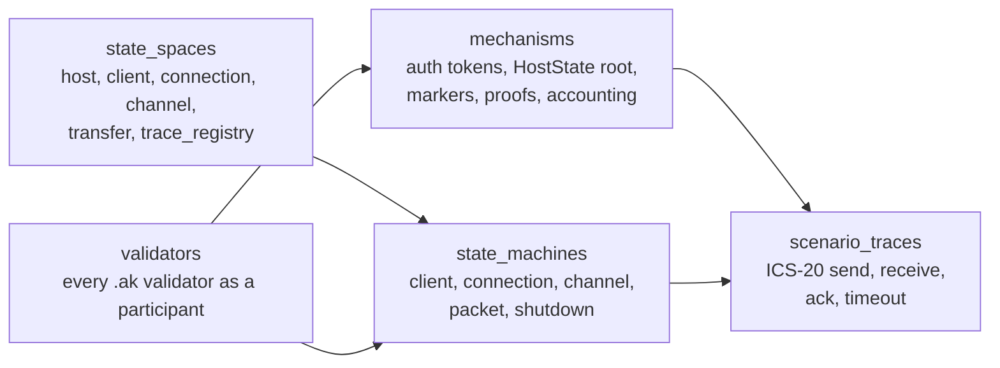
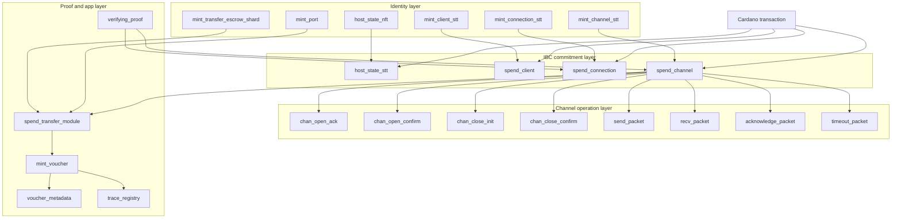
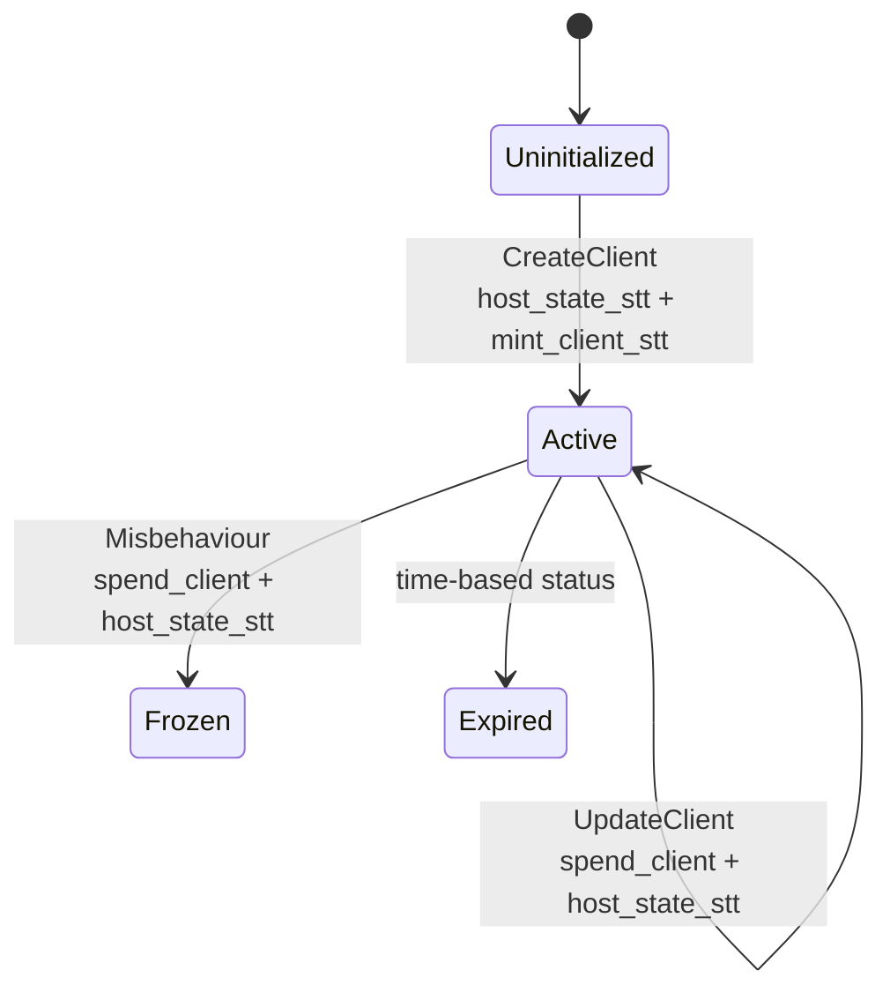
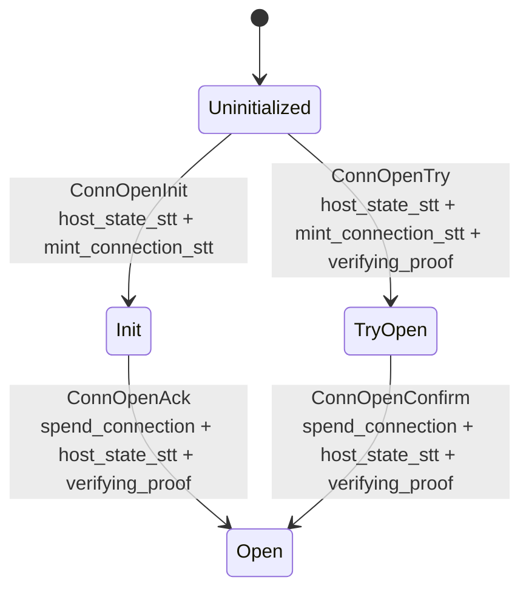
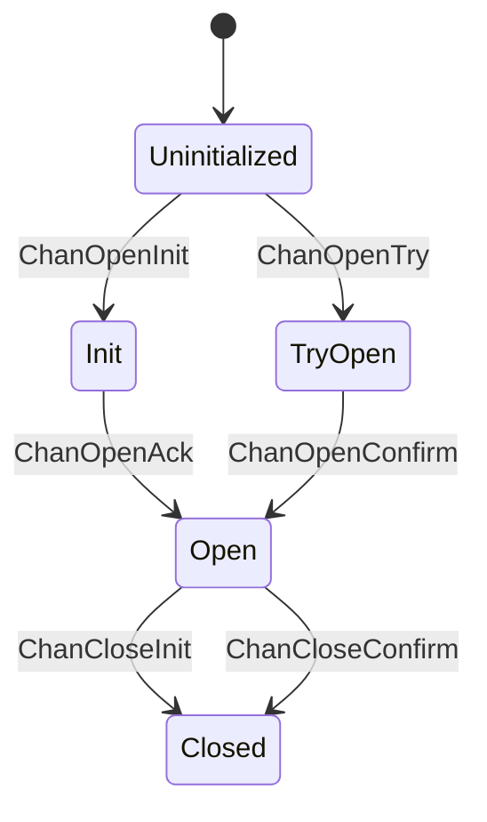
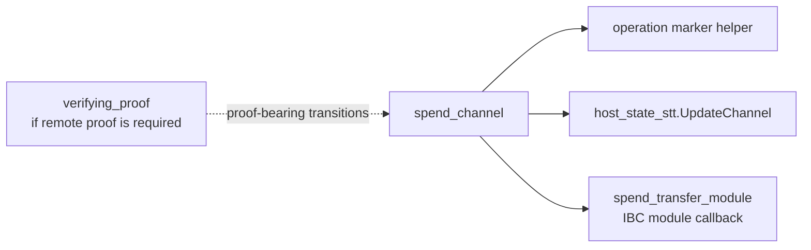
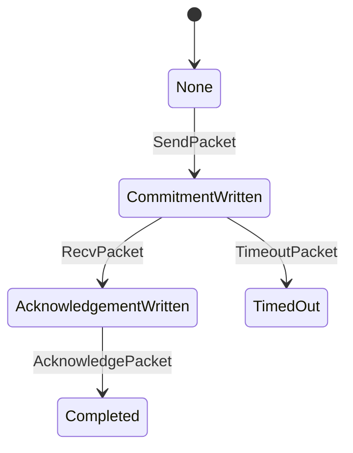
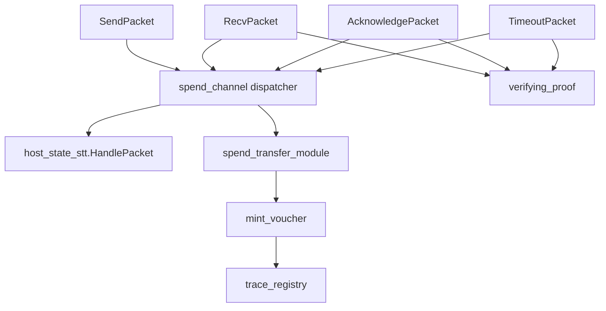

# Cardano IBC On-chain State Machine Model

This directory replaces the interactive prototype with a static formal model.
The source of truth is [`model.yaml`](model.yaml): every validator is represented
as a machine participant, and each protocol mechanism is described as
transitions over explicit state spaces.

The model is intentionally not a web app. It should be reviewable in GitHub,
diffable in pull requests, and precise enough to become input for generated
diagrams, invariant checks, or a future TLA+/Alloy model.

## Model Shape

## Global Machine

The protocol is a composed state machine. A Cardano transaction is a transition
attempt. Validators are transition guards. Outputs and minted assets are the
next-state witness.

## Lifecycle Machines

### Client

### Connection

### Channel

Each channel lifecycle transition is a composed transaction:

### Packet

Packet transitions are where most of the protocol coupling becomes visible:

## Validator Inventory

The validator inventory in [`model.yaml`](model.yaml) includes all non-test
validators under `cardano/onchain/validators`, including protocol validators,
operation helper policies, reference-only helpers, compile support validators,
and local/test stubs. The important production machines are:

| Machine | Source | Role |
| --- | --- | --- |
| `host_state_nft` | `validators/host_state_nft.ak` | root HostState identity |
| `host_state_stt` | `validators/host_state_stt.ak` | global commitment root transition checker |
| `mint_client_stt` | `validators/minting_client_stt.ak` | client state-thread token |
| `spend_client` | `validators/spending_client.ak` | client update and misbehaviour |
| `mint_connection_stt` | `validators/minting_connection_stt.ak` | connection state-thread token |
| `spend_connection` | `validators/spending_connection.ak` | proof-bearing connection updates |
| `mint_channel_stt` | `validators/minting_channel_stt.ak` | channel state-thread token |
| `spend_channel` | `validators/spending_channel.ak` | channel dispatcher and HostState coupling |
| `send_packet` | `validators/spending_channel/send_packet.ak` | SendPacket checks and marker |
| `recv_packet` | `validators/spending_channel/recv_packet.ak` | RecvPacket checks and marker |
| `acknowledge_packet` | `validators/spending_channel/acknowledge_packet.ak` | ack checks and marker |
| `timeout_packet` | `validators/spending_channel/timeout_packet.ak` | timeout checks and marker |
| `spend_transfer_module` | `validators/spending_transfer_module.ak` | ICS-20 callbacks and accounting |
| `mint_voucher` | `validators/minting_voucher.ak` | voucher mint, burn, refund |
| `trace_registry` | `validators/trace_registry.ak` | voucher trace reverse lookup |
| `verifying_proof` | `validators/verifying_proof.ak` | ICS-23 proof marker |

## How To Extend The Model

When a validator branch changes, update the same information in
[`model.yaml`](model.yaml):

- add or update the validator entry;
- update the affected mechanism;
- update the lifecycle transition;
- update scenario traces for user-visible flows such as ICS-20 send, receive,
  acknowledgement, timeout, channel open, or shutdown;
- cross-check the related labels in [`../../../../INVARIANTS.md`](../../../../INVARIANTS.md).
