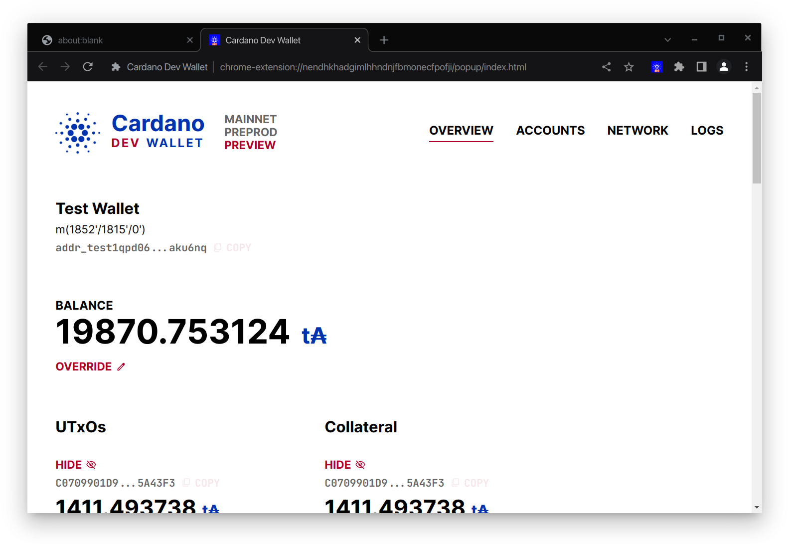

# Cardano Dev Wallet

A browser extension that implements [CIP-30](https://cips.cardano.org/cip/CIP-30/) Cardano wallet connector with a UI that is more convenient for developers than mainstream user-oriented wallets.

Forked from https://github.com/mlabs-haskell/cardano-dev-wallet (commit: 2b986bb8670cba13a429b9133bb54fcd096e924f)

This folk only to remove header.content-type (Chrome will reject the submitTx call to Ogmios, since Ogmios won't return "Access-Control-Allow-Headers" for it).

## User Guide

See [guide/Readme.md](guide/Readme.md)

## Workflow

`cd webext` before issuing any of the commands below.

### Build to use
- Run: `npm install && node build.js --release`. This will build the extension to folder `webext/build`
- Open `chrome://extensions` in the Chrome browser. Enable Developer mode (top right corner)
- Click load unpacked, select folder `webext/build`
- Enjoy!

### Develop UI
- Run: `node build.js`
- Open `http://localhost:8000/` in the browser.
- This will run the extension as a simple webpage.
  - No webextension features will be available, like connecting to a dApp.
  - Just for faster feedback cycles when tweaking the UI.

### Develop WebExtension
- Run: `node build.js --run`
- Chrome will launch with the extension loaded.
- Configure the network and accounts to start developing.
- Any changes to the source code will auto build & reload the extension.

### Bundling
- Run: `node build.js --bundle`

### More Options
- Run: `node build.js --help` to see all the available options.

## Plutip

See [plutip/README.md](plutip/README.md) to see how to configure Plutip for use with the extension.

## Devloper Notes

See [DevNotes.md](DevNotes.md)
