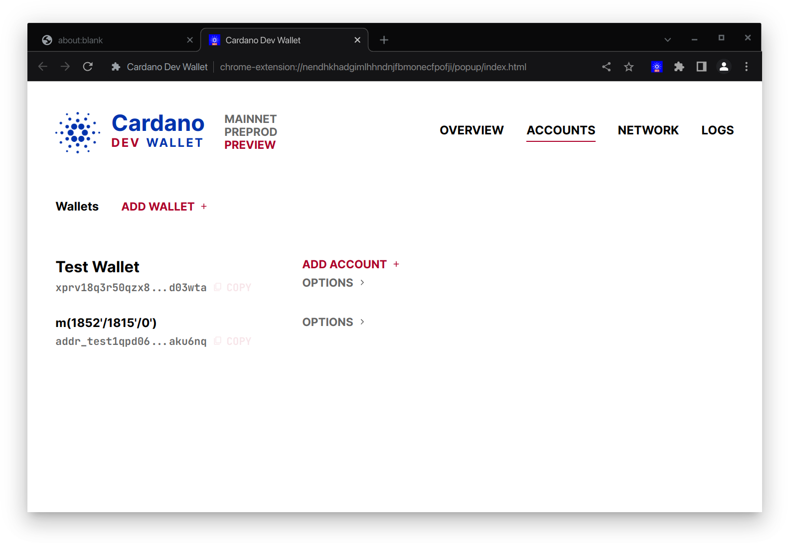
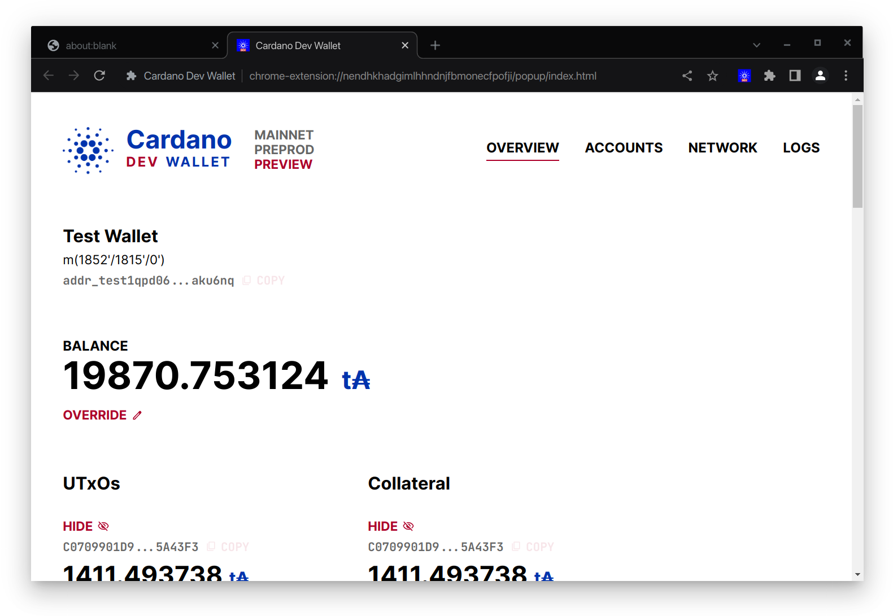

# User Guide

## Table of Contents

-   [Home page](#home-page)
-   [Configuration](#configuration)
    -   [Configure
        Accounts](#configure-accounts)
        -   [Add Root Key](#add-root-key)
        -   [Add Account](#add-account)
        -   [Activate Account](#activate-account)
    -   [Configure Network
        Backend](#configure-network-backend)
    -   [Add Backend](#add-backend)
    -   [Activate Backend](#activate-backend)
-   [Features](#features)
    -   [Overview](#overview)
    -   [Override Balance](#override-balance)
    -   [Override UTxOs and Collateral
        UTxOs](#override-utxos-and-collateral-utxos)
    -   [Logs of CIP 30 API
        Calls](#logs-of-cip-30-api-calls)

## Home page

Click on the extension button in the toolbar to open the extension home
page.

Use the three vertically stacked buttons to select the active network:
Mainnet, Preprod, Preview.

Configuration is stored separately for each network. Accounts and
network backends configured in one network won't be visible in another.

# Configuration

## Configure Accounts

> Note: At the moment, Cardano Dev Wallet only supports HD wallets.

Click the **Accounts** link in the header to go to Accounts page.

### Add Root Key

Click **Add Wallet**.

Enter a name and the private key (xprv...) or mnemonics corresponding to
the account.

Click **Save**.

### Add Account

Click **Add Account**.

Enter the account index.

Click **Save**.

### Activate Account

Click **Options** button next to the account (not the wallet) to reveal
the **Set Active** button.

Click **Set Active**.

The active account will be highlighted now.

## Configure Network Backend

Click the **Network** link in the header to go to the Network page.

## Add Backend

Click **Add** next to the **Backend Providers** heading. Select **OGMIOS/KUPO** in **Type**

Fill in the details and click **Save**.

# Features

## Overview

See the details of active account in the home page.

The active account and the balance is displayed at the top.

Scroll down to reveal the list of **UTxOs** and **Collateral** UTxOs are
displayed below.

## Override Balance

Click the **Override** button below the Balance section.

The balance display will change into an input box. The original balance
will be displayed on the right side.

Type in the new balance.

Click **Save**.

Click **Edit Override** to update the value.\
Click **Reset** to remove the override.

## Override UTxOs and Collateral UTxOs

Cardano Dev Wallet lets you remove some of the UTxOs from the list
returned by `getUtxos()` and `getCollateral()` CIP30 API calls.

This will help you simulate different cases for your dApps without
having to switch accounts.

Scroll down to the UTxOs list.

Click on the **Hide** button on top of a UTxO to hide that UTxO from
CIP30 API calls.

The hidden UTxOs will be shown dimmed.

Click on the **Show** button on top of the UTxO to stop hiding it.

## Logs of CIP 30 API Calls

> Note: As of now, the logs are not persisted anywhere. They will be
> reset when the extension tab is closed. They will not be reset while
> navigating between different pages in the extension tab.
>
> Logs will not be captured if the extension tab is closed. Keep the
> extension tab open to keep capturing the logs.

Click the **Logs** link in the header to go to the Logs page.

Make some API calls from your dApp to see the logs.

