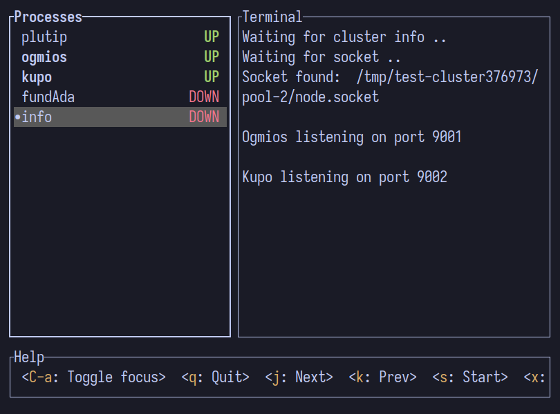
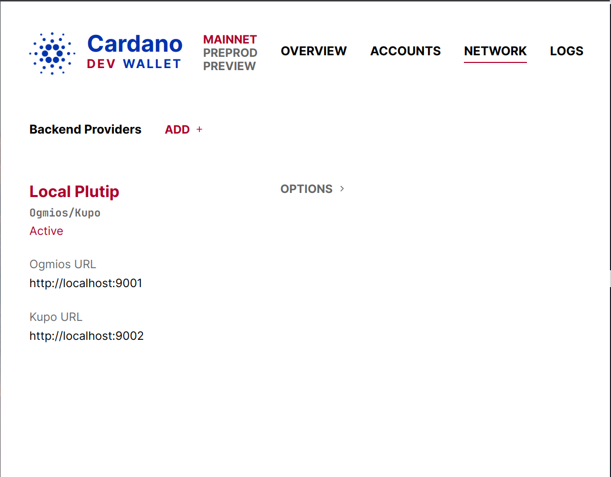
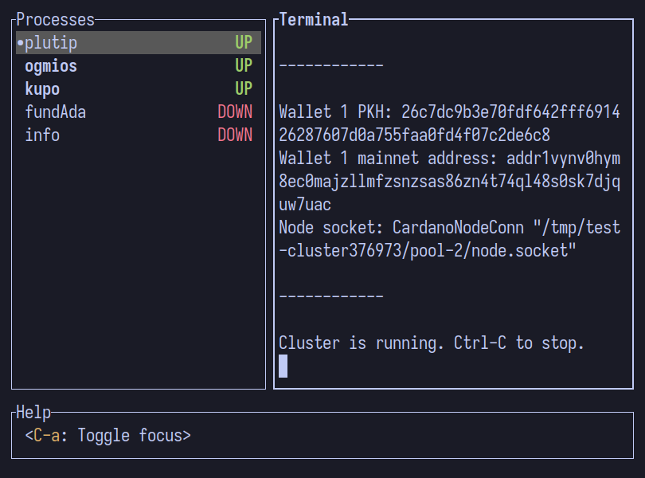
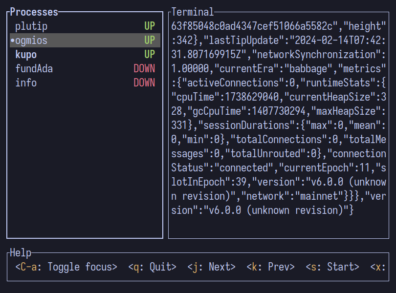
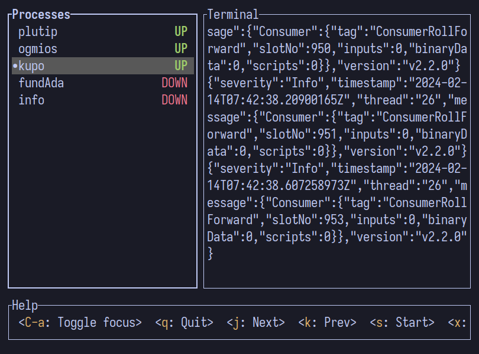
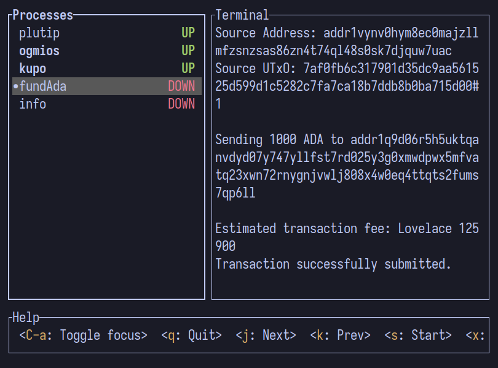

# Plutip + Ogmios + Kupo configuration

This is a nix flake which automatically starts plutip, ogmios and kupo
and send some ADA to a predefined wallet.

## Usage

`nix run .`

Wait till the port is displayed in `info` tab.

Configure the extension to use the Ogmios and Kupo instances connected to the launched plutip cluster.

## User Interface

We use [mprocs](https://github.com/pvolok/mprocs) to manage the processes with a pretty TUI.

Press Up/Down arrow to switch between different processes.

Press q to stop all processes and exit.

## Configuration

Configuration is done in `.env` file in this folder.
See [env.example](./env.example) for available options.

## Screenshots

