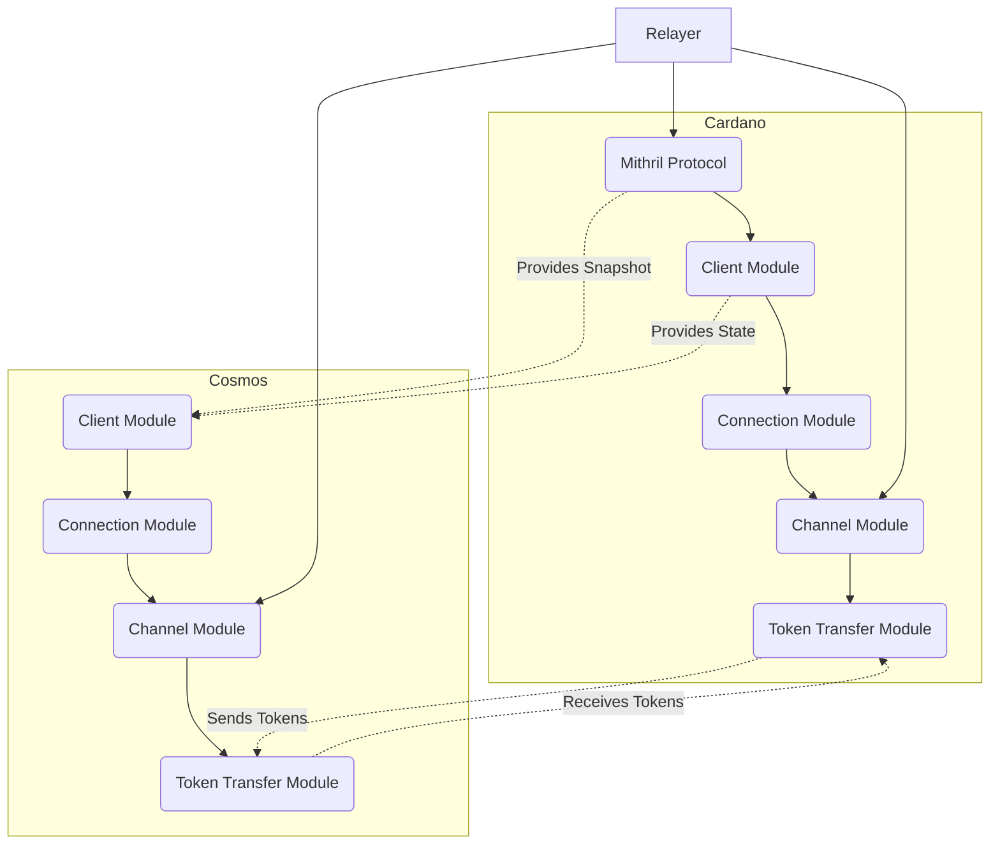
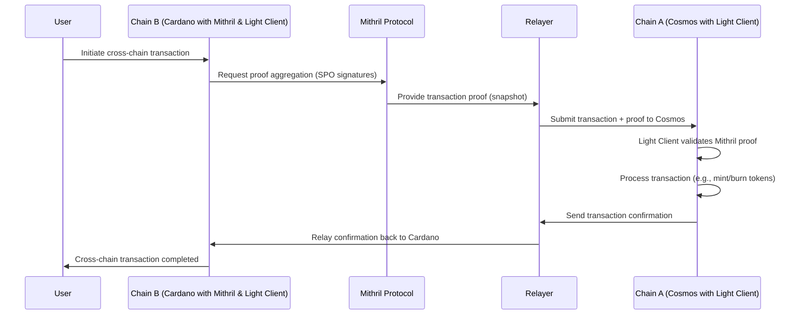

### 2. Solution Architecture Overview

This section presents a detailed high-level overview of the architecture for implementing the Inter-Blockchain Communication (IBC) protocol on Cardano, focusing on the core components and interactions between systems. We describe how **Aiken**, as the smart contract language, and **Mithril Protocol**, as a threshold signature mechanism, are integrated into the architecture. The Mithril Protocol acts as an intermediary layer that addresses Cardano's consensus constraints on threshold signatures by aggregating signatures from Cardano's SPOs (Stake Pool Operators) to create transaction snapshots. This aggregated proof is used by the Cosmos Light Client to verify transactions on Cardano.

### Table of Contents
  - [Core Components](#core-components)
  - [IBC Modules Overview](#ibc-modules-overview)
  - [IBC Modules Interaction Diagram](#ibc-modules-interaction-diagram)
  - [High-Level Flow of IBC Transactions](#high-level-flow-of-ibc-transactions)
  - [Summary](#summary)

### Core Components

1. **Light Clients**  
   Light clients are critical in verifying cross-chain messages, providing proof that the state of the counterpart blockchain is valid. On both Cardano and Cosmos, light clients verify cryptographic proofs, but due to the difference in consensus mechanisms, the Cardano side integrates with **Mithril Protocol** for generating secure and efficient proofs. Cosmos, in contrast, implements light clients directly using its native consensus for threshold signatures.

2. **Mithril Protocol**  
   The **Mithril Protocol** aggregates signatures from a set of Stake Pool Operators (SPOs) to create a compact and verifiable proof of the Cardano chain’s state. This aggregated proof serves as the snapshot that the Cosmos IBC light client uses to validate the state of Cardano during IBC transactions. This design circumvents the limitation that Cardano’s consensus does not natively support threshold signatures for transaction proofs, as required by the Cosmos IBC light client.

3. **Relayers**  
   Relayers are off-chain entities responsible for transmitting IBC messages between blockchains. In the Cardano IBC implementation, **Relayers interact with the Mithril Protocol** to retrieve transaction proofs and snapshots, which are then sent to the Cosmos side for verification. Relayers play a key role in ensuring that cross-chain messages are transmitted securely and in a decentralized manner, with multiple relayers operating simultaneously for redundancy.

4. **Threshold Signatures via Mithril Protocol**  
   Instead of using native threshold signatures (which Cosmos supports but Cardano does not), the Mithril Protocol aggregates SPO signatures to generate a single, verifiable snapshot of Cardano’s state. This signature aggregation allows the Cosmos Light Client to trust the snapshot without requiring individual verifications for every transaction, thus ensuring security and scalability.

5. **Aiken Smart Contracts**  
   On the Cardano side, **Aiken** is the primary smart contract language used for executing IBC-related operations. The Aiken-based contracts are responsible for managing IBC token transfers, minting, burning, and handling other cross-chain message logic. Aiken provides an efficient, secure, and developer-friendly environment for executing smart contracts on Cardano.

### IBC Modules Overview

The IBC protocol is built using several core modules that interact with each other to manage cross-chain transactions, communication, and security. Here’s a breakdown of the core IBC modules and their roles in this architecture, as well as their interaction with the Mithril Protocol and Aiken smart contracts.

1. **ICS 2: Client Module**  
   This module manages the lifecycle of IBC light clients. The client module ensures that the Cardano state is tracked by the Cosmos chain (and vice versa), leveraging the **Mithril Protocol** to provide cryptographic proof of the Cardano chain’s state for verification.  
   Reference: [ICS 002: IBC Client Semantics](https://github.com/cosmos/ibc/tree/main/spec/core/ics-002-client-semantics)

2. **ICS 3: Connection Module**  
   Responsible for managing and maintaining secure connections between blockchains, the connection module ensures the authenticity and security of the communication between the two chains. It works closely with the light client and relayer to establish trust.  
   Reference: [ICS 003: Connection Semantics](https://github.com/cosmos/ibc/tree/main/spec/core/ics-003-connection-semantics)

3. **ICS 4: Channel Module**  
   The channel module manages message flow across chains, ensuring message ordering and delivery reliability. The interaction between this module and the relayers ensures that cross-chain transactions are executed in the correct order and without errors.  
   Reference: [ICS 004: Channel and Packet Semantics](https://github.com/cosmos/ibc/tree/main/spec/core/ics-004-channel-and-packet-semantics)

4. **ICS 20: Token Transfer Module**  
   This module handles the cross-chain transfer of tokens between Cardano and Cosmos. On the Cardano side, Aiken smart contracts are used to lock, mint, and burn tokens based on the state of the counterpart chain, ensuring correct token balances across both networks.  
   Reference: [ICS 020: Fungible Token Transfer](https://github.com/cosmos/ibc/tree/main/spec/app/ics-020-fungible-token-transfer)

5. **ICS 18: Relayer Module**  
   Defines the protocol for relayers that are responsible for carrying messages between chains. In this architecture, relayers interact with the **Mithril Protocol** to retrieve and transmit cryptographic proofs to the Cosmos side.  
   Reference: [ICS 018: Relayer Algorithms](https://github.com/cosmos/ibc/tree/main/spec/core/ics-018-relayer-algorithms)

#### IBC Modules Interaction Diagram

Here’s a **diagram** showing how the IBC modules and Mithril Protocol interact within the Cardano-Cosmos IBC architecture:

- **Cardano** and **Cosmos** represent the two blockchains, each equipped with their own IBC modules.
- The **Mithril Protocol** aggregates proofs from Cardano's SPOs and provides transaction snapshots to the Cosmos Light Client for verification.
- **Relayers** communicate with Mithril to retrieve transaction snapshots and proofs, which are then relayed to the corresponding IBC modules.

### High-Level Flow of IBC Transactions

The high-level flow of IBC transactions flow begins with the initiation of the transaction on **Cardano**, followed by the **Mithril Protocol** aggregating the transaction proof. The **Relayer** retrieves this proof and sends it to **Cosmos**, where the proof is verified before completing the cross-chain transaction.

#### Steps of the IBC Transaction Flow:

1. **Initiation on Cardano (Chain B)**:  
   A user or dApp initiates a cross-chain transaction on Cardano (Chain B), such as transferring tokens or sending a message to Cosmos (Chain A).

2. **Mithril Protocol Aggregation**:  
   The **Mithril Protocol** aggregates signatures from Cardano's Stake Pool Operators (SPOs) to create a cryptographic proof of the transaction, ensuring the proof is valid and can be used on Cosmos.

3. **Relayer Retrieves Proof**:  
   The **Relayer** queries the Mithril Protocol to retrieve the transaction proof from Cardano.

4. **Proof Sent to Cosmos (Chain A)**:  
   The **Relayer** transmits the proof, along with the transaction data, to the Cosmos blockchain (Chain A).

5. **Light Client Validation on Cosmos**:  
   The **Cosmos Light Client** verifies the cryptographic proof generated by the Mithril Protocol on Cardano, confirming that the transaction can be trusted.

6. **Completion on Cosmos**:  
   Once the proof is verified, the Cosmos blockchain processes the transaction, updating the state accordingly (e.g., minting tokens or recording the message).

7. **Relayer Sends Confirmation Back to Cardano**:  
   After the transaction is completed on Cosmos, the **Relayer** sends a confirmation back to Cardano to finalize the cross-chain transaction.

#### IBC Transaction Flow

### Key Components in the Diagram:

- **Cardano (Chain B)**: Where the cross-chain transaction is initiated. Cardano interacts with the **Mithril Protocol** to generate proof through aggregated SPO signatures.
- **Mithril Protocol**: Aggregates signatures from Cardano's SPOs to create a transaction snapshot (proof), which is crucial for validating the transaction on Cosmos.
- **Relayer**: Responsible for retrieving the transaction proof from Mithril and submitting it to Cosmos. After Cosmos processes the transaction, the relayer sends the confirmation back to Cardano.
- **Cosmos (Chain A)**: Verifies the proof using its **Light Client** and processes the transaction (e.g., minting or burning tokens) based on the cross-chain request from Cardano.

The transaction starts on **Cardano**, where the **Mithril Protocol** aggregates the necessary proof for verification on **Cosmos**. The **Relayer** is the key intermediary, handling proof retrieval and message passing between the chains. Once Cosmos verifies the proof via its **Light Client**, the transaction is finalized, and confirmation is sent back to Cardano to complete the cross-chain operation.

This flow ensures that Cardano’s unique consensus model (which doesn't natively support threshold signatures) is addressed by the Mithril Protocol, which securely aggregates and delivers transaction proofs, ensuring seamless interoperability between Cardano and Cosmos.

### Summary

The integration of the **Mithril Protocol** into the Cardano IBC architecture addresses the challenge posed by Cardano’s consensus not supporting threshold signatures natively. Mithril provides a mechanism for aggregating signatures from SPOs, generating secure transaction proofs that the Cosmos Light Client can validate. The use of **Aiken** as the smart contract language for handling token operations on Cardano ensures efficient and secure execution of cross-chain transactions. This architecture leverages the modularity of IBC, enhanced by Mithril, to create a robust and scalable solution for cross-chain interoperability.