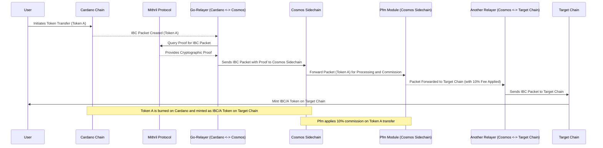
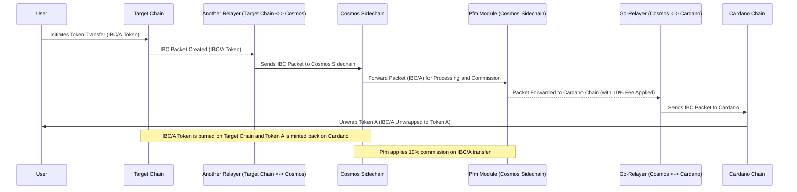
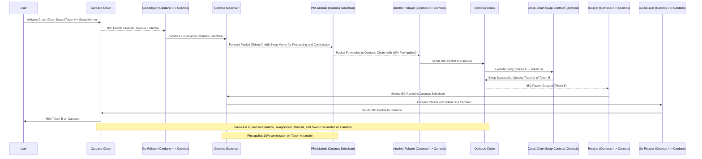

### 5. High-Level Solution Design

This section provides a conceptual overview of the architecture for the Cardano IBC implementation. The design focuses on how the key components work together to enable cross-chain communication, token transfers, and interoperability between Cardano, Cosmos Sidechain, and Osmosis.

#### 5.1. Key Components Overview

The diagram illustrates the interaction between several core and infrastructure components across different blockchain layers. These components are grouped into **Cardano Chain**, **Cosmos Sidechain**, **Osmosis Chain**, and applications responsible for communication between these chains.

##### 5.1.1. Core Components

- **Aiken IBC Contracts** (Cardano Chain):  
  This component is responsible for handling IBC transactions and managing IBC packet transfers on the Cardano blockchain. These contracts are built using the Aiken language to facilitate secure and scalable interoperability.

- **IBC Module** (Cosmos Sidechain):  
  The core module on the Cosmos sidechain handles packet transfers between Cardano and Cosmos networks. This module manages the communication protocol required for cross-chain transactions.

- **Pfm Module (Packet Forward Middleware)** (Cosmos Sidechain):  
  This middleware applies a 10% commission fee on token transfers and forwards IBC messages between the Cardano and Cosmos ecosystems.

- **Interchain Transfer Module** (Cosmos Sidechain):  
  The Interchain Transfer Module allows for fungible token transfers between Cardano and Cosmos, leveraging the IBC protocol.

- **Cross-Chain Swap Contracts** (Osmosis Chain):  
  This module on the Osmosis chain is responsible for managing cross-chain swaps and other transaction-based activities within the Osmosis ecosystem.

##### 5.1.2. Supporting Infrastructure Components

- **Kupmios (Kupo + Ogmios)**:  
  These tools support transaction building and submission, with **Kupo** indexing chain data and **Ogmios** acting as a lightweight communication layer with Cardano nodes.

- **Mithril Protocol**:  
  The Mithril protocol enhances chain synchronization and security by generating proofs for IBC transactions. It consists of:
  - **Mithril Signer (Cardano SPO)**:  
    A key component managed by Cardano Stake Pool Operators (SPO) to create cryptographic proofs.
  - **Mithril Aggregator**:  
    Collects proofs from multiple Mithril signers and submits them to the blockchain, ensuring faster and more secure finality of IBC messages.

- **Cardano-db-sync**:  
  Used to query IBC events and keep the IBC gateway and relayers in sync with the current state of the Cardano blockchain.

##### 5.1.3. Application Layer

- **IBC Application**:  
  This is the primary interface that enables users to interact with IBC functionality, such as token transfers and swaps between different blockchains.

- **IBC Explorer**:  
  Provides visibility into IBC transactions and insights into the chain state, allowing users and developers to monitor the IBC protocol's status.

- **Subql - Multichain Indexer**:  
  Indexes and queries IBC transactions across multiple chains, enabling developers to query blockchain events efficiently. The **ouroboros-miniprotocols-ts** library helps communicate with Cardano chain index events from Subql.

##### 5.1.4. Relayers

- **Go-Relayer**:  
  The Go-Relayer is a core component responsible for transferring messages between the Cardano blockchain and the Cosmos Sidechain. It is a lightweight relayer that handles packet forwarding and ensures decentralized and permissionless communication between chains.

- **Hermes Relayer**:  
  Hermes relayer is deployed between the Cosmos Sidechain and the Osmosis Chain to facilitate message passing and enable cross-chain transactions such as token swaps.

#### 5.2. Interaction Between Components

The IBC system is designed to ensure smooth communication between Cardano, Cosmos Sidechain, and Osmosis by relaying messages through the various layers.

- **User Initiation**:  
  Users initiate actions through the IBC Application, such as cross-chain token swaps or transfers. These actions are transmitted through a secure and decentralized relayer network.

- **Message Processing on the Cardano Chain**:  
  Aiken IBC Contracts on Cardano are responsible for managing the IBC packet transfers. These contracts handle the requests sent by users and communicate with the Cosmos Sidechain to forward IBC packets.

- **Communication via Kupmios and Mithril**:  
  The Kupmios infrastructure (Kupo + Ogmios) helps build and submit transactions while the Mithril protocol ensures the synchronization of data and transaction proofs across the networks. Mithril's signer and aggregator modules help achieve secure communication between chains.

- **Cosmos Sidechain Processing**:  
  The IBC Module on the Cosmos Sidechain receives the packets from the Cardano chain. The Pfm Module applies a commission to the token transfers, while the Interchain Transfer Module finalizes the transactions.

- **Cross-Chain Token Swaps on Osmosis**:  
  On the Osmosis Chain, cross-chain swaps are facilitated by the swap contracts. The Hermes relayer helps forward the messages from the Cosmos Sidechain to Osmosis, where token swaps and other DeFi operations occur.

- **Monitoring and Tracking**:  
  The Subql Multichain Indexer helps track the IBC transactions and state across chains. The IBC Explorer provides a user-friendly interface for viewing the status of IBC transfers.

#### 5.3. Smart Contract Operations

The architecture relies heavily on smart contract logic for IBC transactions and cross-chain swaps. The contracts in the **Aiken IBC Contracts** and **CosmWasm Contracts** are responsible for:

- Verifying the integrity of token transfers and ensuring that appropriate transaction fees are applied.
- Minting and burning tokens during transfers, ensuring the correct representation of assets on the target chains.

#### 5.4 Token Mint Flow Diagram (Token A → IBC/A)

#### Key Steps Explained:

1. **User Initiation**: The user initiates the token transfer of **Token A** on the **Cardano Chain**.
   
2. **IBC Packet Creation**: The Cardano Chain prepares the IBC packet for **Token A**, containing the transfer details.

3. **Mithril Proof**: The **Go-Relayer** queries the **Mithril Protocol** to obtain cryptographic proof for the transaction, ensuring security and finality.

4. **Relayer Sends the IBC Packet**: The Go-Relayer forwards the IBC packet containing **Token A** to the **Cosmos Sidechain**.

5. **Pfm Module in Cosmos Sidechain**: The **Pfm Module** processes the packet on the Cosmos Sidechain, applying a 10% commission on the **Token A** transfer and forwarding the packet to the next relayer.

6. **Relayer (Cosmos to Target Chain)**: The second relayer forwards the packet from the Cosmos Sidechain to the **Target Chain**.

7. **Minting IBC/A Token**: Once the packet is received on the **Target Chain**, **IBC/A token** is minted on the Target Chain, while **Token A** is burned on Cardano.

#### 5.5 Token Unwrap Flow (IBC/A → Token A)

#### Key Steps Explained:

1. **User Initiation**: The user initiates the transfer of **IBC/A token** on the **Target Chain**, intending to send it back to the **Cardano Chain**.

2. **IBC Packet Creation**: The Target Chain creates an IBC packet containing the transfer details for the **IBC/A token**.

3. **Relayer (Target Chain to Cosmos Sidechain)**: The first relayer forwards the IBC packet from the **Target Chain** to the **Cosmos Sidechain**.

4. **Pfm Module in Cosmos Sidechain**: The **Pfm Module** processes the packet, applying a 10% commission on the transfer, and then forwards the packet to the next relayer for transmission to **Cardano**.

5. **Relayer (Cosmos Sidechain to Cardano)**: The **Go-Relayer** (Relayer1) forwards the IBC packet from the **Cosmos Sidechain** to the **Cardano Chain**.

6. **Unwrapping on Cardano Chain**: Once the IBC packet arrives on the **Cardano Chain**, the **IBC/A token** is unwrapped, and the original **Token A** is minted back to the user on **Cardano**.

7. **Burn/Mint Mechanism**: **IBC/A token** is burned on the **Target Chain**, and **Token A** is minted back on the **Cardano Chain**.

#### 5.6 Cross-Chain Swap Flow (Token A → Token B via Osmosis)

#### Key Steps Explained:

1. **User Initiation**: The user initiates a **cross-chain swap** on **Cardano**, providing **Token A** and including a **memo** with the swap information. This memo indicates the swap action to be performed on **Osmosis**.

2. **IBC Packet Creation**: The **Cardano Chain** creates an IBC packet with **Token A** and includes the **swap memo**.

3. **Relayer (Cardano to Cosmos Sidechain)**: The **Go-Relayer** forwards the IBC packet to the **Cosmos Sidechain**.

4. **Pfm Module in Cosmos Sidechain**: The **Pfm Module** processes the packet on the **Cosmos Sidechain**, applying a 10% commission on **Token A** and forwarding the packet to the next relayer for transfer to **Osmosis**.

5. **Relayer (Cosmos to Osmosis)**: The second relayer forwards the IBC packet from the Cosmos Sidechain to the **Osmosis Chain**.

6. **Swap on Osmosis**: The **Cross-Chain Swap Contract** on **Osmosis** receives the IBC packet, executes the swap from **Token A to Token B**, and creates a new transfer request for **Token B** to be sent back to **Cardano**.

7. **IBC Packet Creation for Token B**: After the swap is completed, an IBC packet is created for **Token B** to be transferred back to **Cardano**.

8. **Relayer (Osmosis to Cosmos)**: The third relayer forwards the IBC packet with **Token B** from the **Osmosis Chain** back to the **Cosmos Sidechain**.

9. **Relayer (Cosmos to Cardano)**: The **Go-Relayer** forwards the packet containing **Token B** from the **Cosmos Sidechain** to **Cardano**.

10. **Minting Token B on Cardano**: Upon receiving the IBC packet, **Token B** is minted on the **Cardano Chain**, completing the swap process.

11. **Burn/Mint Mechanism**: **Token A** is burned on **Cardano**, swapped to **Token B** on **Osmosis**, and **Token B** is minted back on **Cardano**.

---

This flow adds the necessary **memo** to trigger the **swap action** on **Osmosis** and incorporates the swap completion with a new IBC packet created for transferring **Token B** back to **Cardano**.