### 6. **Detailed Solution Architecture**

This section describes the detailed architecture required for establishing and maintaining cross-chain communication between **Cardano** and **Cosmos** using the **Mithril Protocol**. We will walk through multiple flows, starting with the process of creating the **Mithril-based light client** on Cosmos, followed by additional flows for updating the client, connection establishment, channel creation, and token transfers.

### Table of Contents

- [6. **Detailed Solution Architecture**](#6-detailed-solution-architecture)
  - [6.1 **Key Components**](#61-key-components)
  - [6.2 **Flow 1: Creating the Mithril-Based Light Client on Cosmos**](#62-flow-1-creating-the-mithril-based-light-client-on-cosmos)
  - [6.3 **Flow 2: Creating a Cosmos-Based Light Client on Cardano**](#63-flow-2-creating-a-cosmos-based-light-client-on-cardano)
  - [6.4 **Flow 3: Updating the Mithril-Based Light Client on Cosmos**](#64-flow-3-updating-the-mithril-based-light-client-on-cosmos)
  - [6.5 **Flow 4: Updating the Cosmos-Based Light Client on Cardano**](#65-flow-4-updating-the-cosmos-based-light-client-on-cardano)
  - [6.6 **Flow 5: Connection Establishment Between Cardano and Cosmos**](#66-flow-5-connection-establishment-between-cardano-and-cosmos)
  - [6.7 **Flow 6: Channel Establishment Between Cardano and Cosmos**](#67-flow-6-channel-establishment-between-cardano-and-cosmos)
  - [6.8 **Flow 7: Transfer of Tokens Between Cardano and Cosmos**](#68-flow-7-transfer-of-tokens-between-cardano-and-cosmos)
  - [6.9 **Flow 8: Transfer of Tokens Between Cardano and Osmosis via Cosmos Sidechain (with PFM)**](#69-flow-8-transfer-of-tokens-between-cardano-and-osmosis-via-cosmos-sidechain-with-pfm)
  - [6.10 **Flow 9: Timeout Handling for Transfers**](#610-flow-9-timeout-handling-for-transfers)
  - [6.11 **Flow 10: Cross-Chain Swap via Osmosis Swap Contract**](#611-flow-10-cross-chain-swap-via-osmosis-swap-contract)


---

### 6.1 **Key Components**

Before describing the specific flows, let’s define the key components involved in the solution architecture:

#### 6.1.1 **Cardano Chain**  
The **Cardano blockchain** provides the source state information, such as block height, epoch number, and cryptographic signatures, which will be tracked by the **Mithril-based light client** on Cosmos. Cardano's state is continuously updated as new blocks are produced and epochs change.

#### 6.1.2 **Mithril Protocol**  
The **Mithril Protocol** aggregates cryptographic signatures from Cardano's **Stake Pool Operators (SPOs)** and produces verifiable **snapshots** of the Cardano blockchain. These snapshots allow other blockchains, like Cosmos, to validate the state of the Cardano chain. Mithril provides essential data, which is used to track and verify Cardano’s state via the light client on Cosmos.

#### 6.1.3 **Relayer**  
The **Relayer** is responsible for fetching the required data (generated by the Mithril Protocol) from the Cardano chain and transmitting it to the **Cosmos network**. It plays a crucial role in cross-chain communication, facilitating the initialization and updates of the Mithril-based light client.

#### 6.1.4 **Cosmos Network**  
The **Cosmos blockchain** will host the **Mithril-based light client**. This light client will track the state of the Cardano blockchain using the data provided by the Mithril Protocol and transmitted by the Relayer. Once initialized, the light client can validate state updates and ensure the integrity of cross-chain operations between Cardano and Cosmos.

---

### 6.2 **Flow 1: Creating the Mithril-Based Light Client on Cosmos**

#### **Objective**:  
To create a **Mithril-based light client** on the Cosmos network, enabling it to track and verify the state of the Cardano blockchain. The Relayer will fetch the necessary state data from the Mithril Protocol and submit it to the Cosmos network.

#### **Steps in the Flow**:

1. **Mithril Protocol Aggregates Information**:  
   The **Mithril Protocol** running on Cardano continuously aggregates cryptographic signatures from the Stake Pool Operators (SPOs). This results in the generation of two key states:
   - **Mithril ClientState**: Represents the current state of the Cardano blockchain, including the chain ID, latest block height, and epoch information.
   - **Mithril ConsensusState**: Provides cryptographic snapshot hashes and certificates, used to verify the current and future states of the Cardano chain.

2. **Relayer Requests ClientState and ConsensusState**:  
   The **Relayer** sends a request to the **Mithril Protocol** to retrieve the **Mithril ClientState** and **Mithril ConsensusState**.

3. **Mithril Protocol Provides States**:  
   The **Mithril Protocol** responds by providing the requested **Mithril ClientState** and **Mithril ConsensusState**, containing the necessary blockchain data and cryptographic information.

4. **Relayer Submits the States to Cosmos**:  
   The **Relayer** submits the **Mithril ClientState** and **Mithril ConsensusState** to the **Cosmos network** to initialize the Mithril-based light client.

5. **Cosmos Initializes the Mithril-Based Light Client**:  
   The **Cosmos network** verifies the submitted states and initializes the **Mithril-based light client**. This light client will now track the state of the Cardano chain and will be able to verify future updates using the Mithril Protocol.

---

### **Proto Definitions: Mithril-Based ClientState and ConsensusState**

Here are the proto definitions for **ClientState** and **ConsensusState** that will be used in the light client creation process:

```proto
message ClientState {
  string chain_id = 1;
  Height latest_height = 2;
  Height frozen_height = 3;
  uint64 current_epoch = 4;
  google.protobuf.Duration trusting_period = 5 [(gogoproto.nullable) = false, (gogoproto.stdduration) = true];
  MithrilProtocolParameters protocol_parameters = 6;
  repeated string upgrade_path = 7;
}

message ConsensusState {
  uint64 timestamp = 1;
  MithrilCertificate first_cert_hash_latest_epoch = 2;
  string latest_cert_hash_tx_snapshot = 3;
}
```

---

### **Creating Mithril-Based Light Client on Cosmos**

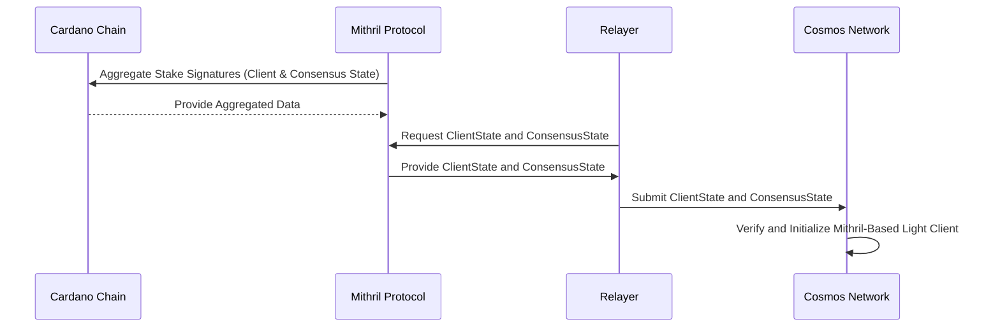

---

### **Summary of Flow 1**:

In this flow, the **Mithril Protocol** running on Cardano aggregates cryptographic signatures and produces the **Mithril ClientState** and **ConsensusState**. These states are fetched by the **Relayer** and transmitted to the **Cosmos network**, where they are used to initialize the **Mithril-based light client**. Once the light client is created, it can track and verify the state of the Cardano blockchain, ensuring accurate cross-chain communication between Cosmos and Cardano.

### 6.3 **Flow 2: Creating a Cosmos-Based Light Client on Cardano**

#### **Objective**:  
To create a **Cosmos-based light client** (specifically a **Tendermint-based light client**) on the **Cardano network**, enabling it to track and verify the state of the Cosmos blockchain.

#### **Steps in the Flow**:

1. **Cosmos Chain Provides Validator Set and Block Data**:  
   The Cosmos blockchain operates using a **Tendermint consensus** mechanism, which relies on a set of validators. To create a Tendermint-based light client on Cardano, the Cosmos network must provide:
   - **Validator set**: The list of validators responsible for validating blocks on Cosmos.
   - **Block header**: The latest block header, which contains information about the block, such as the block height, hash, and other relevant metadata.

2. **Relayer Requests Validator Set and Block Header from Cosmos**:  
   The **Relayer** initiates a request to the Cosmos network to retrieve the **validator set** and the **latest block header**.

3. **Cosmos Provides Validator Set and Block Header**:  
   The Cosmos network responds by sending the **validator set** and **latest block header** to the Relayer. This data is critical for initializing the Tendermint-based light client on Cardano.

4. **Relayer Submits the Validator Set and Block Header to Cardano**:  
   The **Relayer** submits the **validator set** and **block header** to the **Cardano network**. This information will be used to initialize the Cosmos-based light client on Cardano.

5. **Cardano Initializes the Cosmos-Based Light Client**:  
   The Cardano network verifies the submitted validator set and block header. Upon successful verification, it initializes the **Tendermint-based light client** on Cardano. This light client will now track the state of the Cosmos blockchain, verifying the block headers and updates from the validator set.

---

### **Creating Cosmos-Based Light Client on Cardano**

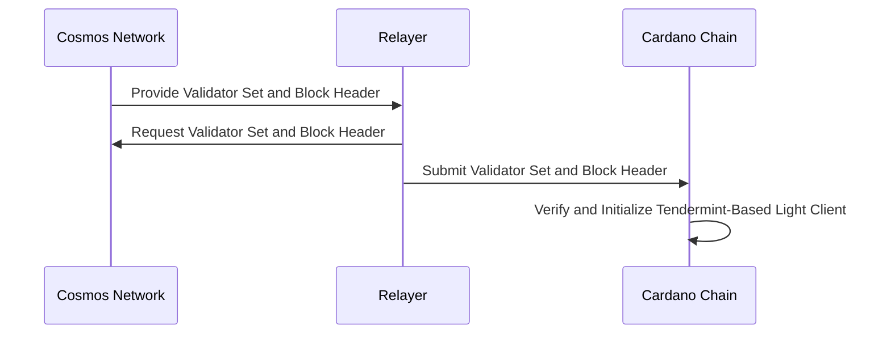

---

### **Explanation of Key States**

For this process, the key states involved are:
- **Validator Set**: This is the list of validators responsible for signing and validating blocks on the Cosmos chain. The validator set must be submitted to Cardano so that the Tendermint-based light client can verify Cosmos blocks.
- **Block Header**: The latest block header from the Cosmos chain, which contains essential block metadata. The block header is used to verify the chain's current state and track future updates.

---

### **Summary of Flow 2**:

In this flow, the **Relayer** retrieves the necessary information from the **Cosmos network** to initialize a **Tendermint-based light client** on Cardano. This light client will track the state of the Cosmos blockchain by verifying block headers and validating the current and future state using the validator set. Once the light client is created, it allows the Cardano chain to interact with Cosmos and verify its state.

### 6.4 **Flow 3: Updating the Mithril-Based Light Client on Cosmos**

#### **Objective**:  
To update the **Mithril-based light client** on the **Cosmos network** using a **Mithril certificate** as proof to verify the current state of the **Cardano chain**.

#### **Detailed Steps**:

1. **Cardano Chain State Updates**:  
   The state of the **Cardano chain** changes over time as new blocks are produced, new epochs are reached, and additional transactions are processed. These changes include updated block heights and epoch numbers, which need to be synchronized with the Cosmos network.

2. **Mithril Protocol Aggregates Information**:  
   The **Mithril Protocol** aggregates cryptographic signatures from **Stake Pool Operators (SPOs)** and generates a **Mithril certificate**. This certificate includes the necessary information to prove that the Cardano state has been validly updated. The certificate contains:
   - The block height and epoch number
   - Signatures from SPOs attesting to the validity of the Cardano state
   - The merkle root and snapshot of the current state

3. **Relayer Requests Mithril Certificate**:  
   The **Relayer** requests the latest **Mithril certificate** from the **Mithril Protocol**, which represents proof of the most recent state update on the Cardano chain.

4. **Mithril Protocol Provides Certificate**:  
   The **Mithril Protocol** responds by providing the requested certificate, which will be used to prove the update to the Mithril-based light client on Cosmos.

5. **Relayer Submits Certificate and Proof to Cosmos**:  
   The **Relayer** submits the **Mithril certificate** and the associated proof to the **Cosmos network**. This certificate will be used to verify the current state of the Cardano chain against the light client.

6. **Verify Membership**:  
   The **Mithril-based light client** on Cosmos runs the **verify membership** function using the certificate and proof provided by the Relayer. It verifies:
   - The aggregate signature and proof of correctness, following the **Mithril certificate verification flow** (as described [here](https://mithril.network/doc/mithril/mithril-protocol/certificates))

7. **Cosmos Updates the Mithril-Based Light Client**:  
   After successful verification, the Mithril-based light client on **Cosmos** updates its state to reflect the most recent changes from the **Cardano chain**. This ensures that the light client is synchronized with Cardano and ready to verify future updates.

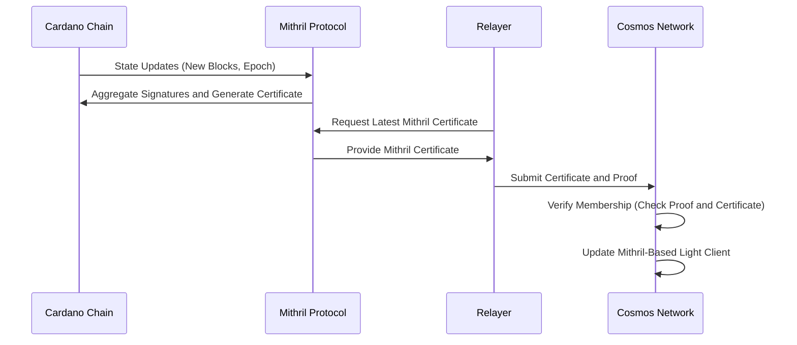

---

### 6.5 **Flow 4: Updating the Cosmos-Based Light Client on Cardano**

#### **Objective**:  
To update the **Tendermint-based light client** on **Cardano** using the **validator set** and **block header** from the **Cosmos network**.

#### **Detailed Steps**:

1. **Cosmos Chain State Updates**:  
   The **Cosmos network** continues to produce new blocks, and the validator set may also be updated periodically as validators are rotated in and out. To ensure the **Tendermint-based light client** on Cardano stays synchronized with the current state of Cosmos, it needs to verify these updates.

2. **Relayer Requests Updated Validator Set and Block Header**:  
   The **Relayer** sends a request to the Cosmos network to retrieve the **updated validator set** and the **latest block header**. The block header contains essential metadata like the block height and hash.

3. **Cosmos Provides Updated Validator Set and Block Header**:  
   The **Cosmos network** responds by providing the **validator set** (which lists the validators responsible for signing the latest block) and the **block header**.

4. **Relayer Submits Updated Validator Set and Block Header to Cardano**:  
   The **Relayer** submits the updated **validator set** and **block header** to the **Cardano chain**. These will be used to verify and update the **Tendermint-based light client**.

5. **Cardano Runs Verify Membership**:  
   The **Tendermint-based light client** on Cardano runs the **verify membership** function, using the updated validator set and block header to validate the signatures and block data. This ensures the light client correctly verifies the latest block produced on Cosmos.

6. **Cardano Updates the Cosmos-Based Light Client**:  
   After successful verification, the **Tendermint-based light client** on **Cardano** updates its state to reflect the latest validator set and block height from the **Cosmos network**. This ensures the light client is synchronized with Cosmos and ready to verify future updates.

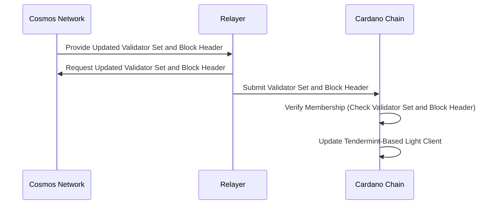

---

### **Summary of Flow 3 & Flow 4**:

- **Flow 3 (Mithril-based light client update on Cosmos)**: The **Mithril-based light client** on Cosmos is updated by submitting a **Mithril certificate** and running the **verify membership** process. The Mithril certificate contains cryptographic signatures and proofs that allow the Cosmos network to verify the state of the Cardano blockchain and update the light client accordingly.
  
- **Flow 4 (Tendermint-based light client update on Cardano)**: The **Tendermint-based light client** on Cardano is updated by receiving the latest **validator set** and **block header** from Cosmos. The light client verifies this data using the **verify membership** function, ensuring that it is synchronized with the current state of the Cosmos blockchain.

### 6.6 **Flow 5: Connection Establishment Between Cardano and Cosmos**

#### **Objective**:  
To establish a secure **IBC connection** between **Cardano** and **Cosmos**. The process follows the standard IBC handshake, with four steps: `connectionOpenInit`, `connectionOpenTry`, `connectionOpenAck`, and `connectionOpenConfirm`. Before each step (except `connectionOpenInit`), the **light client** of the chain processing the transaction must be updated to ensure it can verify the previous connection step.

---

### **Detailed Steps**:

1. **Step 1: `connectionOpenInit` (Called by Relayer on Cardano)**

   - **Relayer Calls `connectionOpenInit` on Cardano**:  
     The **Relayer** submits the `connectionOpenInit` transaction on **Cardano** to initiate the connection handshake. No prior **update client** is needed for this step because it does not require verifying any prior state. The transaction contains:
     - The **client identifier** for the **Cosmos light client** (Tendermint-based) on Cardano.
     - Proof of the **Mithril-based light client** on Cosmos, allowing Cosmos to verify the state of Cardano later during `connectionOpenTry`.

2. **Step 2: `connectionOpenTry` (Called by Relayer on Cosmos)**

   - **Update Cosmos Light Client on Cosmos**:  
     Before the **Relayer** submits the `connectionOpenTry` transaction on **Cosmos**, the **Mithril-based light client** on **Cosmos** must be updated to reflect the latest Cardano state, which includes the `connectionOpenInit` transaction. The **Relayer** fetches the latest **Mithril certificate** from the Mithril Protocol and submits an **update client** transaction on **Cosmos**.

   - **Relayer Calls `connectionOpenTry` on Cosmos**:  
     After the **Mithril-based light client** on Cosmos is updated, the **Relayer** submits the `connectionOpenTry` transaction on **Cosmos**, allowing the Cosmos chain to attempt establishing the connection. This transaction includes:
     - Proof of the **Tendermint-based light client** on Cardano, allowing Cardano to verify the state of Cosmos.

3. **Step 3: `connectionOpenAck` (Called by Relayer on Cardano)**

   - **Update Tendermint-Based Light Client on Cardano**:  
     Before the **Relayer** submits the `connectionOpenAck` transaction on **Cardano**, the **Tendermint-based light client** on **Cardano** must be updated to reflect the latest Cosmos state, which includes the `connectionOpenTry` transaction. The **Relayer** fetches the latest **validator set** and **block header** from Cosmos and submits an **update client** transaction on **Cardano**.

   - **Relayer Calls `connectionOpenAck` on Cardano**:  
     After the **Tendermint-based light client** on Cardano is updated, the **Relayer** submits the `connectionOpenAck` transaction on **Cardano**, acknowledging that the Cosmos state has been successfully verified.

4. **Step 4: `connectionOpenConfirm` (Called by Relayer on Cosmos)**

   - **Update Mithril-Based Light Client on Cosmos**:  
     Before the **Relayer** submits the `connectionOpenConfirm` transaction on **Cosmos**, the **Mithril-based light client** on **Cosmos** must be updated one last time to reflect the latest Cardano state, which includes the `connectionOpenAck` transaction. The **Relayer** submits an **update client** transaction on **Cosmos**.

   - **Relayer Calls `connectionOpenConfirm` on Cosmos**:  
     After the **Mithril-based light client** is updated, the **Relayer** submits the `connectionOpenConfirm` transaction on **Cosmos**, finalizing the connection. Both chains have now verified each other's states, completing the connection establishment and enabling secure cross-chain communication.

---

### **Connection Establishment Flow with Client Updates**

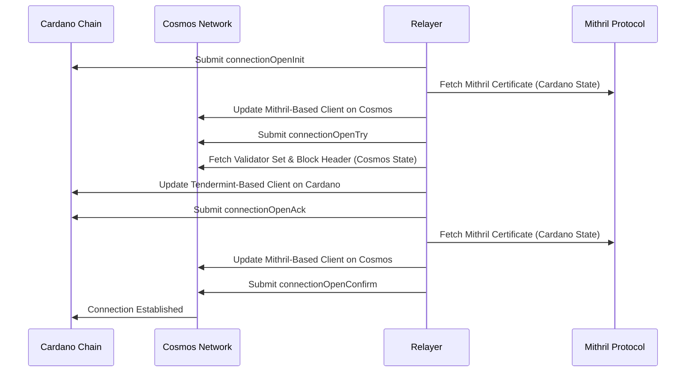

---

### **Key Aspects of the Flow**:

1. **No Client Update Before `connectionOpenInit`**:  
   The `connectionOpenInit` transaction on **Cardano** does not require any verification of prior state, so no **update client** transaction is necessary before submitting it.

2. **Client Updates Before Subsequent Steps**:  
   The **Relayer** must update the **light client** on the same chain where each subsequent step (`connectionOpenTry`, `connectionOpenAck`, and `connectionOpenConfirm`) will be called:
   - **Update Cosmos light client** before `connectionOpenTry` and `connectionOpenConfirm`.
   - **Update Cardano light client** before `connectionOpenAck`.

3. **Relayer’s Role**:  
   The **Relayer** manages the entire process by fetching necessary proofs (e.g., **Mithril certificates** and **Cosmos validator sets**) and submitting **update client** transactions before each connection step that requires state verification.

---

### **Summary of Flow 5**:

In this flow, the **Relayer** manages the connection establishment between **Cardano** and **Cosmos** using the standard IBC protocol. The process begins with `connectionOpenInit` on **Cardano**, which doesn’t require any client updates. For the remaining steps (`connectionOpenTry`, `connectionOpenAck`, and `connectionOpenConfirm`), the **light client** must be updated on the chain processing the transaction to ensure it can verify the state from the opposite chain. Once the connection is fully established, the two chains can securely communicate, enabling cross-chain transactions and messaging.

### 6.7 **Flow 6: Channel Establishment Between Cardano and Cosmos**

#### **Objective**:  
After successfully establishing a connection, the next step is to establish an **IBC channel** between **Cardano** and **Cosmos**. This flow consists of four key steps: `channelOpenInit`, `channelOpenTry`, `channelOpenAck`, and `channelOpenConfirm`. Just like with connection establishment, **light client updates** are required before verifying the state in each step after `channelOpenInit`.

---

### **Detailed Steps**:

1. **Step 1: `channelOpenInit` (Called by Relayer on Cardano)**

   - **Relayer Calls `channelOpenInit` on Cardano**:  
     The **Relayer** initiates the channel establishment process by submitting the `channelOpenInit` transaction on **Cardano**. No prior **update client** is required for this step, as there’s no need to verify the state of the counterparty chain at this point. The transaction includes:
     - The **port ID** and **channel ID** on **Cardano**.
     - Proof that the channel on **Cardano** is ready to be opened for communication with **Cosmos**.

2. **Step 2: `channelOpenTry` (Called by Relayer on Cosmos)**

   - **Update Cosmos Light Client on Cosmos**:  
     Before the **Relayer** submits the `channelOpenTry` transaction on **Cosmos**, the **Mithril-based light client** on **Cosmos** must be updated to reflect the latest state of **Cardano**, which includes the `channelOpenInit` transaction. The **Relayer** fetches the latest **Mithril certificate** and submits an **update client** transaction on **Cosmos**.

   - **Relayer Calls `channelOpenTry` on Cosmos**:  
     After updating the **Mithril-based light client**, the **Relayer** submits the `channelOpenTry` transaction on **Cosmos**, allowing Cosmos to attempt opening the channel. This transaction contains:
     - The **port ID** and **channel ID** on **Cosmos**.
     - Proof that **Cosmos** has received and verified the `channelOpenInit` transaction from **Cardano**.

3. **Step 3: `channelOpenAck` (Called by Relayer on Cardano)**

   - **Update Cardano Light Client on Cardano**:  
     Before the **Relayer** submits the `channelOpenAck` transaction on **Cardano**, the **Tendermint-based light client** on **Cardano** must be updated to reflect the latest state of **Cosmos**, which includes the `channelOpenTry` transaction. The **Relayer** fetches the latest **validator set** and **block header** from Cosmos and submits an **update client** transaction on **Cardano**.

   - **Relayer Calls `channelOpenAck` on Cardano**:  
     Once the **Cardano light client** is updated, the **Relayer** submits the `channelOpenAck` transaction on **Cardano**, acknowledging that the **Cosmos state** has been successfully verified.

4. **Step 4: `channelOpenConfirm` (Called by Relayer on Cosmos)**

   - **Update Cosmos Light Client on Cosmos**:  
     Before the **Relayer** submits the `channelOpenConfirm` transaction on **Cosmos**, the **Mithril-based light client** on **Cosmos** must be updated to reflect the latest **Cardano state**, which includes the `channelOpenAck` transaction. The **Relayer** fetches the latest **Mithril certificate** and submits an **update client** transaction on **Cosmos**.

   - **Relayer Calls `channelOpenConfirm` on Cosmos**:  
     After updating the **Mithril-based light client**, the **Relayer** submits the `channelOpenConfirm` transaction on **Cosmos**, finalizing the channel establishment. Both chains have now verified each other's states, and the channel is successfully opened, allowing communication over IBC.

---

### **Channel Establishment Flow**

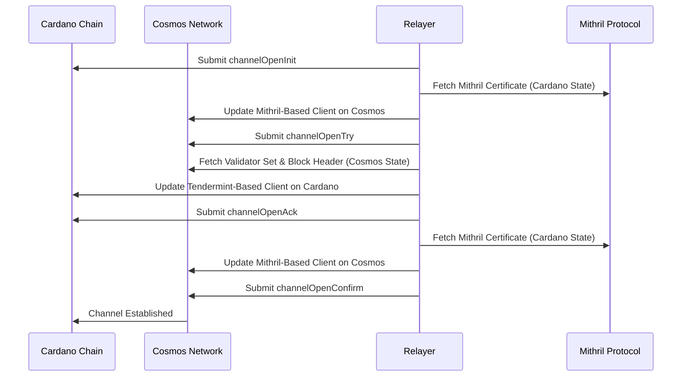

---

### **Key Aspects of the Flow**:

1. **No Client Update Before `channelOpenInit`**:  
   The `channelOpenInit` transaction on **Cardano** doesn’t require any verification of a prior state, so no **update client** is needed before this step.

2. **Client Updates for Subsequent Steps**:  
   Just like in the connection establishment flow, the **Relayer** must update the **light client** on the same chain where the next step (`channelOpenTry`, `channelOpenAck`, `channelOpenConfirm`) is going to be called:
   - **Update Cosmos light client** before calling `channelOpenTry` and `channelOpenConfirm`.
   - **Update Cardano light client** before calling `channelOpenAck`.

3. **Relayer’s Role**:  
   The **Relayer** handles all transactions and client updates, fetching the necessary proofs (e.g., **Mithril certificates** and **Cosmos validator sets**) and submitting **update client** transactions before each step that requires verification.

---

### **Summary of Flow 6**:

In this flow, the **Relayer** establishes an IBC channel between **Cardano** and **Cosmos**. The process begins with `channelOpenInit` on **Cardano**, which does not require any prior client update. For the subsequent steps (`channelOpenTry`, `channelOpenAck`, and `channelOpenConfirm`), the **light client** must be updated on the chain that is processing the transaction to ensure it can verify the state of the other chain. Once the channel is fully established, the two chains can communicate over IBC, enabling cross-chain transactions and messaging.

### 6.8 **Flow 7: Transfer of Tokens Between Cardano and Cosmos**

#### **Objective**:  
This flow describes how native tokens on **Cardano** are transferred to the **Cosmos Sidechain**, as well as how IBC tokens on **Cosmos** are returned to **Cardano**. The process uses the standard IBC packet protocol (`SendPacket`, `RecvPacket`, and `AckPacket`), with additional logic for handling native tokens via **escrow** and IBC tokens via **burning**.

---

### **Detailed Steps for Flow 7: Cardano to Cosmos Sidechain (Escrow and Mint)**

1. **Step 1: Generate `SendPacket` on Cardano**

   - **User Initiates Transfer (SendPacket)**:  
     The user initiates the transfer of native tokens from **Cardano** to the **Cosmos Sidechain**. This generates a **SendPacket** containing:
     - The amount and type of the native tokens.
     - The destination chain (**Cosmos Sidechain**).
     - The destination account on **Cosmos**.
   
   - **Escrow Native Tokens on Cardano**:  
     Since the tokens are native to **Cardano**, they are **escrowed** (locked in a smart contract) on **Cardano** when the **SendPacket** is created.

   - **Relayer Fetches SendPacket**:  
     The **Relayer** retrieves the **SendPacket** and prepares to submit it to **Cosmos**.

2. **Step 2: Update Cosmos Light Client on Cosmos**

   - **Update Mithril-Based Light Client on Cosmos**:  
     The **Relayer** updates the **Mithril-based light client** on **Cosmos** to verify the current state of **Cardano**. This involves fetching the latest **Mithril certificate** from the **Mithril Protocol** and submitting an **update client** transaction on **Cosmos**.

3. **Step 3: Submit `SendPacket` to Cosmos Sidechain**

   - **Relayer Submits SendPacket to Cosmos**:  
     Once the **Mithril-based light client** on **Cosmos** is updated, the **Relayer** submits the **SendPacket** via the IBC channel to the **Cosmos Sidechain**.

4. **Step 4: Cosmos Processes `RecvPacket` and Mints IBC Tokens**

   - **Cosmos Mints IBC Tokens**:  
     After receiving the **RecvPacket**, the **Cosmos Sidechain** verifies the packet and **mints IBC tokens** equivalent to the native tokens escrowed on **Cardano**.

5. **Step 5: Cosmos Sends `AckPacket` to Cardano**

   - **Cosmos Acknowledges the Transfer**:  
     After minting the tokens, **Cosmos** sends an **AckPacket** back to **Cardano**, confirming the successful minting of IBC tokens.

6. **Step 6: Cardano Receives `AckPacket` and Completes Transfer**

   - **Relayer Completes Transfer on Cardano**:  
     Once **Cardano** receives the **AckPacket**, the **Relayer** confirms that the transfer was successful.

---

### **Cardano to Cosmos Transfer (Escrow and Mint)**

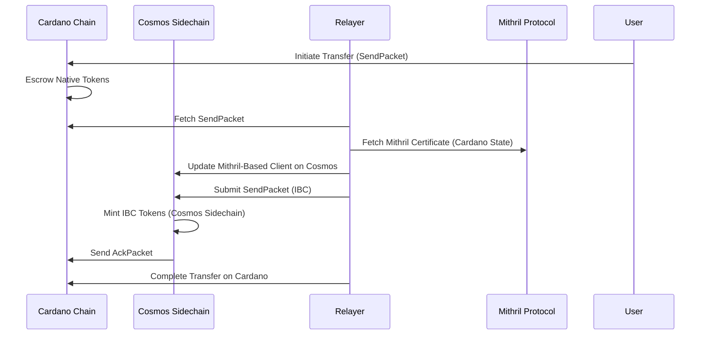

---

### **Detailed Steps for Flow 8: Cosmos to Cardano (Burn and Unescrow)**

1. **Step 1: Generate `SendPacket` on Cosmos**

   - **User Initiates Return (SendPacket)**:  
     The user initiates the return of their IBC tokens from **Cosmos** to **Cardano**. This generates a **SendPacket** containing:
     - The amount and type of the IBC tokens.
     - The destination chain (**Cardano**).
     - The destination account on **Cardano**.

   - **Burn IBC Tokens on Cosmos**:  
     Since the tokens being transferred are **IBC tokens**, they are **burned** on **Cosmos** when the **SendPacket** is created.

   - **Relayer Fetches SendPacket**:  
     The **Relayer** retrieves the **SendPacket** from **Cosmos** and prepares to submit it to **Cardano**.

2. **Step 2: Update Cardano Light Client on Cardano**

   - **Update Tendermint-Based Light Client on Cardano**:  
     The **Relayer** updates the **Tendermint-based light client** on **Cardano** by fetching the latest **validator set** and **block header** from **Cosmos**, submitting an **update client** transaction on **Cardano**.

3. **Step 3: Submit `SendPacket` to Cardano**

   - **Relayer Submits SendPacket to Cardano**:  
     After updating the **Cardano light client**, the **Relayer** submits the **SendPacket** to **Cardano** via the IBC channel.

4. **Step 4: Cardano Processes `RecvPacket` and Unescrows Native Tokens**

   - **Cardano Unescrows Native Tokens**:  
     After receiving the **RecvPacket**, **Cardano** verifies the packet and **unescrows** the native tokens back to the user’s account on **Cardano**.

5. **Step 5: Cardano Sends `AckPacket` to Cosmos**

   - **Cardano Acknowledges Transfer**:  
     After unescrowing the tokens, **Cardano** sends an **AckPacket** back to **Cosmos**, confirming the successful return of the tokens.

6. **Step 6: Cosmos Receives `AckPacket` and Completes Transfer**

   - **Relayer Completes Transfer on Cosmos**:  
     Once **Cosmos** receives the **AckPacket**, the **Relayer** confirms that the transfer has been successfully completed.

---

### **Cosmos to Cardano Transfer (Burn and Unescrow)**

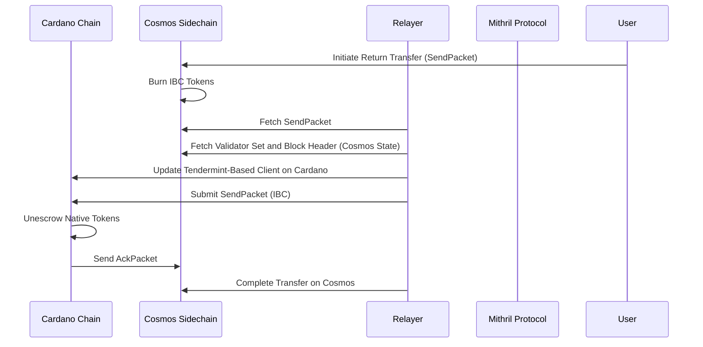

---

### **Key Aspects of the Flow**:

1. **SendPacket, RecvPacket, and AckPacket**:
   - The process always begins with a **SendPacket**, regardless of whether you are transferring native tokens (Cardano to Cosmos) or returning IBC tokens (Cosmos to Cardano).
   - **Escrow** happens when sending native tokens from **Cardano**, while **Burn** happens when returning IBC tokens from **Cosmos**.

2. **Escrow and Mint (Cardano to Cosmos)**:  
   - Native tokens on **Cardano** are **escrowed**, and IBC tokens are **minted** on **Cosmos**.

3. **Burn and Unescrow (Cosmos to Cardano)**:  
   - IBC tokens are **burned** on **Cosmos**, and native tokens are **unescrowed** on **Cardano**.

---

This completes the transfer flows, detailing the transfer of native tokens from **Cardano** to **Cosmos**, and the return of IBC tokens from **Cosmos** to **Cardano** using the IBC packet process.

---

### 6.9 **Flow 8: Transfer of Tokens Between Cardano and Osmosis via Cosmos Sidechain (with PFM)**

#### **Objective**:  
This flow describes the transfer of tokens from **Cardano** to **Osmosis** via the **Cosmos Sidechain** and the **Packet Forwarding Middleware (PFM)**. The tokens are forwarded from **Cardano** to **Osmosis** using the PFM on **Cosmos**, which automatically forwards the **SendPacket** to **Osmosis** after processing on **Cosmos**.

---

### **Detailed Steps for Flow 8: Cardano to Osmosis via Cosmos (Escrow and Mint)**

1. **Step 1: Generate `SendPacket` on Cardano**

   - **User Initiates Transfer (SendPacket)**:  
     The user initiates the transfer of native tokens from **Cardano** to **Osmosis** (via **Cosmos Sidechain**). This generates a **SendPacket** on **Cardano**, which contains:
     - The amount and type of native tokens.
     - The destination chain (**Osmosis**) and the **Cosmos Sidechain** as the intermediate hop.
     - The destination account on **Osmosis**.

   - **Escrow Native Tokens on Cardano**:  
     Since the tokens being transferred are native tokens, they are **escrowed** on **Cardano** when the **SendPacket** is generated.

   - **Relayer Fetches SendPacket**:  
     The **Relayer** retrieves the **SendPacket** and prepares to submit it to **Cosmos**.

2. **Step 2: Update Cosmos Light Client on Cosmos**

   - **Update Mithril-Based Light Client on Cosmos**:  
     The **Relayer** updates the **Mithril-based light client** on **Cosmos** by fetching the latest **Mithril certificate** and submitting an **update client** transaction on **Cosmos**. This ensures that the latest state of the **Cardano chain** is available for verification.

3. **Step 3: Submit `SendPacket` to Cosmos Sidechain**

   - **Relayer Submits SendPacket to Cosmos Sidechain**:  
     Once the **Mithril-based light client** is updated, the **Relayer** submits the **SendPacket** to the **Cosmos Sidechain**. The **Cosmos Sidechain** processes the **RecvPacket** and the **PFM** forwards it to **Osmosis**.

4. **Step 4: Cosmos Sidechain Forwards Packet to Osmosis (via PFM)**

   - **PFM Forwards Packet**:  
     The **Packet Forwarding Middleware (PFM)** on the **Cosmos Sidechain** forwards the **RecvPacket** to **Osmosis**. This happens transparently without further action from the user, as the PFM is responsible for automatically forwarding packets to the final destination (Osmosis).

5. **Step 5: Osmosis Processes `RecvPacket` and Mints IBC Tokens**

   - **Osmosis Mints IBC Tokens**:  
     Once **Osmosis** receives the **RecvPacket** forwarded from **Cosmos**, it verifies the packet and **mints IBC tokens** equivalent to the native tokens escrowed on **Cardano**.

6. **Step 6: Osmosis Sends `AckPacket` to Cosmos**

   - **Osmosis Acknowledges Transfer**:  
     After minting the IBC tokens, **Osmosis** sends an **AckPacket** back to **Cosmos**, confirming the successful minting of tokens.

7. **Step 7: Cosmos Sends `AckPacket` to Cardano**

   - **Cosmos Acknowledges the Transfer**:  
     Once **Cosmos** receives the **AckPacket** from **Osmosis**, it forwards the **AckPacket** to **Cardano**, confirming the completion of the transfer.

8. **Step 8: Cardano Receives `AckPacket` and Completes Transfer**

   - **Relayer Completes Transfer on Cardano**:  
     Once **Cardano** receives the **AckPacket**, the **Relayer** completes the transfer, confirming that the tokens have been successfully minted on **Osmosis**.

---

### **Cardano to Osmosis Transfer (Escrow and Mint via PFM)**

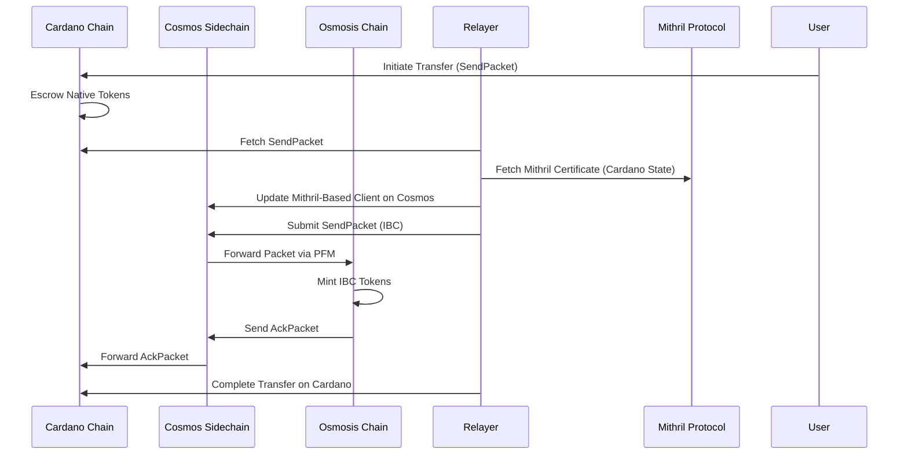

---

### **Detailed Steps for Flow 9: Osmosis to Cardano via Cosmos (Burn and Unescrow)**

1. **Step 1: Generate `SendPacket` on Osmosis**

   - **User Initiates Return (SendPacket)**:  
     The user initiates the return of their IBC tokens from **Osmosis** to **Cardano** (via **Cosmos Sidechain**). This generates a **SendPacket** containing:
     - The amount and type of IBC tokens.
     - The destination chain (**Cardano**) and **Cosmos Sidechain** as the intermediate hop.
     - The destination account on **Cardano**.

   - **Burn IBC Tokens on Osmosis**:  
     Since the tokens being transferred are **IBC tokens**, they are **burned** on **Osmosis** when the **SendPacket** is generated.

   - **Relayer Fetches SendPacket**:  
     The **Relayer** retrieves the **SendPacket** from **Osmosis** and prepares to submit it to **Cosmos**.

2. **Step 2: Update Cardano Light Client on Cardano**

   - **Update Tendermint-Based Light Client on Cardano**:  
     The **Relayer** updates the **Tendermint-based light client** on **Cardano** by fetching the latest **validator set** and **block header** from **Cosmos** and submitting an **update client** transaction on **Cardano**.

3. **Step 3: Submit `SendPacket` to Cosmos Sidechain**

   - **Relayer Submits SendPacket to Cosmos Sidechain**:  
     Once the **Tendermint-based light client** is updated, the **Relayer** submits the **SendPacket** to the **Cosmos Sidechain**. The **PFM** on **Cosmos** forwards the packet back to **Cardano**.

4. **Step 4: Cosmos Sidechain Forwards Packet to Cardano (via PFM)**

   - **PFM Forwards Packet**:  
     The **Packet Forwarding Middleware (PFM)** on **Cosmos** automatically forwards the **RecvPacket** to **Cardano**.

5. **Step 5: Cardano Processes `RecvPacket` and Unescrows Native Tokens**

   - **Cardano Unescrows Native Tokens**:  
     Upon receiving the **RecvPacket**, **Cardano** verifies the packet and **unescrows the native tokens** back to the user’s account.

6. **Step 6: Cardano Sends `AckPacket` to Cosmos**

   - **Cardano Acknowledges the Transfer**:  
     After unescrowing the tokens, **Cardano** sends an **AckPacket** back to **Cosmos**, confirming the successful return of native tokens.

7. **Step 7: Cosmos Sends `AckPacket` to Osmosis**

   - **Cosmos Acknowledges the Transfer**:  
     Once **Cosmos** receives the **AckPacket**, it forwards the **AckPacket** to **Osmosis**, confirming the completion of the transfer.

8. **Step 8: Osmosis Receives `AckPacket` and Completes Transfer**

   - **Relayer Completes Transfer on Osmosis**:  
     Once **Osmosis** receives the **AckPacket**, the **Relayer** confirms the completion of the token return to **Cardano**.

---

### **Osmosis to Cardano Transfer (Burn and Unescrow via PFM)**

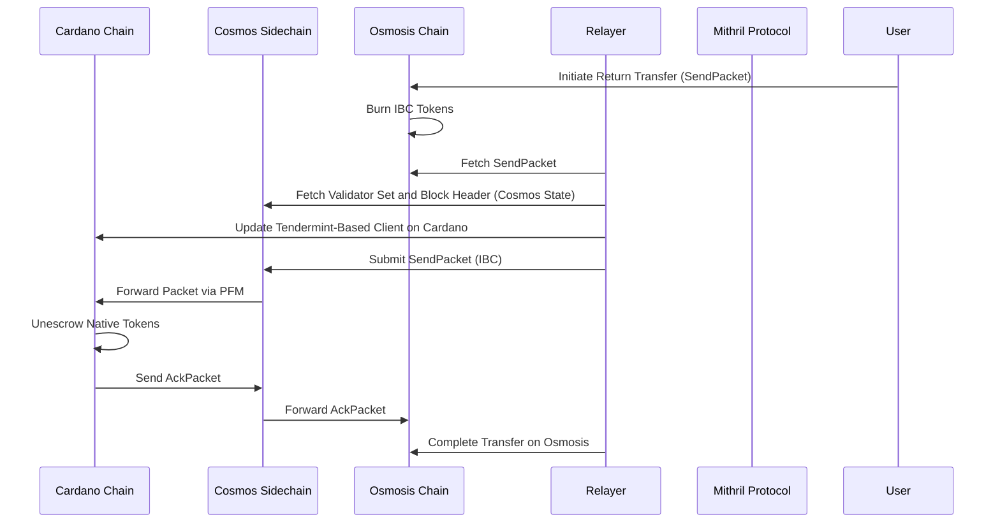

---

### **Key Aspects of the Flow**:

1. **SendPacket, RecvPacket, and AckPacket**:  
   The **SendPacket** is generated when transferring both native tokens from **Cardano** and IBC tokens from **Osmosis**.  
   - **Escrow** happens for native tokens on **Cardano** when sending.
   - **Burn** happens for IBC tokens on **Osmosis** when returning them to **Cardano**.

2. **PFM Handling**:  
   The **Packet Forwarding Middleware (PFM)** on **Cosmos** automatically forwards the packet to **Osmosis** when transferring from **Cardano** and forwards the packet back to **Cardano** when returning from **Osmosis**.

---

This completes the detailed transfer flows from **Cardano** to **Osmosis** via the **Cosmos Sidechain** using the **Packet Forwarding Middleware (PFM)**, along with the reverse flow of returning IBC tokens from **Osmosis** to **Cardano**.

My apologies for the confusion! Below is the correctly formatted **6.10 Timeout Handling** flow with the full explanation for both escrowed tokens on **Cardano** and burned tokens on **Osmosis**. 

---

### 6.10 **Flow 10: Timeout Handling for Transfers Between Cardano and Osmosis**

#### **Objective**:  
To handle timeout scenarios for token transfers between **Cardano** and **Osmosis** via the **Cosmos Sidechain**. In the event of a timeout, the transaction is considered unsuccessful, and tokens are either **unescrowed** (on Cardano) or **minted** back (on Osmosis).

---

### **Detailed Steps for Timeout Handling (Cardano to Osmosis)**

1. **Step 1: Timeout Event Detected on Cardano**

   - **Timeout Event Detected**:  
     A timeout occurs when the **AckPacket** is not received within the defined timeframe for the **SendPacket** initially sent from **Cardano** to **Osmosis**. This triggers the refund mechanism on **Cardano**.

2. **Step 2: Unescrow Tokens on Cardano**

   - **Unescrow Native Tokens**:  
     Since the tokens were **escrowed** on **Cardano** during the initial transfer, they are now **unescrowed** and returned to the user's account on **Cardano**.

---

### **Mermaid Diagram: Timeout Handling for Escrowed Tokens (Cardano to Osmosis)**

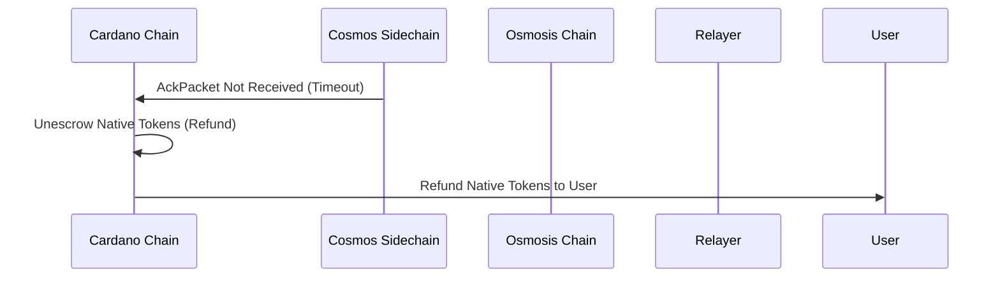

---

### **Detailed Steps for Timeout Handling (Osmosis to Cardano)**

1. **Step 1: Timeout Event Detected on Osmosis**

   - **Timeout Event Detected**:  
     A timeout occurs when the **AckPacket** is not received within the defined timeframe for the **SendPacket** initially sent from **Osmosis** to **Cardano**. This triggers the refund mechanism on **Osmosis**.

2. **Step 2: Mint Tokens Back on Osmosis**

   - **Mint IBC Tokens Back**:  
     Since the IBC tokens were **burned** on **Osmosis** during the initial transfer, new tokens are now **minted** back to the user’s account on **Osmosis** to compensate for the failed transfer.

---

### **Mermaid Diagram: Timeout Handling for Burned Tokens (Osmosis to Cardano)**

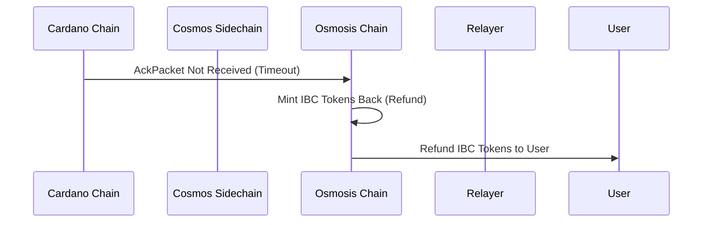

---

### **Key Aspects of Timeout Handling**:

1. **Escrow and Unescrow** (Cardano to Osmosis):  
   If a transfer from **Cardano** times out, the native tokens are **unescrowed** and refunded to the user’s account on **Cardano**.

2. **Burn and Mint** (Osmosis to Cardano):  
   If a transfer from **Osmosis** times out, new IBC tokens are **minted** back to the user’s account on **Osmosis** as a refund for the failed transfer.

---

This completes the **timeout handling flow** for both directions of transfer between **Cardano** and **Osmosis**, ensuring that users are refunded when transfers fail to complete within the expected timeframe.

Here is the swap flow integrated into the document in the requested format:

---

### 6.11 **Flow 11: Cross-Chain Swap via Osmosis Swap Contract**

#### **Objective**:  
This flow describes the cross-chain swap of tokens between **Cardano** and **Osmosis** using the **Osmosis Swap Contract**. Tokens are swapped on **Osmosis**, and the resulting tokens are returned back to **Cardano**.

---

### **Detailed Steps for Flow 11: Cross-Chain Swap (Token A → Token B)**

1. **Step 1: User Initiates Cross-Chain Swap on Cardano**

   - **SendPacket Creation**:  
     The user initiates a cross-chain swap of **Token A** on **Cardano**, providing the swap parameters (Token A → Token B) in a **memo**.  
     The **Cardano Chain** creates a **SendPacket** containing the following details:
     - The amount and type of **Token A**.
     - The swap instructions in the **memo** (indicating Token B as the target).
     - The destination chain (Osmosis) and the intermediary **Cosmos Sidechain**.

   - **Burn Token A on Cardano**:  
     Since **Token A** is being swapped, it is **burned** on the **Cardano Chain** when the **SendPacket** is created.

2. **Step 2: Update Cosmos Light Client**

   - **Update Mithril-Based Light Client on Cosmos**:  
     The **Relayer** updates the **Mithril-based light client** on **Cosmos** by submitting an **update client** transaction, ensuring the latest state of the **Cardano Chain** is synchronized with Cosmos.

3. **Step 3: Submit SendPacket to Cosmos Sidechain**

   - **Relayer Submits SendPacket**:  
     The **Relayer** submits the **SendPacket** to the **Cosmos Sidechain**. The **Packet Forward Middleware (PFM)** applies a 10% fee on **Token A** and forwards the packet to **Osmosis**.

4. **Step 4: Swap Execution on Osmosis**

   - **Cross-Chain Swap on Osmosis**:  
     The **Osmosis Swap Contract** receives the **RecvPacket** with **Token A** and the swap memo. It executes the swap from **Token A to Token B**.  
     - **Token A** is swapped for **Token B** on **Osmosis**.

5. **Step 5: Generate IBC Packet for Token B**

   - **IBC Packet Creation for Token B**:  
     After the swap, **Osmosis** creates an IBC packet for **Token B** and prepares it for transfer back to **Cardano**.

6. **Step 6: Send IBC Packet to Cosmos Sidechain**

   - **Relayer Submits Token B IBC Packet**:  
     The **Relayer** sends the IBC packet containing **Token B** from **Osmosis** to the **Cosmos Sidechain** via the **Packet Forward Middleware**.

7. **Step 7: Update Cardano Light Client**

   - **Update Tendermint-Based Light Client on Cardano**:  
     The **Relayer** fetches the latest state of **Cosmos** and submits an **update client** transaction on **Cardano**, allowing **Cardano** to verify the **Token B** packet.

8. **Step 8: Submit RecvPacket on Cardano and Mint Token B**

   - **Mint Token B on Cardano**:  
     Upon receiving the **RecvPacket** on **Cardano**, **Token B** is minted on the **Cardano Chain**, completing the swap process.

---

### **Mermaid Diagram: Cross-Chain Swap (Cardano → Osmosis → Cardano)**

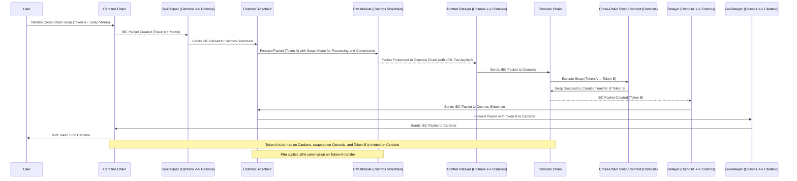

---

### **Summary of the Swap Flow**:

- **Initiating the Swap**: The user initiates the cross-chain swap from **Cardano**, and **Token A** is burned. The **Relayer** sends the packet to **Cosmos**, and the **Packet Forward Middleware** forwards it to **Osmosis**.
  
- **Swap Execution on Osmosis**: The **Osmosis Swap Contract** executes the swap from **Token A to Token B**, and **Token B** is then forwarded back to **Cardano**.
  
- **Minting Token B on Cardano**: Upon receiving the IBC packet for **Token B**, **Cardano** mints **Token B** to the user's account, completing the swap.