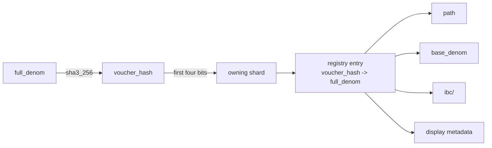
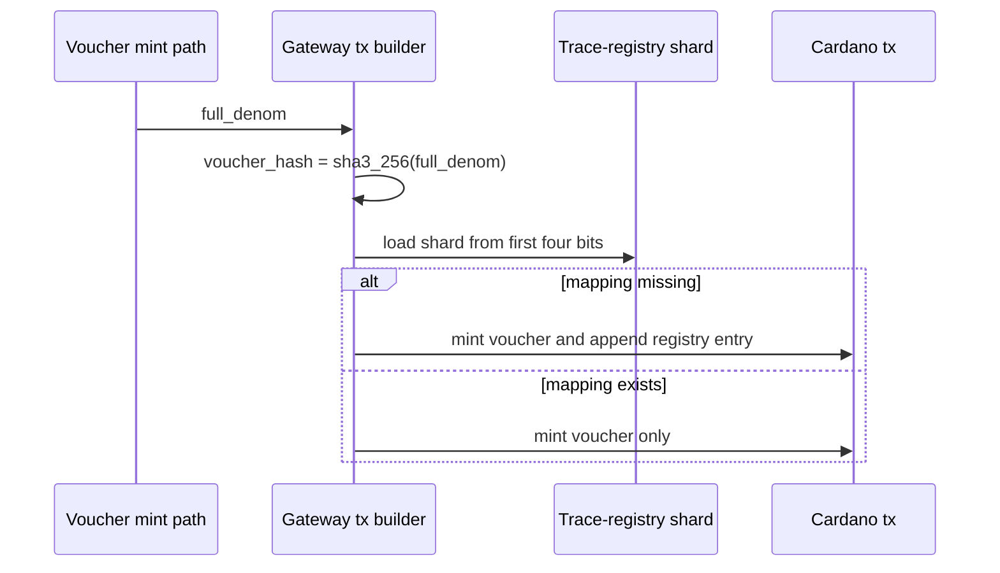

# Cardano Voucher Trace Registry

This document describes the on-chain voucher trace registry used by Cardano to
reverse a voucher asset hash back into the canonical ICS-20 full denom trace.

## Why This Exists

Cardano voucher asset names are fixed-size token-name bytes, while ICS-20 denom
traces are variable-length strings that can grow at every hop. Cardano therefore
uses a hash of the full denom trace as the voucher token name.

That keeps voucher asset identifiers compact and deterministic, but it also means
the original full denom string cannot be recovered from the asset id alone. The
trace registry solves that reversibility problem without relying on an off-chain
database.

## What Is Canonical

The canonical mapping is:

- `voucher_hash -> full_denom`

Where:

- `voucher_hash` is the Cardano voucher token name bytes
- `full_denom` is the exact ICS-20 trace string whose `sha3_256` hash produced
  that token name

Everything else is derived from that canonical value:

- `path`
- `base_denom`
- `ibc/<hash>` for standard ICS-20 lookup UX
- friendly wallet presentation strings

## Why The Registry Is Separate From HostState

The trace registry is intentionally not part of `HostState`.

`HostState` is the Cardano IBC commitment thread proven to counterparties. It
must stay focused on consensus-relevant IBC state and the commitment root used
for proofs. Voucher trace lookup is Cardano-local metadata needed for reverse
lookup and UX, not for counterparty verification.

Keeping the registry separate avoids:

- growing the IBC commitment root with local lookup data
- forcing counterparties to care about voucher presentation metadata
- coupling voucher reverse lookup updates to the main HostState thread

## Sharding Model

The registry uses 16 shards.

- the first four bits of `voucher_hash` choose the owning shard
- each shard is its own UTxO protected by a unique shard NFT
- each shard datum stores a list of `(voucher_hash, full_denom)` entries

Why 16 shards:

- it is enough to bound contention in practice
- it keeps datum growth per shard smaller than a single global registry UTxO
- any client can locate the correct shard from the asset id alone

## Security Invariants

The validator enforces these invariants:

1. A mapping can only be inserted when the same transaction mints the matching
   voucher token under the voucher minting policy.
2. The inserted `full_denom` must hash exactly to the inserted `voucher_hash`.
3. The insert must go to the shard selected by the first four bits of the hash.
4. Existing mappings are immutable.
5. A first-seen voucher trace appends one new entry; repeated mints reuse the
   existing mapping and do not rewrite the shard.

These rules ensure the registry cannot be populated by arbitrary off-chain
claims. Only real voucher mint flows can create first-seen entries, and the
mapping is cryptographically tied to the minted asset id.

## Write Paths

There are three voucher mint paths that may insert into the registry:

### 1. RecvPacket Voucher Mint

Cardano receives an ICS-20 packet whose denom does not correspond to a native
Cardano asset on this hop, so Cardano mints a voucher. If the voucher trace is
new, the same transaction appends the mapping to the correct shard.

### 2. Timeout Refund Voucher Mint

Cardano may need to re-mint a voucher after an outbound packet times out. That
refund path uses the same registry insertion logic so timeout refunds cannot
create an unregistered voucher asset.

### 3. Acknowledgement-Error Refund Voucher Mint

If the remote chain rejects the transfer and Cardano must mint the voucher back,
that refund path also performs a first-seen registry insert when necessary.

## Read Paths

Readers do not query a Gateway database anymore.

The lookup flow is:

1. parse the Cardano asset id
2. extract the voucher hash from the token name
3. derive the shard from the first four bits
4. read that shard datum from Cardano state
5. locate the matching `voucher_hash -> full_denom` entry
6. derive `path`, `base_denom`, and `ibc/<hash>` off-chain

## Wallet And Dapp Presentation

The registry is the source of truth for correctness, but third-party wallets may
still display the raw hashed token name unless they choose to resolve the trace.

Our intended presentation model is:

- correctness comes from the on-chain registry
- friendly display strings are derived from the registry
- dapps and SDKs should resolve the registry directly for human-readable UX

This keeps the protocol honest even if wallet presentation varies.

## Non-Goals

The registry does not:

- change voucher asset identity
- replace HostState
- become part of the IBC proof root
- store a second mutable index for `ibc/<hash>`
- guarantee that every generic Cardano wallet will automatically show a pretty name

## Operational Consequences

- First-seen voucher mint transactions are slightly larger because they also
  spend and recreate one trace-registry shard.
- Repeated mints of an already-known voucher do not pay that extra shard cost.
- A Cardano dapp no longer needs the Gateway database for denom trace lookup,
  but it still needs some Cardano chain-data source to read shard UTxOs.
