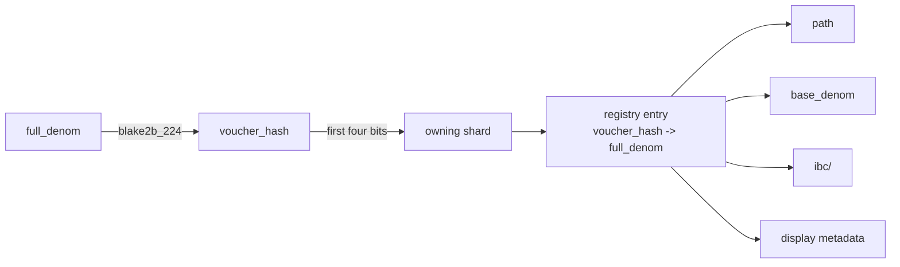
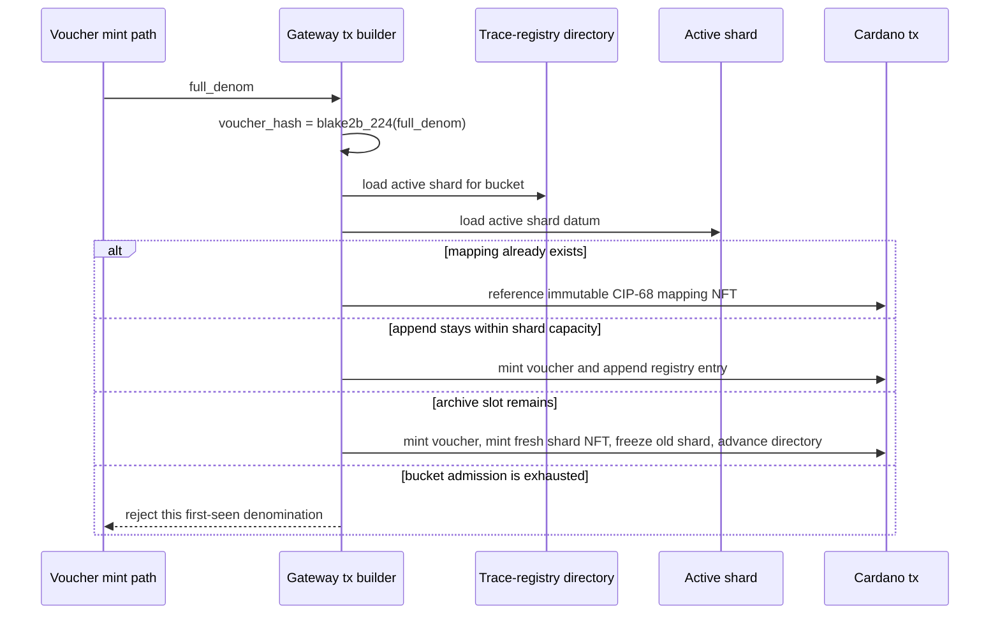

# Cardano Voucher Trace Registry

This document describes the on-chain voucher trace registry used by Cardano to
reverse a voucher asset hash back into the canonical ICS-20 full denom trace.

## Why This Exists

Cardano voucher asset names are fixed-size token-name bytes, while ICS-20 denom
traces are variable-length strings that can grow at every hop. Cardano therefore
uses a hash of the full denom trace as the voucher token name.

That keeps voucher asset identifiers compact and deterministic, but it also means
the original full denom string cannot be recovered from the asset id alone. The
trace registry solves that reversibility problem without relying on an off-chain
database.

## What Is Canonical

The canonical mapping is:

- `voucher_hash -> full_denom`

Where:

- `voucher_hash` is the Cardano voucher token name bytes
- `full_denom` is the exact ICS-20 trace string whose `blake2b_224` hash produced
  that token name

Everything else is derived from that canonical value:

- `path`
- `base_denom`
- `ibc/<hash>` for standard ICS-20 lookup UX
- friendly wallet presentation strings

```mermaid
flowchart LR
  A["full_denom"] -->|"blake2b_224"| B["voucher_hash"]
  B -->|"first four bits"| C["owning shard"]
  C --> D["registry entry<br/>voucher_hash -> full_denom"]
  D --> E["path"]
  D --> F["base_denom"]
  D --> G["ibc/<hash>"]
  D --> H["display metadata"]
```

## Why The Registry Is Separate From HostState

The trace registry is intentionally not part of `HostState`.

`HostState` is the Cardano IBC commitment thread proven to counterparties. It
must stay focused on consensus-relevant IBC state and the commitment root used
for proofs. Voucher trace lookup is Cardano-local metadata needed for reverse
lookup and UX, not for counterparty verification.

Keeping the registry separate avoids:

- growing the IBC commitment root with local lookup data
- forcing counterparties to care about voucher presentation metadata
- coupling voucher reverse lookup updates to the main HostState thread

## Sharding Model

The registry uses 16 buckets plus a directory UTxO.

- the first four bits of `voucher_hash` choose the owning bucket
- each bucket has one active shard and at most eight archived shards
- a separate directory UTxO records the active shard token name for every bucket
- each shard is its own UTxO protected by a unique shard NFT
- each shard datum stores a list of `(voucher_hash, full_denom)` entries

Why 16 buckets:

- it is enough to bound contention in practice
- it keeps datum growth per writable shard smaller than a single global registry UTxO
- any client can locate the correct bucket from the asset id alone

Why the directory exists:

- active shard identities can change over time without changing bucket semantics
- rollover can freeze an old shard exactly as-is and move future writes to a new shard
- readers can still discover archived shards for historical entries

## Protocol Capacity And Voucher Lifetime

Registry growth is bounded by protocol constants enforced both on-chain and by
the Gateway:

| Resource | Limit |
| --- | ---: |
| Buckets | 16 |
| Full denom UTF-8 bytes | 256 |
| Trace hops | 8 |
| Entries per shard | 32 |
| Encoded shard datum | 3,072 bytes |
| Archived shards per bucket | 8 |
| Encoded directory datum | 6,144 bytes |

An active shard rolls over only when appending the next entry would exceed its
entry-count or encoded-CBOR limit. This prevents callers from cheaply creating
empty archives. Once a bucket already has eight archives and its active shard is
full, that bucket stops accepting first-seen denominations. The count-only upper
bound is therefore 288 mappings per bucket and 4,608 mappings across all 16
buckets; long denoms may reach the byte limit sooner.

Admission exhaustion does **not** strand voucher holders. Every first-seen
voucher also creates a deterministic CIP-68 reference NFT at an immutable
metadata script. A repeated mint or refund proves the existing mapping with that
single NFT and its canonical datum, independently of the directory and archived
shard list. Existing vouchers therefore remain mintable, refundable, burnable,
and resolvable even when their bucket cannot accept another denomination.

## Security Invariants

The validator enforces these invariants:

1. A mapping can only be inserted when the same transaction mints the matching
   voucher token under the voucher minting policy.
2. The inserted `full_denom` must hash exactly to the inserted `voucher_hash`.
3. The insert must go to the bucket selected by the first four bits of the hash.
4. Existing mappings are immutable.
5. A first-seen voucher trace either appends to the active shard or atomically
   rolls the bucket to a fresh active shard and inserts there.
6. A rollover preserves the old shard contents exactly and advances the directory
   pointer in the same transaction.
7. Denom, shard, archive-list, and directory growth cannot exceed the protocol
   limits above.
8. Rollover is accepted only at the active shard's capacity boundary.
9. Existing mappings are authenticated by exactly one immutable CIP-68 reference
   NFT carrying the canonical voucher metadata datum.

These rules ensure the registry cannot be populated by arbitrary off-chain
claims. Only real voucher mint flows can create first-seen entries, and the
mapping is cryptographically tied to the minted asset id.

## Write Paths

There are three voucher mint paths that may insert into the registry:

### 1. RecvPacket Voucher Mint

Cardano receives an ICS-20 packet whose denom does not correspond to a native
Cardano asset on this hop, so Cardano mints a voucher. If the voucher trace is
new, the same transaction either appends the mapping to the current active shard
or rolls over to a fresh active shard and inserts there.

### 2. Timeout Refund Voucher Mint

Cardano may need to re-mint a voucher after an outbound packet times out. That
refund path uses the same registry insertion logic so timeout refunds cannot
create an unregistered voucher asset.

### 3. Acknowledgement-Error Refund Voucher Mint

If the remote chain rejects the transfer and Cardano must mint the voucher back,
that refund path also performs a first-seen registry insert when necessary.

```mermaid
sequenceDiagram
  participant W as Voucher mint path
  participant G as Gateway tx builder
  participant D as Trace-registry directory
  participant S as Active shard
  participant C as Cardano tx

  W->>G: full_denom
  G->>G: voucher_hash = blake2b_224(full_denom)
  G->>D: load active shard for bucket
  G->>S: load active shard datum
  alt mapping already exists
    G->>C: reference immutable CIP-68 mapping NFT
  else append stays within shard capacity
    G->>C: mint voucher and append registry entry
  else archive slot remains
    G->>C: mint voucher, mint fresh shard NFT, freeze old shard, advance directory
  else bucket admission is exhausted
    G-->>W: reject this first-seen denomination
  end
```

## Read Paths

Readers do not query a Gateway database anymore.

The lookup flow is:

1. parse the Cardano asset id
2. extract the voucher hash from the token name
3. derive the bucket from the first four bits
4. read the directory UTxO to find the active and archived shard token names for that bucket
5. read the active shard first, then any archived shards if needed
6. locate the matching `voucher_hash -> full_denom` entry
7. derive `path`, `base_denom`, and `ibc/<hash>` off-chain

## Wallet And Dapp Presentation

The registry is the source of truth for correctness, but third-party wallets may
still display the raw hashed token name unless they choose to resolve the trace.

Our intended presentation model is:

- correctness comes from the on-chain registry
- friendly display strings are derived from the registry
- dapps and SDKs should resolve the registry directly for human-readable UX

This keeps the protocol honest even if wallet presentation varies.

## Non-Goals

The registry does not:

- change voucher asset identity
- replace HostState
- become part of the IBC proof root
- store a second mutable index for `ibc/<hash>`
- guarantee that every generic Cardano wallet will automatically show a pretty name

## Operational Consequences

- First-seen voucher mint transactions are slightly larger because they also
  spend and recreate one trace-registry shard.
- Once the next append would exceed 32 entries or 3,072 encoded datum bytes, the
  first-seen insert rolls the bucket to a fresh active shard in the same tx.
- The Gateway may still estimate a candidate transaction as a safety check, but
  it cannot force an early rollover below the on-chain capacity boundary.
- Repeated mints and refunds of an already-known voucher carry only its immutable
  CIP-68 reference UTxO; they do not witness the directory or bucket shards.
- An exhausted bucket rejects only new denominations. Operators should monitor
  archive counts before the eighth rollover; increasing these protocol limits
  requires a reviewed contract upgrade.
- A Cardano dapp no longer needs the Gateway database for denom trace lookup,
  but it still needs some Cardano chain-data source to read shard UTxOs.
