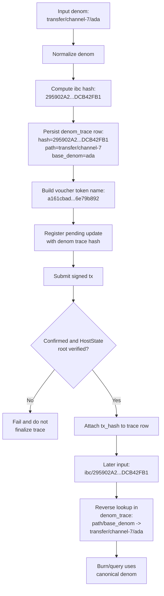

# Denom Trace Mapping

This document shows a concrete example for how denom traces are created, finalized, and used for reverse lookup.

## Concrete Example

- Canonical denom example: `transfer/channel-7/ada`
- Computed IBC denom hash: `ibc/295902A2AC8AF68262566DB16795B73ED2D2B31C5B05FFF6A3299008DCB42FB1`
- Voucher token-name hash example: `a161cbad47f75408e7e815be862b38abe795ed21523749cae06a37696e79b892`

## Notes

- The `denom_trace` row is the canonical source for reversing `ibc/<hash>` into `path/base_denom`.
- Finalization should only happen after transaction confirmation and HostState root verification.
