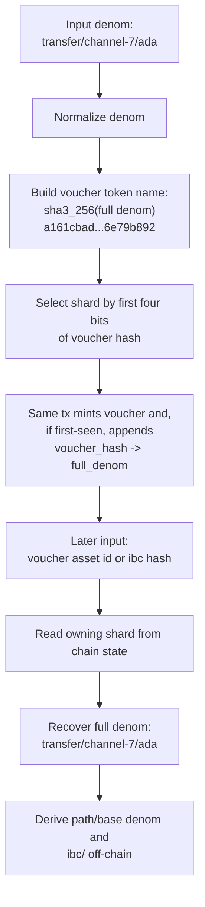

# Denom Trace Mapping

This document shows a concrete example for how voucher traces are recorded and
later used for reverse lookup under the on-chain registry design.

## Concrete Example

- Canonical denom example: `transfer/channel-7/ada`
- Computed IBC denom hash: `ibc/295902A2AC8AF68262566DB16795B73ED2D2B31C5B05FFF6A3299008DCB42FB1`
- Voucher token-name hash example: `a161cbad47f75408e7e815be862b38abe795ed21523749cae06a37696e79b892`

```mermaid
flowchart TB
  A["Input denom:<br/>transfer/channel-7/ada"] --> B["Normalize denom"]
  B --> C["Build voucher token name:<br/>sha3_256(full denom)<br/>a161cbad...6e79b892"]
  C --> D["Select shard by first four bits<br/>of voucher hash"]
  D --> E["Same tx mints voucher and,<br/>if first-seen, appends<br/>voucher_hash -> full_denom"]
  E --> F["Later input:<br/>voucher asset id or ibc hash"]
  F --> G["Read owning shard from chain state"]
  G --> H["Recover full denom:<br/>transfer/channel-7/ada"]
  H --> I["Derive path/base denom and<br/>ibc/<hash> off-chain"]
```

## Notes

- The on-chain shard entry is now the canonical source for reversing a voucher asset hash into the full denom trace.
- `ibc/<hash>` is derived from the recovered full denom and is not stored as a second mutable index.
- First-seen inserts happen in the same transaction as voucher mint, so there is no separate finalization step.
