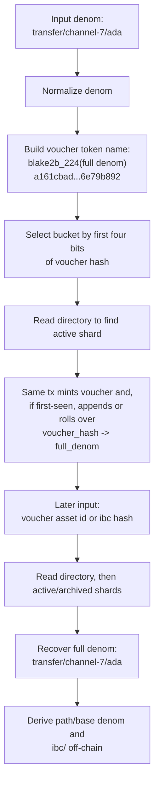

# Denom Trace Mapping

This document shows a concrete example for how voucher traces are recorded and
later used for reverse lookup under the on-chain registry design.

## Concrete Example

- Canonical denom example: `transfer/channel-7/ada`
- Computed IBC denom hash: `ibc/295902A2AC8AF68262566DB16795B73ED2D2B31C5B05FFF6A3299008DCB42FB1`
- Voucher token-name hash example: `a161cbad47f75408e7e815be862b38abe795ed21523749cae06a37696e79b892`

```mermaid
flowchart TB
  A["Input denom:<br/>transfer/channel-7/ada"] --> B["Normalize denom"]
  B --> C["Build voucher token name:<br/>blake2b_224(full denom)<br/>a161cbad...6e79b892"]
  C --> D["Select bucket by first four bits<br/>of voucher hash"]
  D --> E["Read directory to find active shard"]
  E --> F["Same tx mints voucher and,<br/>if first-seen, appends or rolls over<br/>voucher_hash -> full_denom"]
  F --> G["Later input:<br/>voucher asset id or ibc hash"]
  G --> H["Read directory, then active/archived shards"]
  H --> I["Recover full denom:<br/>transfer/channel-7/ada"]
  I --> J["Derive path/base denom and<br/>ibc/<hash> off-chain"]
```

## Notes

- The on-chain shard entry is now the canonical source for reversing a voucher asset hash into the full denom trace.
- The directory is the canonical source for which shard is currently active for a given bucket.
- `ibc/<hash>` is derived from the recovered full denom and is not stored as a second mutable index.
- First-seen inserts happen in the same transaction as voucher mint, so there is no separate finalization step.
- If the next append would exceed the shard entry or encoded-byte limit, the
  same transaction rolls the bucket to a fresh active shard before inserting the
  new mapping.
- New denominations are limited to 256 UTF-8 bytes and eight trace hops. Shards
  hold at most 32 entries or 3,072 encoded bytes, and each bucket has at most
  eight archived shards.
- Existing voucher mints and refunds prove their mapping with the immutable
  CIP-68 reference NFT rather than including the directory and every bucket
  shard. Reaching the new-denomination limit therefore does not strand existing
  voucher funds.
