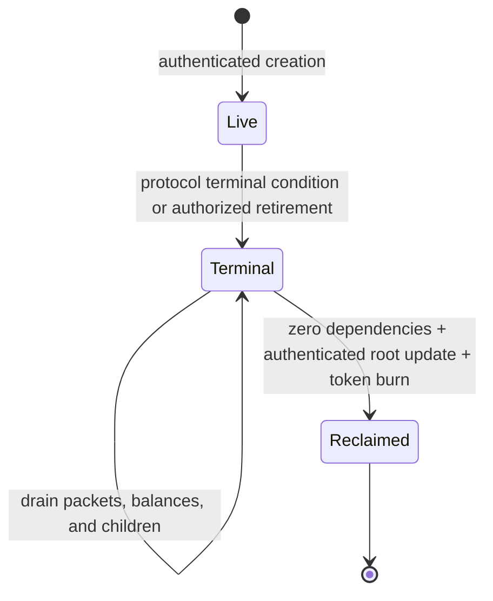

# Persistent IBC State Reclamation Lifecycle

Status: proposed design for [issue #611](https://github.com/cardano-foundation/cardano-ibc-incubator/issues/611).
It describes required invariants and implementation phases; it does not describe
a reclamation feature available in the current deployment.

## Context And Current Behavior

Cardano represents each IBC client, connection, channel, application root, and
application shard with an authenticated UTxO. `HostState` is the single-token
thread that orders writes and commits the IBC key/value state in
`ibc_state_root`. The commitment design is described in
[HostState UTxO Sharding Mechanics](./host-state-utxo-sharding.md), and the
external proof anchor is described in
[Probabilistic Light Client](./probabilistic-light-client.md).

On current `main`:

- client and connection validators require a same-address continuation carrying
  the same authentication token;
- channel close transitions create a `Closed` channel continuation and preserve
  the channel token, sequences, and packet maps;
- client, connection, channel, and transfer-escrow-shard policies have creation
  paths but no authenticated object-reclamation burn path;
- monotonically increasing HostState sequences prevent identifier reuse;
- the sparse commitment helper can already express a deletion by updating a leaf
  to the empty value, but no object lifecycle authorizes most such deletions;
- transfer escrow shards retain their NFT even when their asset balance is empty,
  and their registry is insert-only; and
- deployment shutdown can reclaim reference scripts and move the HostState NFT
  after a grace period, but finalization is not gated by authenticated child
  counts or application balances. Moving that NFT to an arbitrary recovery
  output is also not a safe terminal seal: root discovery is NFT-based, so a
  later datum-bearing output carrying the preserved NFT could be mistaken for a
  post-finalization HostState anchor.

[PR #617](https://github.com/cardano-foundation/cardano-ibc-incubator/pull/617)
adds one deliberately narrow exception. A permissionless operation can prune a
finalized receipt/acknowledgement pair from an unordered, open channel after
proving that the source packet commitment is absent at a sufficiently recent
authenticated counterparty height. It advances an on-chain proof-height floor
and deletes both HostState leaves atomically. This solves bounded packet-history
growth for that case; it does not reclaim channel UTxOs, authentication tokens,
ordered acknowledgements, application shards, connections, or clients. See the
[FAQ](./FAQ.md#why-can-finalized-packet-history-be-pruned-without-keeping-an-off-chain-copy).

## Goals And Non-Goals

The lifecycle must:

- release UTxO min-ADA and stop live indexing work when an object is provably no
  longer usable;
- preserve IBC membership, non-membership, replay, and close-handshake semantics;
- prove dependencies and balances with bounded authenticated witnesses rather
  than ledger-wide or historical sequence scans;
- make authentication-token burning, retained tombstones, and value recipients
  explicit; and
- make deployment finalization impossible while live protocol state or backing
  value remains.

This design does not:

- make an active, merely idle, or temporarily expired object reclaimable;
- use a Gateway database assertion as an on-chain absence proof;
- delete historical roots that an accepted counterparty consensus state may
  still reference;
- make channel, connection, or client identifiers reusable;
- reclaim voucher trace mappings while voucher assets may still exist; or
- retrofit new burn branches into already deployed validator hashes.

## Global Invariants

Every implementation phase must preserve these rules:

1. **No identifier reuse.** HostState creation sequences never decrease. A
   reclaimed identifier and authentication token can never be minted again.
2. **One atomic commitment transition.** Reclamation spends and recreates the
   HostState thread, increments its version once, and verifies every changed leaf
   from the old root to the new root with fixed-depth sibling witnesses.
3. **No inferred absence.** A transaction cannot prove "no children" by scanning
   UTxOs or `0..next_sequence`. It must consume an authenticated zero dependency
   count committed by the protocol.
4. **No unsettled value.** Protocol backing assets, refunds, acknowledgements,
   and application-owned child state are settled before their parent is
   reclaimed. Min-ADA is not treated as proof that an application balance is
   zero.
5. **Burn the live capability.** A reclaimed object token is burned under its own
   policy in the same transaction. Moving it to an arbitrary wallet is not
   reclamation because the token could be returned to a newly created script
   output.
6. **Terminal facts are immutable.** Proof-critical terminal state remains in a
   standard IBC leaf or a versioned, immutable tombstone leaf. A later transition
   cannot alter or remove that tombstone.
7. **Reclamation is monotonic.** There is no `Reclaimed -> Live` transition.
8. **Historical proof retention is separate.** Removing the current live UTxO
   does not authorize deletion of Gateway data required to serve a proof against
   an older accepted HostState root.

## State Machine

`Terminal` is object-specific. A channel is terminal when `Closed`; a channel
that never reached `Open` may instead enter an authority-gated local
`Abandoning { not_before }` state and become `Abandoned` after its handshake
grace period. A client is terminal when irrecoverably `Frozen` or `Expired`
under the supported client semantics. Connections have no ICS terminal state,
so they need an explicit local `Retiring { not_before }` lifecycle record.
Application shards inherit the terminal state of their owning channel and
additionally require zero principal.

Entering `Terminal` blocks new children and new user-facing work, but permits the
strictly decreasing operations needed to settle packets, refunds, balances, and
existing children. Reclamation is permissionless only after every predicate is
cryptographically checkable. Authority to retire a still-active connection or
abandon an incomplete channel handshake is a separate admission/governance
decision and cannot default to any caller.

## Authentication Tokens And Tombstones

An object reclamation transaction must satisfy all of the following:

- consume exactly one authenticated object input;
- mint exactly `-1` of that input's token and no other token under the same
  policy;
- use an appended, typed burn redeemer bound to the matching typed HostState and
  object spend redeemers;
- produce no output containing the burned token;
- leave every HostState creation sequence unchanged; and
- pay non-protocol residual value only according to the ownership rules below.

The preferred HostState tombstone key is a reserved, versioned namespace such as
`cardano/tombstones/v1/{kind}/{identifier}`. Its value contains the object kind,
identifier, terminal time or height, and hash of the final canonical value. It is
not a substitute for a standard IBC leaf when a counterparty still needs that
standard membership proof.

The rules by object are:

- **Packet:** delete finalized packet leaves; do not create a per-packet
  tombstone. Monotonic sequences and the authenticated receive-proof floor are
  the replay tombstone.
- **Channel:** for a standard `Closed` channel, retain the complete channel-end
  leaf and its immutable `nextSequenceRecv` leaf. The former is needed for a
  later counterparty `ChannelCloseConfirm`; the latter is needed for ordered
  `Timeout`/`TimeoutOnClose` proofs if the counterparty still has an unreceived
  outbound commitment. Delete only `nextSequenceSend` and `nextSequenceAck` on
  reclaim. For an authorized `Abandoned` handshake that never reached `Open`,
  delete the pre-open standard leaf and all three sequence leaves, and insert an
  immutable local tombstone containing the final channel hash and abandonment
  reason.
- **Connection:** after retirement and zero children, delete the standard
  connection leaf and insert an immutable local tombstone. Retaining an `Open`
  standard connection leaf would falsely advertise that it remains usable.
- **Client:** after terminal status and zero children, delete its standard client
  and consensus-state leaves and insert an immutable local tombstone containing
  the final client-state hash and terminal reason.
- **Transfer escrow shard:** burn the shard NFT and transition its module-local
  registry entry from live to an immutable retired marker. Do not return the
  registry key to "never existed," because that would permit deterministic
  re-minting.
- **HostState:** normal reclamation always preserves its NFT and same-address
  continuation. Final shutdown first locks a tombstone-only root in a typed
  terminal seal for the required counterparty proof window, then burns exactly
  one HostState NFT under an appended final-burn policy branch. A reviewed
  permanently locked terminal validator is an alternative, but an arbitrary
  deployer output is not.

Here, "tombstone-only root" means the canonical terminal commitment set: local
immutable tombstones, retained standard `Closed` channel-end leaves and their
immutable `nextSequenceRecv` leaves, retired registry markers, and any immutable
trace mappings required by the shutdown policy. It excludes live clients,
connections, channels, packets, mutable sequence leaves, application children,
and mutable balances.

## Authenticated Dependency Counts

Sparse-tree non-membership proves that one key is absent, not that an unbounded
key prefix has no children. Parent eligibility therefore uses counters committed
under reserved HostState paths:

- `cardano/dependencies/v1/clients/{clientId}/liveConnections`
- `cardano/dependencies/v1/connections/{connectionId}/liveChannels`
- `cardano/dependencies/v1/global/liveClients`
- `cardano/dependencies/v1/global/liveConnections`
- `cardano/dependencies/v1/global/liveChannels`

The exact path encoding must be versioned and shared by Aiken, Gateway, and the
transaction builder. Client creation initializes its connection count to zero
and increments the global client count. Connection creation atomically increments
the client's and global connection counts and initializes its channel count.
Channel creation atomically increments the connection's and global channel
counts. Reclamation performs the inverse updates and rejects missing counters,
stale witnesses, negative results, overflow, or a parent mismatch.

Application dependencies remain application-owned. A channel reclamation invokes
a typed `OnChanReclaim` callback. The registered module must prove its own
per-channel live-child count and backing balance are zero. Core IBC accepts the
callback result but does not attempt to decode every application's state. A
module without a bounded authenticated zero proof must reject reclamation.

Counters are live-state indexes, not historical creation totals. They are part of
the committed transition and cannot be sourced from Gateway caches.

## Eligibility By Object

### Packet State

- An outbound commitment is deleted only by a valid acknowledgement or timeout
  transition.
- An unordered receipt and acknowledgement are deleted together only after an
  authenticated proof that the source commitment is absent at or above both the
  receive high-water mark and replay floor. This is the behavior implemented by
  PR #617.
- The lifecycle follow-up should support safe closed-channel cleanup and ordered
  acknowledgement cleanup. Ordered replay safety comes from
  `nextSequenceRecv`; the source-commitment absence proof is still required so an
  acknowledgement needed for settlement is not erased early.
- A channel is not reclaimable until all three packet maps are empty. A close
  with outstanding outbound commitments must either be rejected or paired with
  a separately specified `TimeoutOnClose` drain path.
- Empty local packet maps do not prove that a counterparty has no unreceived
  outbound commitments. A reclaimed `Closed` channel therefore retains its
  immutable `nextSequenceRecv` leaf for standard ordered timeout proofs.

### Channel

A channel has two terminal paths: the standard `Closed` path, or an authenticated
local `Abandoned` path for a handshake that never reached `Open`. In both cases it
is reclaimable only when:

- packet commitments, receipts, and acknowledgements are empty;
- its registered application accepts `OnChanReclaim` and proves zero live child
  state and zero backing balance;
- the parent connection's authenticated live-channel count is positive and is
  decremented exactly once;
- the channel NFT is burned; and
- every retained, deleted, or inserted HostState value is checked with bounded
  witnesses.

For a `Closed` channel, the transition retains the standard channel-end and
`nextSequenceRecv` leaves while deleting `nextSequenceSend` and
`nextSequenceAck`. For an incomplete `Init` or `TryOpen` handshake, the configured
deployment admission authority must first commit
`Abandoning { not_before, final_channel_hash }`. That transition atomically
blocks `OpenAck`, `OpenConfirm`, and packet work. After `not_before`, reclamation
deletes the pre-open standard channel and all sequence leaves and inserts an
immutable `Abandoned` tombstone. An `Open` channel is never eligible for this
shortcut; it must use the standard close and drain path.

No grace period replaces the zero-state predicates. Time alone cannot prove that
a packet or application balance was settled.

### Connection

IBC connections do not close. A connection first enters a local, HostState-
committed `Retiring` state through the configured deployment admission authority.
That transition blocks new channel creation on the connection and records a
`not_before` time long enough for in-progress handshakes to complete, close, or
enter the authenticated abandonment path above.

It is reclaimable after `not_before` only when its authenticated live-channel
count is zero. Reclamation burns its NFT, decrements its parent client's
live-connection count, deletes the standard connection leaf, and inserts the
immutable retired tombstone.

### Client

A client is reclaimable only when:

- its supported on-chain status is irrecoverably `Frozen` or `Expired`;
- its authenticated live-connection count is zero;
- all retained consensus states and their committed leaves are removed in
  bounded transactions before the final reclaim; and
- no supported recovery or upgrade path can make the client active again.

The final transaction burns the client NFT, deletes the client-state leaf, and
inserts the immutable terminal tombstone. If a future client type supports
recovery from either status, that type needs a stricter terminal predicate.

### Transfer Escrow Shard

A transfer escrow shard is reclaimable only after its channel is terminal, its
tracked escrow principal is exactly zero, and the module can decrement the
channel's authenticated live-shard count. The transaction burns the shard NFT,
removes the UTxO, and retains a retired registry marker.

The current `{channel_id, denom}` datum does not track escrow principal. This is
especially important for lovelace, where output lovelace combines escrowed ADA
with min-ADA. A new deployment must track principal explicitly; output lovelace
alone is not a valid zero-balance proof. Until then, lovelace shards are not
eligible for reclamation.

### Voucher Trace Registry

The voucher trace registry is canonical reverse-lookup data, separate from
HostState; see [Cardano Voucher Trace Registry](./cardano-trace-registry.md).
Entries are immutable and archived shards preserve lookup history after rollover.
They cannot be reclaimed merely because one channel closes: voucher assets may
still exist in wallets or return through another route.

Individual trace entries and archived shards therefore remain permanent during a
deployment. Whole-registry reclamation is allowed only during final shutdown
after an authenticated zero voucher-supply/accounting condition exists, or after
a migration preserves the canonical mappings in the successor deployment. Until
one of those mechanisms is implemented, trace-registry reclamation is a
non-goal and its storage cost belongs in admission/rent policy.

## Value Ownership And Economic Admission

Permissionless execution must not mean permissionless theft of min-ADA. New
object and shard datums need an immutable `reclaim_to` credential or a
deployment-defined treasury. A successful reclaim sends only residual,
non-protocol value to that destination. Application backing value must have been
settled through its protocol path before reclaim; it is never a cleanup reward.

If permissionless cleanup is desirable, creation may fund a separately bounded
cleanup bounty paid to the submitter. The owner refund, protocol backing, and
cleanup bounty must be accounted independently on-chain.

Because creation causes persistent proof, indexing, and tombstone costs, a
production deployment also needs at least one of:

- an admission authority or per-identity quota;
- a refundable storage bond large enough to fund cleanup;
- protocol rent for permanently retained tombstones and trace mappings; or
- a rate limit tied to the HostState creation transition.

The choice is deployment policy, but the validator must enforce whichever value
split is selected. Gateway policy alone cannot prevent direct on-chain creation.

## Gateway Indexing And Historical Proofs

Gateway must maintain separate views:

- a live-object index keyed by authentication token and current UTxO;
- a terminal/reclaimed index keyed by IBC identifier and tombstone; and
- versioned commitment-tree history for proof construction at accepted HostState
  roots.

Live list queries use the live index and must not probe every historical sequence
from zero to a HostState `next_*_sequence`. Reclamation events atomically remove
the live row and add the tombstone row. Reorg handling reverses both changes.
A cold rebuild starts at the deployment genesis or an authenticated HostState
checkpoint and replays canonical HostState transitions. Each reclamation
transaction must expose the exact tombstone key/value and retained/deleted values
through typed redeemers and consumed datums, so the validator and a cold replayer
derive the same map. The root alone is not invertible, and current live UTxOs are
not sufficient after reclamation: a retained `Closed` channel leaf, its
`nextSequenceRecv` leaf, and a local tombstone leaf no longer have corresponding
object UTxOs. Checkpoints may accelerate replay only when they are bound to a
specific authenticated HostState output and root; they are never an
unauthenticated Gateway snapshot.

Queries must distinguish `live`, `terminal`, `reclaimed`, and `never existed`.
A historical query at height `H` uses the commitment snapshot for `H`, even if
the object was reclaimed later. Historical sparse-tree nodes may be garbage-
collected only after no supported counterparty proof or recovery window can
reference those roots. This retention policy is independent of current UTxO
reclamation.

## Shutdown And Finalization

Shutdown is an ordered drain, not a timer followed by deletion:

1. Enter `ShuttingDown`; reject new clients, connections, channels, source-chain
   deposits, and new application children.
2. Continue only decreasing operations: acknowledgements, timeouts, refunds,
   packet-history pruning, channel close, and object reclamation.
3. Drain and reclaim application shards.
4. Reclaim closed or authenticated-abandoned channels and reduce connection
   counts to zero.
5. Retire and reclaim connections and reduce client counts to zero.
6. Reclaim terminal clients and their consensus-state leaves.
7. Verify module roots report zero live children and zero backing balances, and
   apply the trace-registry/voucher-supply rule.
8. Reclaim module infrastructure that is no longer needed for proof serving.
9. After the grace period and an on-chain drain gate pass, create a typed
   HostState terminal seal containing the final tombstone-only root and a
   `proof_window_end`.
10. Keep the HostState NFT and the reference scripts needed to authenticate that
    seal locked until the counterparty proof window ends.
11. Burn exactly one HostState NFT under an appended final-burn policy branch and
    reclaim the remaining reference-script infrastructure, or move the seal to a
    separately reviewed permanently locked terminal validator.

The sealing gate must verify authenticated zero live-client, connection, channel,
and application counts plus every deployment-specific balance predicate. The
remaining IBC root may contain only the terminal commitment set defined above;
it must not contain live standard objects, packet leaves, or mutable sequence
leaves. The terminal validator admits no ordinary state transition. The final
burn then requires the sealed datum, expiry of its proof window, the deployment
authority, an exact `-1` HostState NFT mint, and no output carrying that NFT. A
Gateway scan or deployer signature cannot substitute for the drain gate.
Reference scripts required by drain, seal, proof, or burn transactions must
remain until their last use.

Current `FinalizeShutdown` behavior is therefore incomplete for this lifecycle:
its time-only gate neither proves a drain nor creates a non-spoofable terminal
anchor. New deployments must not treat moving the NFT to a deployer wallet as
successful protocol finalization.

## Migration And Redeployment

Adding datum fields, dependency leaves, callbacks, and burn redeemers changes
Aiken validator hashes and the wire ABI. Constructors must be appended rather
than reordered, generated Plutus types must be regenerated, and the bridge
manifest schema must be bumped.

Existing object tokens, including the HostState NFT, were minted under policies
that do not authorize the new burn branches. A new validator cannot
retroactively reclaim those UTxOs. The feature therefore requires a fresh
deployment and new objects, or a separately designed migration branch already
authorized by the old policy. The old deployment must remain available for
conservative draining; its current time-only HostState finalization and NFT move
must not be treated as proof that child objects, balances, or future NFT-bearing
anchors are gone.

A successor deployment imports only explicitly authenticated live state and
canonical trace mappings. Creation sequences and reclaimed identifiers are never
reset in a way that makes old proof paths or asset identities ambiguous.

## Phased Implementation

1. **Foundations:** freeze key encodings and tombstone schemas; add authenticated
   dependency counts, ownership/bond fields, typed callback/redeemer ABI, Gateway
   live indexes, and a shutdown finalization gate in a fresh deployment.
2. **Packet completion:** extend authenticated pruning to the ordered and closed
   cases, and specify outstanding commitment handling on close.
3. **Channel and application reclamation:** add channel burns, retained `Closed`
   and `nextSequenceRecv` leaves, authenticated handshake abandonment, proof-safe
   sequence deletion, module approval, explicit transfer principal, shard
   retirement markers, and per-channel application counts.
4. **Connection and client reclamation:** add connection retirement/grace,
   parent-count decrements, bounded consensus-state cleanup, token burns, and
   immutable tombstones.
5. **Operational completion:** enable historical/live query semantics, reorg and
   cold-rebuild recovery, economic admission, full shutdown orchestration, and
   migration runbooks.

Each phase must be deployable only when its parent/child invariants are complete.
In particular, deleting a channel before its module can prove zero children is
not a partial implementation of this design.

## Acceptance Tests

The implementation is complete only with positive and negative coverage for:

- **Dependency:** creation increments exactly one parent count; reclamation
  decrements it exactly once; missing, stale, mismatched, negative, and nonzero
  counts reject.
- **Balance and ownership:** nonzero escrow principal, mixed min-ADA/principal,
  wrong refund credential, stolen residual value, and unpaid configured bounty
  reject.
- **Replay:** a burned token and reclaimed identifier cannot be recreated;
  historical packet membership below the proof floor cannot replay; a retired
  shard registry key cannot mint again.
- **Proof/root:** every leaf update has the exact old value, new value, key, order,
  and fixed-depth witness; wrong roots, omitted required sequence deletion,
  deletion of a required `Closed` channel or `nextSequenceRecv` leaf, and mutable
  tombstones reject.
- **Lifecycle:** active/idle objects reject; channels with any packet map entry
  reject; an incomplete handshake before its abandonment `not_before` and any
  attempt to abandon an `Open` channel reject; connections before `not_before`
  reject; recoverable clients reject; valid terminal zero-dependency objects
  succeed.
- **Application:** missing or rejecting `OnChanReclaim`, a live shard, nonzero
  principal, and an untracked lovelace balance reject.
- **Shutdown:** finalization rejects every nonzero core or module count, packet
  leaf, application balance, premature HostState burn, arbitrary NFT recovery
  output, and premature reference-script reclaim; a fully drained deployment can
  seal a tombstone-only root, serve it through the proof window, then burn the NFT.
- **Gateway:** list APIs return only live objects, tombstone queries distinguish
  reclaimed from never-created, historical proofs survive reclamation, and a
  replay from genesis or an authenticated checkpoint reconstructs retained
  `Closed` and `nextSequenceRecv` leaves, local tombstones, indexes, and roots
  identically after rollback or cold rebuild.
- **Migration and ABI:** constructor indices and golden encodings remain stable,
  manifests reject incompatible deployments, and old-policy objects are never
  reported as reclaimable by the new deployment.
- **Budgets:** worst-case fixed-depth witnesses and maximum bounded datum sizes
  remain below transaction size, CPU, and memory limits.

These tests extend the repository-wide contract inventory in
[INVARIANTS.md](../INVARIANTS.md) and should be required before any reclamation
branch is enabled in a production manifest.
