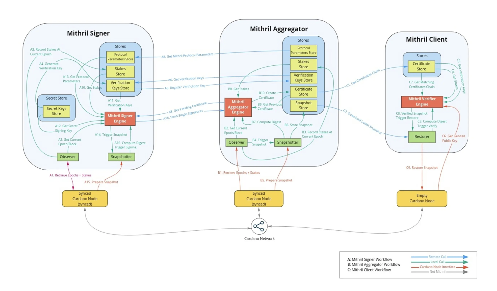
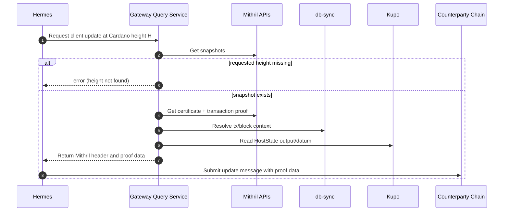

## Mithril Light Client Design

Author: Julius Tranquilli,https://github.com/floor-licker

Date: February 6, 2026 

**Important Note**:  Mithril is in beta and regularly has protocol upgrades, often they are breaking, i.e, require the whole network to upgrade their local infra. Breaking Mithril protocol upgrades will break the IBC bridge and we will have to update and react accordingly whenever Mithril has breaking changes. Because of the nature of a network, its not really an option to just stay on an old version of the protocol, the whole point is that everyone is forming a network

This document is intended to describe the overall architecture of the Mithril light client as well as why we are using Mithril in the first place.

The Mithril header and certificate formats are defined in the protobuf types under `cosmos/entrypoint/x/clients/mithril/mithril.pb.go`, reviewing those shapes helps with overall intuition for this process.

In avoiding re-stating things that are explained in depth elsewhere, I will say that a Mithril certificate is a cryptographically attested certificate (by Cardano SPOs) which testifies to the state of Cardano at a given checkpoint, for example at block N. Mithril certifies transaction inclusion and **not** UTxO inclusion. The Mithril certificate is not something derived from Cardano consensus the way that Tendermint headers are, rather Mithril is a separate aggregator-signer network that SPOs run alongside their nodes. The integrity of that network of course also relies on the proportion of Cardano stake participating in the network, and if that proportion increases it would in general improve bridge operations, and also make Mithril certifications more meaningful with respect to extrapolations about finality since a greater proportion of stake is agreeing on a given state.

The true intent of the Mithril project is to bootstrap nodes and allow them to sync with the chain faster. That means there is a slight misalignment in terms of our objectives for IBC and the objectives of the Mithril team, in that we would prefer more granularity in terms of lower tip lag and higher certificate cadence, but that is also a problem which is easy to over-simplify. 

For example, if the aggregator tries to get a certificate signed at a point that is so close to the chain tip that many honest Nodes simply have different views of the ledger, i.e, maybe there’s a fork of 1-3 blocks (which is not all that strange), they would simply compute a different digest than the one they’re being asked to sign by the aggregator, and no certificate could be produced at that height. i.e, what I’m calling “Mithril misses” (like a cache miss) would basically mean that you tried to produce a certificate at a height where most SPOs were genuinely not agreeing on a canonical ledger view. 

In this repo, the Mithril light client is an IBC 02-client implementation that lets a Cosmos chain verify Cardano-side IBC state by anchoring it to Mithril certificates plus Cardano transaction evidence. 

The core idea is that Mithril does not directly sign the Cardano IBC commitment root, instead Mithril certifies a transaction snapshot that can prove a specific Cardano transaction happened at a given Cardano block number, and that transaction is used to locate and authenticate the HostState UTxO, whose inline datum contains the `ibc_state_root`. Once that root is authenticated and stored in the client’s consensus state for that height, the normal IBC membership and non-membership verification methods can operate against it. 
So to be clear, it’s not the case that you can “do” the kind of UTxO membership/non-membership proofs we initially endeavoured to do (which are ostensibly not possible at the moment), rather you can get around this by building a system based on transaction inclusion attestation and then cryptographic proofs of the output of those transactions. Inherently we are talking about transactions which operate on Cardano’s on-chain host state as thats where we’ve implemented the underlying validators and STT architecture + spending conditions that allow us to enforce this and operate as we do, that is, the cryptographic guarantees I’m describing are not true for arbitrary Cardano transactions, this is an explicitly designed architecture that relies on the integrity of the validators and HostState UTxO we have deployed on Cardano.

High-level workflow reference:

_Caption: Diagram adapted from [IOG “Mithril nears mainnet release”](https://www.iog.io/news/mithril-nears-mainnet-release)._

## Mithril Proof Flow For Relaying

This sequence shows how the gateway builds Mithril-based proof material for relaying.

The on-chain state is split into client state and consensus state. 

Client state tracks the chain identifier, latest height, frozen height, trusting period, current Mithril epoch, the Mithril protocol parameters needed for certificate verification, and the HostState NFT identity (policy id and token name) used to find the correct Cardano output when extracting the `ibc_state_root`. 

Consensus state stores the timestamp derived from the Mithril certificate sealing time, references to the relevant certificates, and the authenticated `ibc_state_root` bytes. The client also stores processed time and processed height metadata for delay-period enforcement, plus some Mithril-specific indexing to remember the first stake distribution certificate for an epoch and the latest transaction snapshot certificate.

The intuitive partition between client and consensus states is that consensus state is the per-height belief of what the counterparty looked like at a given point, this is the snapshot that proofs get checked against. 
Client state holds things that don’t change every update or are global across most/many state changes. In general, the proof material or material we are proving against/with, would not exist in client state, rather consensus state. 
A given consensus state is basically the verified result of a mithril update at a specific height, which amounts to a timestamp taken from the transaction snapshot certificate `sealed_at`, the certificate references that anchor what was verified (first stake distribution certificate for the epoch, and the latest transaction snapshot certificate hash), and the authenticated ibc_state_root that the client extracted from the HostState transaction that was proven to be included in the Mithril-certified transaction set. So in summary, its not really the Mithril certificate + some other things, its more like the minimal per-height anchor material derived from each certificate that we need to be able to do inclusion/exclusion membership proofs for IBC. 

The update flow is: a relayer submits a Mithril header, the light client validates the certificate chain and signatures, and then it verifies host-state commitment evidence to ensure the `ibc_state_root` it will store is actually tied to Mithril-certified Cardano data. The header validation enforces that stake distribution and transaction snapshot certificates link correctly via `previous_hash`, that the snapshot merkle root is consistent with what the snapshot certificate commits to, and that the update is newer than the current client state. It also supports epoch catch-up by allowing a bounded list of prior stake distribution certificates to be includedso the client can backfill gaps and keep the previous_hash chain contiguous enough for on-chain verification.

## Proof Logic

The actual proof logic may be a bit dense if you are not familiar with IBC in general, or at least have a good intuition for Merkle-based cryptography. IBC proofs are generally based around membership and non-membership, i.e,  prove to me that X exists at this place and time, or prove to me that X does not exist at this place in time. This is why we were initially pushing quite hard to find a way to do verifiable UTxO inclusion proofs, because canonically in IBC you are verifying on-chain state, Cosmos even has a KV-store which is inherently merkleized which makes IBC extremely easy, but that is quite an uphill battle on Cardano, especially since it requires a canonical ledger view which is its own challenge referenced elsewhere.
 Membership and non-membership checks take the stored `ibc_state_root` from the consensus state at the requested height and verify a fixed-depth binary Merkle proof of length 64 where the direction at each depth is derived from the first 8 bytes of sha256(key). Leaves commit to the value hash (with empty values mapping to an all-zero leaf), and inner nodes are hashed with a distinct prefix. A major design detail is encoding-bridging: Cardano commits many IBC values as CBOR/Plutus-data bytes, while ibc-go constructs expected values as protobuf bytes, so when a proof carries a committed value that does not byte-match the expected protobuf value, the verifier decodes both into their **semantic** forms for known key families (connections, channels, client states, consensus states, and packet-related keys) and compares meaning rather than raw bytes, while still recomputing the Merkle root using the committed bytes.

 Regarding the semantic form conversion, the short version is that you are proving membership in a Cardano commitment, and that commitment is over Cardano’s chosen bytes, not Cosmos’s. On Cosmos, the IBC store values are typically protobuf-encoded (and for some keys they are wrapped in a protobuf `Any`). On Cardano, the on-chain commitment scheme is committing to CBOR/Plutus-data style encodings of logically equivalent objects. So if you take the “expected value” bytes produced by ibc-go and naively compare them to the “committed value” bytes proven under the Cardano root, they often will not match byte-for-byte even when they represent the same logical state. It sounds odd but it’s actually the safe way to do it, given the reality that two chains can store the same logical IBC state using different encodings. If you recomputed the root using protobuf bytes instead of the committed bytes, you would not be verifying what Cardano committed to. If you recomputed using committed bytes but skipped the semantic check, you would be accepting “some bytes that hash into the root,” without proving those bytes correspond to the IBC object the Cosmos side expects, which could let a relayer feed you a different encoding that still fits the Merkle root but represents a different meaning. The bridge approach enforces both, the merkle proof must match the authenticated `ibc_state_root`, and for known key spaces the committed bytes must decode to a value that matches the expected IBC object semantics. For unknown key families, it fails closed with an existence proof value mismatch, which is also important: you only get this flexibility where you’ve explicitly implemented the decoding and comparison rules.

I would advise actually reviewing the relevant protobuf definitions referenced earlier for Mithril before reading the following, as perhaps your intuition can put much of it together on your own. 
Think of the `MithrilHeader` as a bundle that lets the chain do two jobs: first, convince itself that this Cardano block number and transaction snapshot are certified by Mithril, and second, use that certified snapshot to authenticate the Cardano IBC commitment root that IBC proofs will later be checked against. 

To be clear: **Most of the fields exist either to make the Mithril certificate verification possible on-chain, or to make the jump from Mithril-certified transaction set to authenticated `ibc_state_root` extracted from Cardano state.**

The header includes a Mithril stake distribution object and its corresponding certificate. The stake distribution object is not the security anchor, the certificate itself is. The implementation mainly uses the stake distribution portion to carry the epoch and to cross-check that the stake distribution’s certificate hash matches the attached stake distribution certificate’s hash, because the certificate verifier needs the correct stake distribution context for that epoch. The client stores the first stake distribution certificate it has seen for an epoch (and also indexes certificates by hash) so later updates can verify the `previous_hash` chain without needing to re-fetch history, and so it can handle the fact that Mithril certificate verification depends on contiguous linking. Let me be clear on what I mean by this: Mithril certificates are chained objets in the sense that each certificate contains a `previous_hash` that is supposed to point to the hash of the previous certificate in the same certificate history. The verification logic in our design does not treat a certificate as something you can validate in total isolation, it validates that the new certificate correctly links to an already known prior certificate and that given the prior certificate’s context, like the stake distribution / verification key material for that era) the new certificate’s multi signature is sound. Thats what I mean by “verification depends on contiguous linking”, you need a contiguous sequence of links so that each step as a trusted predecessor to anchor it. Obviously when the bridge is starting up we do need to have a “first” mithril certificate. We bootstrap from a trusted checkpoint at client creation time, we create the client with an initial client state and an initial consensus state that already contain a known good Mithril stack distribution certificate reference for the current epoch and an authenticated ibc_state_root for some Carrdano block number. From that point onward, every update can be verified by linking back to what is already stored.  So we don’t run that certificate verifier against the very first certificate when the client is created, we just store it as an actor

The header also includes a Cardano transaction snapshot and its corresponding certificate. This pair is central because the transaction snapshot certificate is what ties the update to a specific certified set of Cardano transactions at a specific Cardano block number. The code checks that the snapshot’s certificate hash matches the attached snapshot certificate’s hash, that the snapshot epoch and block number align with what the certificate says it signed, and that the merkle root in the snapshot matches the merkle root found inside the certificate’s protocol message. 

The client stores the latest transaction snapshot certificate per epoch mostly as a reference for a what we last accepted type of metadata for update logic and duplicate detection, but the real anchor for IBC is the per-height consensus state that will hold the authenticated `ibc_state_root`.

The optional list of previous stake distribution certificates exists for catch-up. If the client missed one or more epochs, it may not have the immediately previous epoch’s certificate in its store, and the verifier cannot validate a new certificate without being able to follow previous_hash links back to something known. This list gives the chain enough intermediate certificates to verify and store the missing links, but only as much as needed to re-establish a contiguous chain; extra entries can be ignored.
The host state commitment evidence fields are the “bridge” from Mithril into Cardano IBC state, and they are the reason this design is stronger than “just trust a relayer-provided root.” 

The header carries a transaction hash, the CBOR for the transaction body, an output index, and a proof that this transaction hash is included in the Mithril-certified transaction set for the snapshot certificate. The chain verifies the inclusion proof against the snapshot’s merkle root, checks that the transaction hash is actually among the certified transactions, then uses the transaction body to locate the output that contains the configured HostState NFT and an inline datum, and finally parses that datum to extract ibc_state_root. That extracted root is what ends up in consensus state and is what membership and non-membership proofs are verified against later.
A MithrilCertificate, as used here, is the structured object the chain parses in order to verify signatures and link updates. The hash and previous_hash fields are used to enforce chaining, prevent accepting unrelated certificate histories, and support the catch-up logic. The epoch and signed_entity_type tell the verifier what domain object was signed (for example, stake distribution for an epoch or transactions at a specific block number), and the code actively checks that the header’s declared snapshot epoch and block number match what the signed entity type encodes. The metadata and protocol_message are parsed because they contribute to what was actually signed (and therefore what the signature attests to), and because the code needs specific message parts such as the cardano transactions merkle root to cross-check the header’s snapshot merkle root. The aggregate_verification_key and multi_signature fields are not just carried through; they are decoded and used by the on-chain verifier to validate the certificate signature under the Mithril protocol parameters. The signed_message field is part of the certificate’s signed payload binding. Genesis_signature is present in the type, but in this implementation it is effectively unsupported; verification paths assume multisignatures and will reject genesis signatures.
CertificateMetadata is parsed because it supplies the protocol parameters and signer stake distribution information that the certificate verification logic relies on, and because timestamps are used to derive the consensus state timestamp (sealed_at becomes the consensus timestamp used for expiry and delay checks). Network and protocol_version are contextual integrity fields; they are part of the attested metadata and can be useful for ensuring you are verifying the right environment, even if your current verification logic is mostly driven by parameters, signers, and sealing time.
ProtocolMessage is parsed because it is the certificate’s “named commitments” payload. This implementation turns the enum-keyed message parts into specific named values and then uses those values for concrete checks, most notably to obtain the cardano transactions merkle root that must match the header’s transaction snapshot merkle root. Other parts like snapshot digest or next aggregate verification key are present as part of the signed payload and can be relevant depending on which signed entity type you are verifying and how the verifier advances keys across epochs, even if your immediate header validation only directly uses a subset.
SignedEntityType is parsed because it tells you what the certificate actually certifies, and the verifier needs that to validate signatures in the correct domain and to reject mismatched headers. In this design you care most about the types that show up in updates: the stake distribution certificate (so you can verify the signer set and keep chaining correct) and the cardano transactions certificate (so you can bind the snapshot merkle root and the block number you will treat as the IBC height). Other variants exist for completeness and for other Mithril-certified entities, but they are only relevant insofar as the verifier supports them and your update logic accepts headers that carry them.

## What Happens If The Relayer Goes Down?

If it’s down long enough that we just miss some Mithril epochs, but the client is still within its trusting period, the design here is meant to recover without resetting the client. The next update can include not just the current stake distribution certificate, but also a chain of prior stake distribution certificates, and the light client will verify and store the missing links until the previous_hash chain is contiguous again. That’s exactly why the header format allows an optional list of previous stake distribution certificates, and why the client stores stake distribution certificates by hash and remembers the “first certificate in epoch”: it gives the on-chain verifier enough local anchor points to validate the next certificate even after gaps.

If the relayer is down long enough that the client passes its trusting period, the client becomes expired. At that point, the IBC security model says you should no longer accept new headers, because you can’t bound “how far you might have drifted” without an external trust assumption. In many IBC light clients, recovery from expiry is done via client recovery (substitute client) or governance-assisted mechanisms, but in this Mithril client implementation those recovery/upgrade paths are currently not implemented, so the practical recovery is typically to create a fresh client from a new trusted checkpoint and re-establish connectivity at the IBC level.
